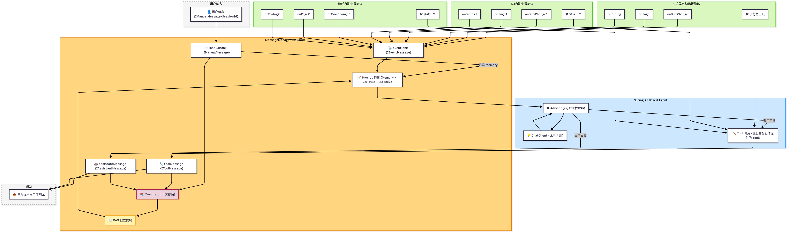

# 简介

Autiva是一个专注于Web、PC、Phone自动化的通用型AI智能体。



# 使用指南

首先，在autiva-web模块application.yml中填写你的LLM key，目前仅支持DeepSeek：
```yml
spring:
  application:
    name: autiva
  config:
    import: classpath:autiva.yml
  ai:
    deepseek:
      api-key: sk-ff1e0328e7b24ad7ace72e69d4710172
    chat:
      client:
        enabled: false
```
然后，在autiva-web模块autiva.yml中将要使用的智能体激活，目前仅支持浏览器智能体：
```yml
autiva:
  workDir: /autiva
  browser:
    enabled: true
```
最后，运行AutivaApplication
