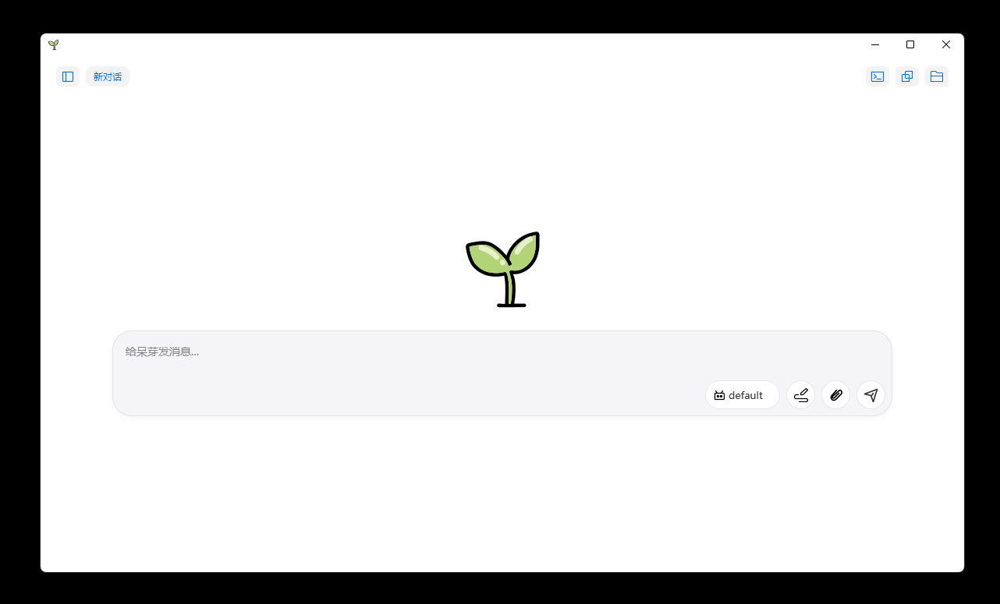
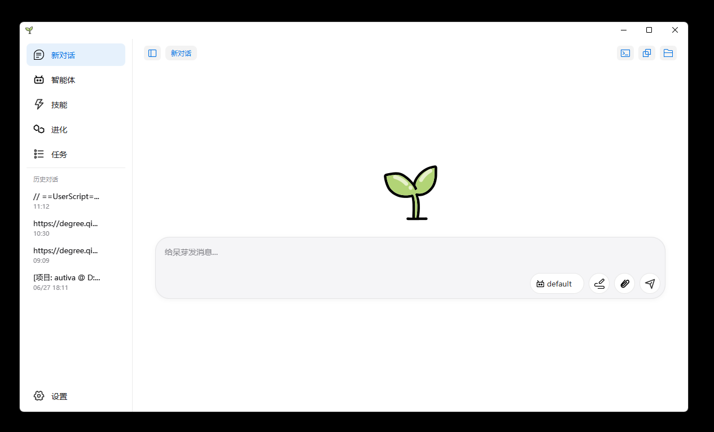
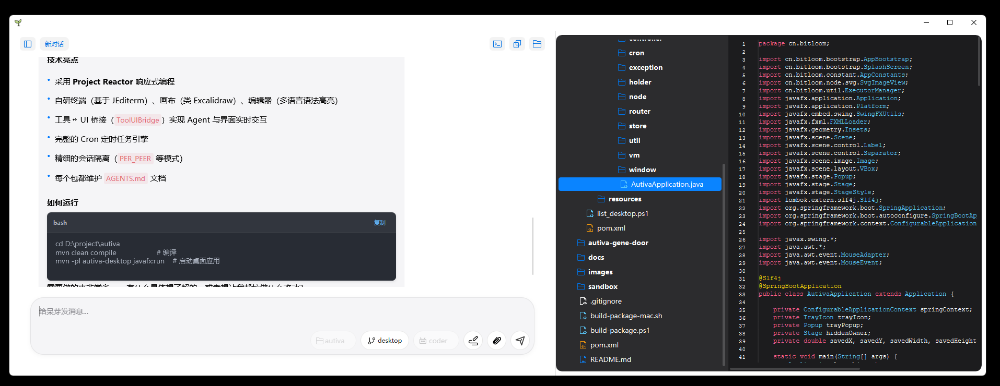

# Autiva

> AI 智能体桌面客户端 — 基于 JavaFX 25 + Spring Boot 4.1 + Spring AI 2.0 构建

Autiva 是一个可扩展的 AI 智能体桌面应用，提供多智能体架构、工具系统、技能系统、记忆系统、进化引擎和 IM 集成，旨在打造一个可自主进化的 AI 代理平台。

## 界面展示







## 技术栈

| 技术 | 版本 | 用途 |
|------|------|------|
| **JDK** | 25 | 运行环境 |
| **JavaFX** | 25.0.3 | 桌面 UI 框架 |
| **Spring Boot** | 4.1.0 | 应用框架 |
| **Spring AI** | 2.0.0 | AI 模型集成 |
| **Project Reactor** | — | 响应式编程 |
| **Maven** | 3.8+ | 构建工具 |

## 模块结构

```
autiva/
├── autiva-desktop/              # 主桌面应用（唯一核心模块）
│   └── src/main/java/cn/bitloom/
│       ├── agentic/             # 智能体核心
│       │   ├── agent/           #   智能体核心（MAIN + SUBAGENT 双类型）
│       │   │   └── advisor/     #     Agent 建议器（记忆、技能、环境、日志等）
│       │   ├── cron/            #   定时任务引擎
│       │   ├── event/           #   事件总线（消息、Diff、UI 卡片事件）
│       │   ├── evolve/          #   进化系统引擎
│       │   │   ├── gene/        #     基因模型与选择器
│       │   │   ├── trajectory/  #     执行轨迹记录
│       │   │   ├── verify/      #     质量验证（结果/过程/质量验证器）
│       │   │   ├── solidify/    #     进化固化器（金丝雀检查）
│       │   │   ├── routing/     #     动态路由引擎
│       │   │   ├── safety/      #     安全校验
│       │   │   └── experience/  #     经验引擎
│       │   ├── hook/            #   Agent 钩子系统（权限控制）
│       │   ├── memory/          #   长期记忆存储
│       │   ├── model/           #   AI 模型工厂
│       │   ├── session/         #   会话管理（含记忆压缩）
│       │   │   └── compaction/  #     压缩策略与触发器
│       │   ├── skill/           #   技能系统
│       │   ├── task/            #   后台任务管理
│       │   │   └── repository/  #     任务持久化
│       │   ├── tool/            #   工具系统
│       │   │   ├── command/     #     命令执行、Shell 会话、批准机制
│       │   │   ├── file/        #     文件读写、搜索、Diff
│       │   │   ├── web/         #     网络搜索、网页获取
│       │   │   ├── task/        #     子智能体委派
│       │   │   ├── memory/      #     长期记忆工具（6 个）
│       │   │   ├── cron/        #     定时任务工具
│       │   │   ├── skill/       #     技能工具
│       │   │   ├── session/     #     会话搜索工具
│       │   │   ├── interaction/ #     TodoWrite、AskUserQuestion
│       │   │   ├── manage/      #     配置管理（App/Skill/MCP/Evolve）
│       │   │   └── evolve/      #     进化管理工具
│       │   └── util/            #   Agent 工具类
│       ├── bridge/              # 外部集成
│       │   ├── wechat/          #   微信 iLink 协议接入
│       │   └── desktop/         #   Tool ↔ UI 桥接
│       ├── bootstrap/           # 应用启动引导（splash screen、资源初始化）
│       ├── config/              # 配置管理（EhCache、Evolve、调度）
│       ├── constant/            # 常量定义
│       ├── controller/          # JavaFX 页面控制器
│       ├── holder/              # UI 组件持有者
│       ├── node/                # 自定义 UI 节点
│       │   ├── canvas/          #   手绘画布（Excalidraw 风格）
│       │   ├── diff/            #   Diff 列表单元
│       │   ├── editor/          #   语法高亮编辑器
│       │   ├── message/         #   消息卡片渲染
│       │   ├── project/         #   文件树组件
│       │   ├── svg/             #   SVG 图像视图
│       │   ├── terminal/        #   终端模拟器（PTY）
│       │   └── tool/            #   工具卡片（Todo、Question、Task、Approval、DiffReview）
│       ├── project/             # 项目管理（文件树 / Git）
│       ├── router/              # 页面路由
│       ├── store/               # 全局状态管理
│       ├── util/                # 通用工具类
│       ├── vm/                  # 视图模型层
│       └── window/              # 窗口管理
├── images/                      # 项目截图
├── .trae/documents/             # 设计与规划文档
└── docs/                        # 静态演示站点
```

## 核心功能

### 智能体系统
- **统一 Agent 架构**：MAIN（主智能体）和 SUBAGENT（子智能体）均为 `Agent` 类实例，由 `AgentDefinition` 区分
- **双范式支持**：Work（工作智能体）与 Coder（编码智能体）并存，各自拥有独立的工作流
- **建议器体系（Advisor）**：记忆注入、会话记忆、技能上下文、环境信息、钩子链、日志追踪等
- 支持流式 / 阻塞两种响应模式
- 多模型切换（DeepSeek、智谱 AI 等）
- 对话记忆自动压缩与上下文管理
- 支持自定义智能体定义（agent.md + config.json），通过 `~/.autiva/agents/` 管理
- **子智能体系统**：Coder（编码）、Explore（探索）、Plan（架构规划）、Review（代码审查）、Doctor（诊断）、General（全栈编码）

### 工具系统
- **文件操作**：Read / Write / Edit（精确字符串替换）
- **文件搜索**：Glob（模式匹配）、Grep（正则搜索）
- **Diff 服务**：DiffService / DiffGenerator（文件差异计算与展示）
- **命令执行**：Command（Shell 执行，含命令分类与批准流程）、Process（后台进程管理）
- **持久 Shell**：跨调用保持工作目录与环境的 Shell 会话
- **终端模拟器**：基于 PTY 的完整终端（PTY + JediTerm）
- **网络操作**：WebSearch（含博查 API）、WebFetch
- **任务管理**：Task（子智能体委派）、TaskOutput
- **用户交互**：AskUserQuestion、TodoWrite
- **配置管理**：AppConfig（读取/修改/路径查询）、Memory（6 个工具）、MCP（3 个配置工具）、Skill（4 个配置工具）、Evolve（8 个管理工具）
- **定时任务**：Cron（创建/列表/触发/删除）
- **会话搜索**：ConversationSearch、CrossSessionSearch

### 记忆系统
- **长期记忆**：基于文件的持久记忆存储，跨会话持续存在
- 6 个记忆工具：MemoryView / MemoryCreate / MemoryStrReplace / MemoryInsert / MemoryDelete / MemoryRename
- 记忆类型：用户（user）、反馈（feedback）、项目（project）、引用（reference）
- **会话记忆**：自动压缩，支持多种压缩策略（递归摘要、滑窗、Token 计数触发）

### 技能系统
- 通过 ZIP 包动态加载专业知识
- YAML frontmatter 格式的技能定义
- 技能热加载与运行时管理
- 技能上下文自动注入（SkillContextAdvisor）

### 进化系统（Evolve）
- **EvolverAgent**：智能体自我进化引擎
- **基因模型**：Gene + GeneCategory + GeneRepository + GeneSelector + GeneInjector
- **轨迹记录**：TrajectoryRecorder + TrajectoryRepository（全链路执行轨迹）
- **验证体系**：ResultVerifier + ProcessVerifier + QualityVerifier（LLM 质量评估）
- **路由引擎**：RoutingEngine + RoutingEntry（动态路由）
- **固化器**：CanaryCheck（金丝雀检查）+ Solidifier + EvolutionEvent
- **经验引擎**：ExperienceEngine + Experience + ExperienceStatus
- **安全保障**：EvolutionSafety（安全校验）

### 画布系统
- 类似 Excalidraw 的手绘风格画布
- 支持矩形、椭圆、菱形、箭头、线条、文本、自由手绘等工具
- SVG / 图片导出（DiagramExportTool）
- 场景序列化与加载（CanvasSceneSerializer）

### A2UI 动态界面
智能体可以通过标准化协议动态生成交互式 UI，包括：
- 布局组件：Row、Column、List、Tabs、Card
- 交互组件：TextField、Button、CheckBox、ChoicePicker、Slider、DateTimeInput
- 展示组件：Text、Image、Icon、Divider
- 事件系统：完整的 UI 事件生命周期

### 外部集成
- **微信**：iLink 协议接入（扫码登录、多类型消息收发：文本/图片/视频/文件/语音）
- **Tool ↔ UI 桥接**：桌面端 ToolUIBridge（消息、Question/Task/Todo/Approval/DiffReview 卡片渲染）

## 快速开始

### 环境要求

- JDK 25+
- Maven 3.8+

### 运行

```bash
# 克隆项目后进入目录
cd autiva

# 编译
mvn clean compile

# 启动桌面应用
mvn -pl autiva-desktop javafx:run
```

### 打包

```bash
mvn clean package
```

Windows 打包：
```bash
.\build-package.ps1
```

macOS 打包：
```bash
./build-package-mac.sh
```

## 配置

配置文件位于 `~/.autiva/settings.yaml`：

```yaml
app:
  session:
    isolation: PER_PEER          # 会话隔离模式
  evolve:
    enabled: false               # 进化系统开关
  search:
    bocha-api-key: your-api-key  # 搜索（可选，博查 API）

spring:
  ai:
    deepseek:
      chat:
        base-url: https://api.deepseek.com
        completions-path: /chat/completions
        api-key: your-api-key
        options:
          model: deepseek-chat

# 微信接入（可选）
weixin:
  ilink:
    enabled: false
```

## 数据目录

```
~/.autiva/
├── agents/                      # 智能体定义（不随 session 变化）
│   ├── work/                    # Work 主智能体
│   │   ├── agent.md             # 智能体定义（YAML frontmatter + 提示词）
│   │   └── config.json          # MCP + 工具白名单 + skill + subagent
│   ├── code/                    # Coder 编码智能体
│   │   ├── agent.md
│   │   └── config.json
│   └── <agent-id>/              # 用户自定义智能体
├── subagents/                   # 子智能体定义
│   ├── coder/
│   ├── explore/
│   ├── plan/
│   ├── review/
│   ├── doctor/
│   └── general/
├── workspace/                   # 运行时数据（仅 session 相关）
│   └── <agent-id>/
│       └── sessions/
│           ├── metadata.json    # Session 序列化
│           └── messages.jsonl   # 消息持久化
├── memory/                      # 长期记忆
│   └── MEMORY.md                # 记忆索引
├── skills/                      # 技能目录
├── mcp/                         # MCP 配置
└── settings.yaml                # 应用配置
```

## 许可证

Apache License 2.0
