# Autiva Agentic 包架构设计文档

> 版本：1.0 | 日期：2026-05-20

---

## 目录

- [1. 系统总览](#1-系统总览)
- [2. 整体架构](#2-整体架构)
- [3. Agent 模块 — 智能体核心](#3-agent-模块--智能体核心)
- [4. Subagent 模块 — 子智能体系统](#4-subagent-模块--子智能体系统)
- [5. Event 模块 — 事件总线](#5-event-模块--事件总线)
- [6. Session 模块 — 会话管理](#6-session-模块--会话管理)
- [7. Memory 模块 — 记忆系统](#7-memory-模块--记忆系统)
- [8. Advisor 模块 — 横切关注点](#8-advisor-模块--横切关注点)
- [9. Evolve 模块 — 自演化引擎](#9-evolve-模块--自演化引擎)
- [10. Tool 模块 — 工具系统](#10-tool-模块--工具系统)
- [11. Skill 模块 — 技能系统](#11-skill-模块--技能系统)
- [12. Workflow 模块 — 工作流引擎](#12-workflow-模块--工作流引擎)
- [13. Deploy 模块 — 部署系统](#13-deploy-模块--部署系统)
- [14. Task 模块 — 任务管理](#14-task-模块--任务管理)
- [15. Util 模块 — 通用工具](#15-util-模块--通用工具)
- [16. Model 模块 — 模型配置](#16-model-模块--模型配置)
- [17. 模块交互关系总图](#17-模块交互关系总图)
- [18. 设计模式汇总](#18-设计模式汇总)
- [19. 文件存储结构](#19-文件存储结构)

---

## 1. 系统总览

Autiva Agentic 包是一个基于 **Spring AI** 框架构建的通造型 AI 智能体系统，采用 **主智能体 + 子智能体** 的分层架构。系统核心设计理念包括：

- **调度者-执行者分离**：主智能体作为调度者不直接操作文件/Shell，所有执行工作委派给子智能体
- **事件驱动通信**：通过 EventBus 的 Inbox/Outbox 双通道实现智能体间异步通信
- **自演化能力**：基于 GEP（基因组演化协议）实现 Agent 的经验可跨 Agent 传承
- **配置驱动**：子智能体、技能等通过 Markdown 配置文件定义，无需编写 Java 代码
- **响应式编程**：基于 Project Reactor 实现全链路异步非阻塞

### 核心技术栈

| 技术 | 用途 |
|------|------|
| Spring AI | LLM 集成框架 |
| Project Reactor | 响应式编程 |
| Spring ApplicationEvent | 会话生命周期事件 |
| OpenAI API 兼容协议 | 多模型接入（DeepSeek / 智谱 GLM） |
| A2A SDK | Agent-to-Agent 协议通信 |
| Flexmark | HTML 转 Markdown |
| SpEL | 工作流条件表达式 |

---

## 2. 整体架构

### 2.1 模块依赖关系

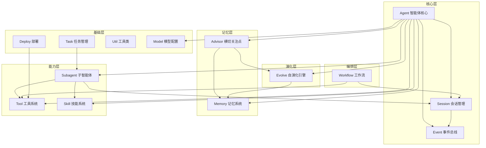

### 2.2 包结构

```
cn.bitloom.agentic/
├── advisor/          # Advisor 横切关注点
├── agent/            # 智能体核心
│   └── subagent/     # 子智能体系统
│       ├── a2a/      # A2A 协议子智能体
│       ├── doctor/   # 系统医生子智能体
│       └── generic/  # 通用子智能体
├── deploy/           # 部署系统
├── event/            # 事件总线
├── evolve/           # 自演化引擎
│   ├── config/       # 进化配置
│   ├── gene/         # 基因管理
│   ├── prompt/       # 提示词组装
│   ├── signal/       # 信号系统
│   ├── solidify/     # 固化器
│   └── strategy/     # 策略引擎
├── memory/           # 记忆系统
├── model/            # 模型配置
├── session/          # 会话管理
├── skill/            # 技能系统
├── task/             # 任务管理
│   └── repository/   # 后台任务仓库
├── tool/             # 工具系统
│   ├── core/         # 核心工具
│   ├── cron/         # 定时任务工具
│   ├── manage/       # 管理类工具
│   ├── memory/       # 记忆工具
│   └── search/       # 搜索工具
├── util/             # 通用工具
└── workflow/         # 工作流引擎
    ├── config/       # 工作流配置
    └── graph/        # 图数据结构
```

---

## 3. Agent 模块 — 智能体核心

### 3.1 功能定位

Agent 模块是整个系统的核心，实现了智能体的身份管理、消息处理循环、工具注册和系统提示词构建。采用 **主智能体 + 子智能体** 架构，主智能体作为调度者，子智能体作为执行者。

### 3.2 类结构

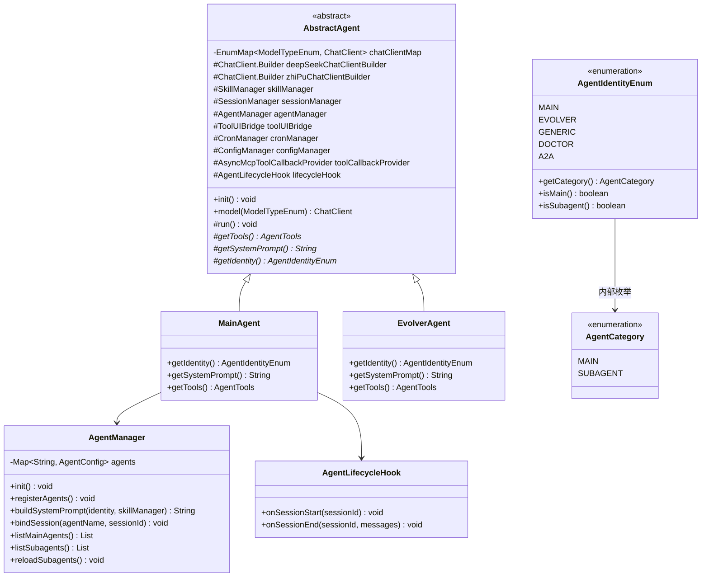

### 3.3 消息处理流程

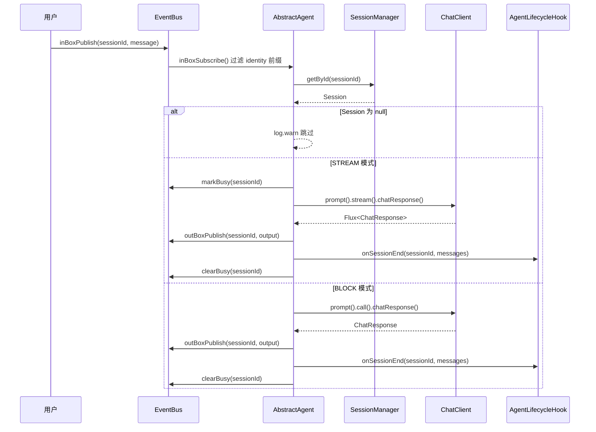

### 3.4 主智能体与子智能体分工

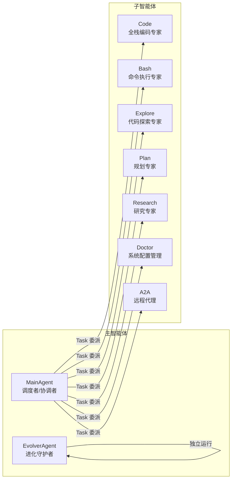

### 3.5 心跳机制

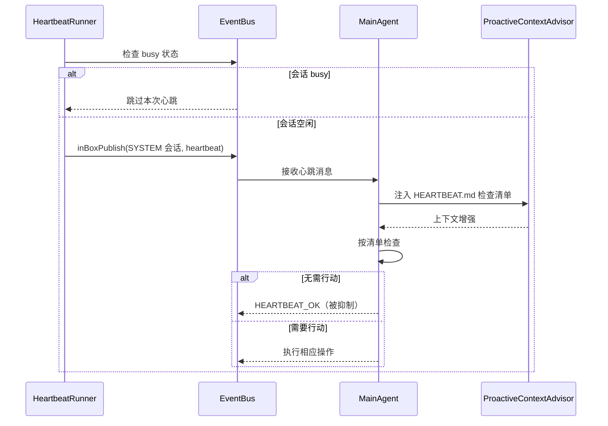

### 3.6 系统提示词构建

`AgentManager.buildSystemPrompt()` 构建主智能体的完整系统提示词，由以下部分组成：

```
┌─────────────────────────────────────────┐
│            系统提示词结构                │
├─────────────────────────────────────────┤
│ 1. 安全准则（硬编码）                   │
│ 2. 工具调用风格（硬编码）               │
│ 3. 记忆系统说明（硬编码）               │
│ 4. 心跳机制说明（硬编码）               │
│ 5. 运行环境信息（动态生成）             │
│ 6. 技能描述（SkillManager 提供）        │
│ 7. 工作空间上下文（读取 .md 文件）      │
│    - IDENTITY.md                         │
│    - SOUL.md                             │
│    - MEMORY.md                           │
│    - USER.md                             │
│    - TOOLS.md                            │
│    - 子智能体注册信息                    │
└─────────────────────────────────────────┘
```

---

## 4. Subagent 模块 — 子智能体系统

### 4.1 功能定位

子智能体系统采用 **策略模式** 设计，定义了统一的抽象接口，支持多种子智能体类型的注册、解析和执行。核心设计原则是 **配置驱动** —— 新增子智能体只需添加 Markdown 配置文件，无需编写 Java 代码。

### 4.2 核心接口

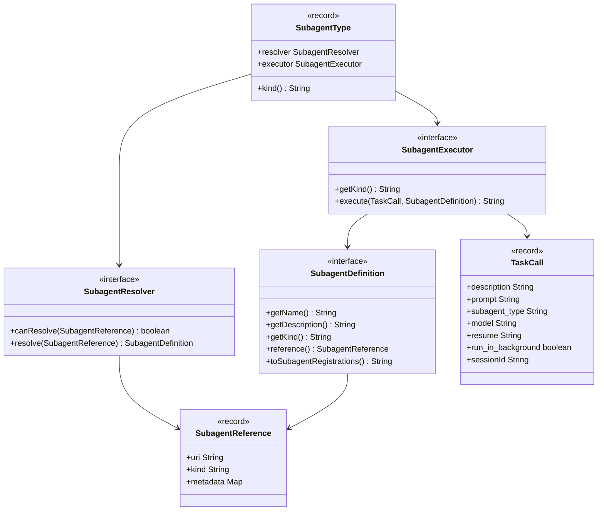

### 4.3 子智能体类型

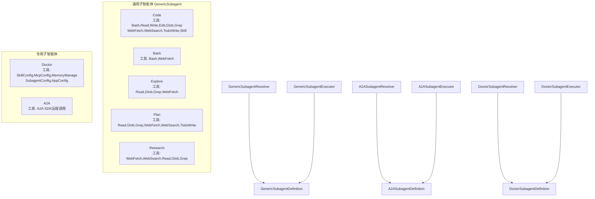

### 4.4 GenericSubagentExecutor 执行流程

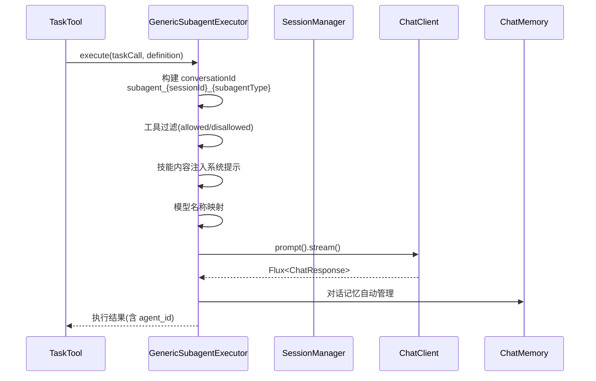

### 4.5 子智能体配置格式

子智能体配置使用 Markdown + YAML frontmatter 格式：

```markdown
---
name: Code
description: 全栈编码专家
model: deepseek
tools:
  - Bash
  - Read
  - Write
  - Edit
  - Glob
  - Grep
  - WebFetch
  - WebSearch
  - TodoWrite
  - Skill
---

# Code 子智能体

你是一个全栈编码专家...
```

---

## 5. Event 模块 — 事件总线

### 5.1 功能定位

Event 模块实现了基于 Reactor 的发布-订阅事件系统，是智能体间异步通信的核心基础设施。采用 **Inbox/Outbox/Stop/Busy** 四通道架构，支持会话级别的消息隔离和流式生成中断。

### 5.2 类结构

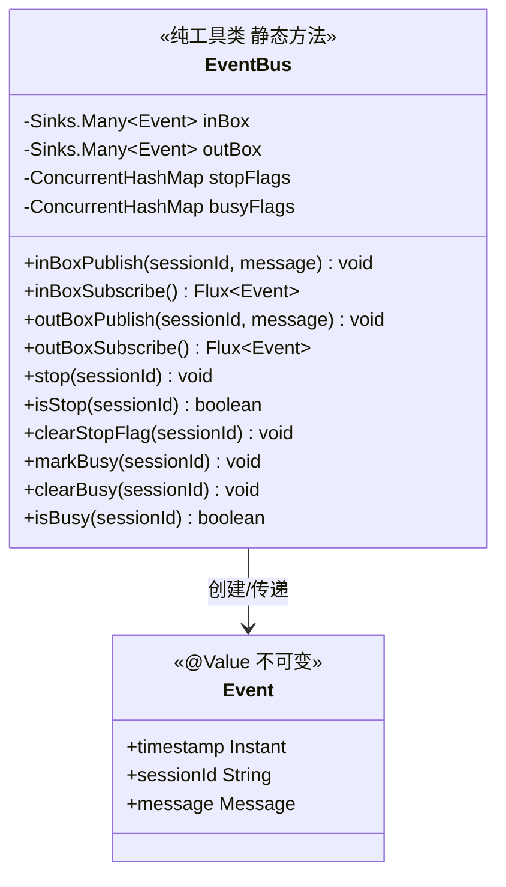

### 5.3 三通道架构

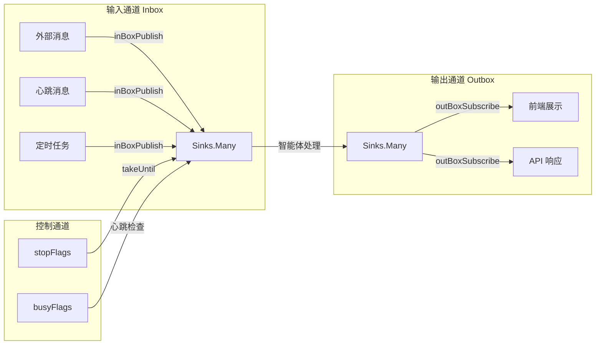

### 5.4 实现原理

- **Sinks.Many**：Reactor 的多播处理器，`multicast().onBackpressureBuffer()` 提供背压缓冲
- **ConcurrentHashMap**：存储 stop/busy 标志，线程安全
- **takeUntil**：配合 `isStop()` 实现流式中断
- **tryEmitNext**：非阻塞发送，失败时记录 warn 日志

---

## 6. Session 模块 — 会话管理

### 6.1 功能定位

Session 模块管理智能体的会话生命周期，支持会话创建、持久化、消息存储、子会话 fork 等操作。每个会话关联一个智能体身份和消息来源，系统会话与用户会话自动配对。

### 6.2 类结构

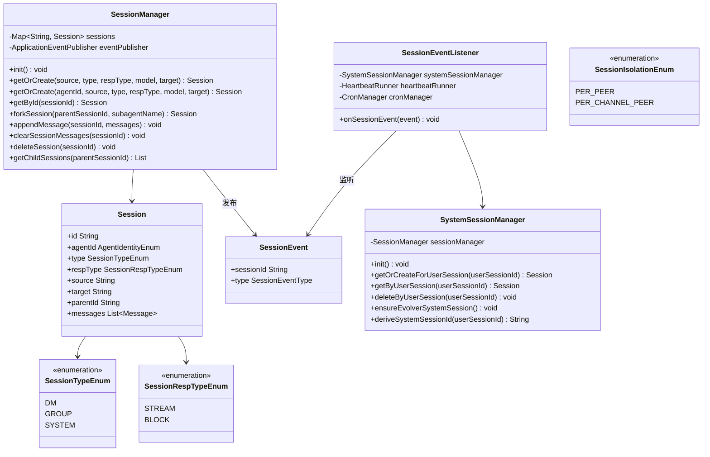

### 6.3 会话生命周期事件流

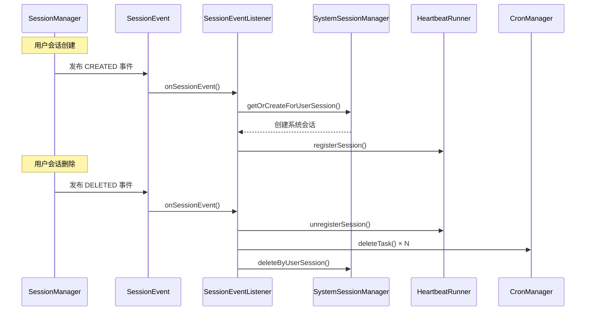

### 6.4 Session ID 格式

```
{agentId}-{type}-{source}-{target}

示例：
MAIN-DM-desktopApp-bitloom            # 主助手桌面端用户会话
MAIN-SYSTEM-desktopApp-bitloom        # 主助手桌面端系统会话
EVOLVER-SYSTEM-internal-internal      # 进化守护者系统会话
MAIN-DM-desktopApp-bitloom_0          # fork 出的子会话
```

### 6.5 会话隔离策略

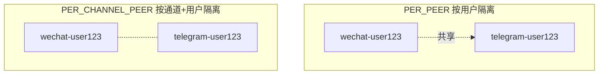

### 6.6 持久化格式

**metadata.json：**
```json
{
  "id": "MAIN-DM-desktopApp-bitloom",
  "agentId": "MAIN",
  "type": "DM",
  "source": "desktopApp",
  "target": "bitloom",
  "parentId": null
}
```

**messages.jsonl：**
```jsonl
{"messageType":"USER","content":"帮我创建一个项目","metadata":{}}
{"messageType":"ASSISTANT","content":"好的，我来帮你...","metadata":{"model":"deepseek"}}
{"messageType":"TOOL","content":"{...}","metadata":{"tool":"write"}}
```

---

## 7. Memory 模块 — 记忆系统

### 7.1 功能定位

Memory 模块实现了三层记忆架构：对话记忆（ConpactChatMemory）、情景记忆（JournalManager）和语义记忆（MemorySearchService），为智能体提供短期对话上下文、中期日志回顾和长期知识检索能力。

### 7.2 类结构

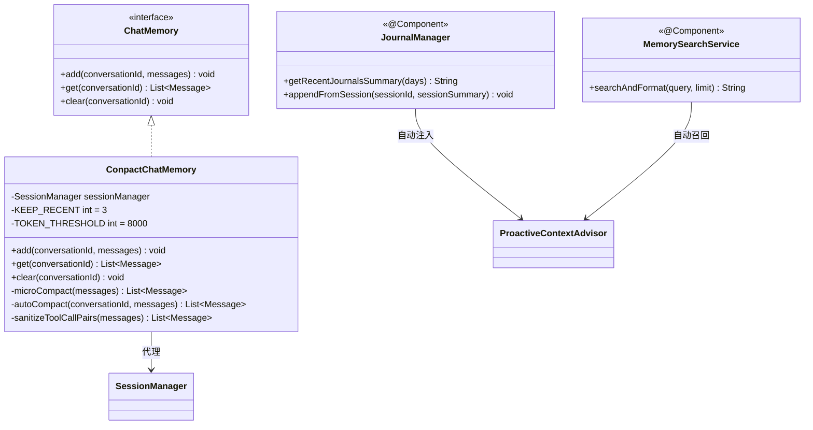

### 7.3 三层记忆架构

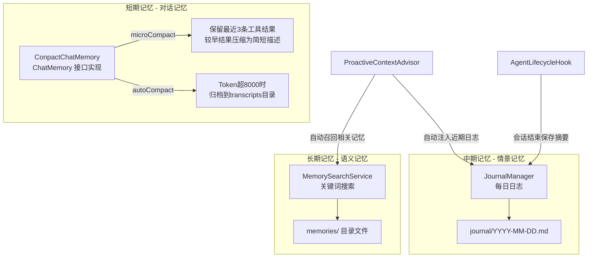

### 7.4 压缩策略

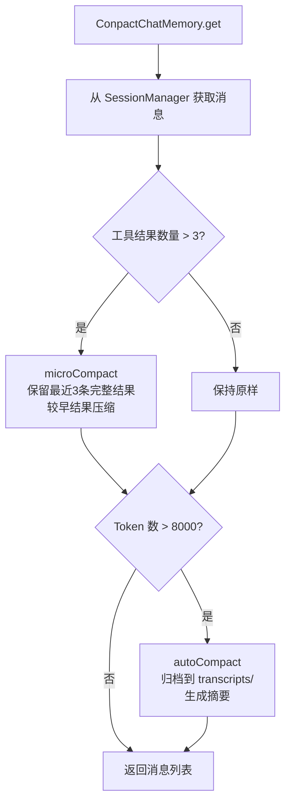

---

## 8. Advisor 模块 — 横切关注点

### 8.1 功能定位

Advisor 模块实现了 Spring AI 的 Advisor 模式，在 LLM 请求/响应过程中添加横切关注点，包括日志记录、动态上下文注入和进化信号检测。

### 8.2 类结构

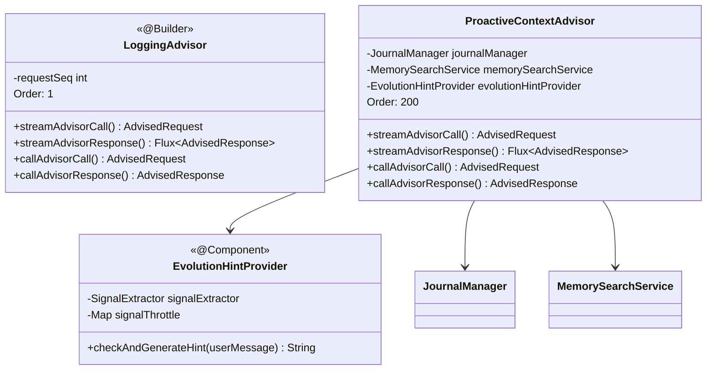

### 8.3 Advisor 链执行顺序

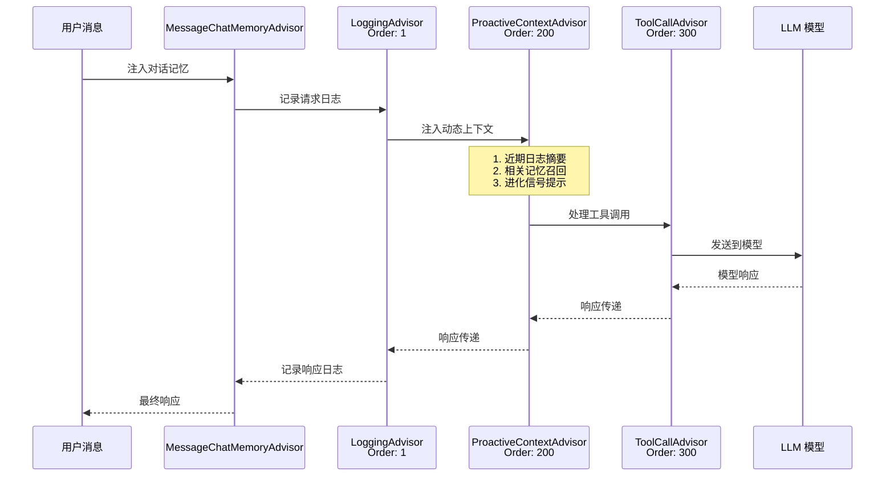

### 8.4 ProactiveContextAdvisor 上下文注入

ProactiveContextAdvisor 在每次 LLM 请求前自动注入三类动态上下文：

| 注入内容 | 来源 | 触发条件 |
|----------|------|----------|
| 近期日志摘要 | JournalManager | 始终注入（最近2天） |
| 相关记忆召回 | MemorySearchService | 基于用户消息关键词搜索 |
| 进化信号提示 | EvolutionHintProvider | 检测到进化信号时（30分钟节流） |

---

## 9. Evolve 模块 — 自演化引擎

### 9.1 功能定位

Evolve 模块实现了基于 **GEP（基因组演化协议）** 的 AI Agent 自演化引擎，参考 EvoMap 的 Evolver 项目设计。核心流水线为：**观察 → 分析 → 选择 → 生成 → 验证 → 固化**。核心愿景："One agent learns, a million inherit."

### 9.2 核心概念

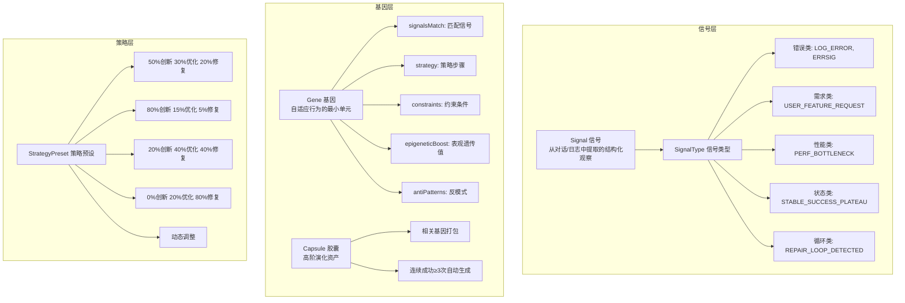

### 9.3 进化流水线

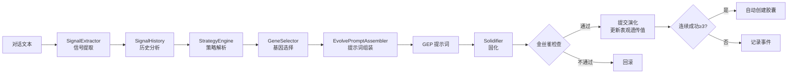

### 9.4 类结构

```mermaid
classDiagram
    class EvolutionEngine {
        <<@Component>>
        -EvolveConfig config
        -GeneStore geneStore
        -SignalExtractor signalExtractor
        -SignalHistory signalHistory
        -GeneSelector geneSelector
        -StrategyEngine strategyEngine
        -EvolvePromptAssembler promptAssembler
        -Solidifier solidifier
        +runCycle(conversationTexts) EvolutionCycleResult
        +getEvolutionContext(conversationTexts) String
        +solidify(event) SolidifyResult
        +queryGenes(category) String
        +queryCapsules() String
        +recommendGenes(conversationTexts) String
        +applyGene(geneId, context) String
        +applyCapsule(capsuleId, context) String
    }

    class GeneStore {
        -ReentrantReadWriteLock lock
        +loadGenes() List~Gene~
        +loadEnabledGenes() List~Gene~
        +loadCapsules() List~Capsule~
        +upsertGene(Gene) void
        +deleteGene(id) void
        +toggleGene(id, enabled) void
        +appendEvent(EvolutionEvent) void
        +readRecentEvents(limit) List~EvolutionEvent~
    }

    class SignalExtractor {
        +extract(texts) List~Signal~
    }

    class GeneSelector {
        +select(signals, genes, preset, analysis) GeneSelectionResult
    }

    class StrategyEngine {
        +resolve(analysis) StrategyPreset
    }

    class EvolvePromptAssembler {
        +assemble(signals, gene, preset, reason) String
        +assembleGeneSummary(genes) String
        +assembleGeneDetail(gene) String
    }

    class Solidifier {
        +solidify(event) SolidifyResult
    }

    EvolutionEngine --> GeneStore
    EvolutionEngine --> SignalExtractor
    EvolutionEngine --> GeneSelector
    EvolutionEngine --> StrategyEngine
    EvolutionEngine --> EvolvePromptAssembler
    EvolutionEngine --> Solidifier
```

### 9.5 基因选择算法

基因选择基于综合得分计算：

```
综合得分 = 信号匹配度 × 表观遗传值 × 策略权重
```

- **信号匹配度**：基因的 `signalsMatch` 与当前信号的交集比例
- **表观遗传值**：成功时乘以 `epigeneticBoostOnSuccess`（1.2），失败时乘以 `epigeneticDecay`（0.95）
- **策略权重**：根据 `StrategyPreset` 调整不同类别基因的权重
- **修复循环强制创新**：检测到修复循环时，强制选择创新类基因
- **停滞探索**：检测到进化停滞时，降低阈值触发探索

### 9.6 资源文件

```
~/.autiva/evolve/
├── genes.json          # Gene 池（JSON 格式）
├── capsules.json       # Capsule 存储（JSON 格式）
├── events.jsonl        # 演化事件日志（仅追加，JSONL 格式）
└── candidates.jsonl    # 候选方案日志
```

---

## 10. Tool 模块 — 工具系统

### 10.1 功能定位

Tool 模块为智能体提供可调用的工具集，是智能体与外部世界交互的核心能力。所有工具统一使用两种注册方式：Builder 模式（优先）和 ToolCallbacks 模式（次选）。

### 10.2 工具注册方式

```mermaid
graph TB
    subgraph Builder模式 优先
        B1[FileSystemTools]
        B2[CommandTools]
        B3[GlobTool]
        B4[GrepTool]
        B5[WebFetchTool]
        B6[WebSearchTool]
        B7[TodoWriteTool]
        B8[AskUserQuestionTool]
        B9[AutoMemoryTools]
        B10[CronTool]
        B11[DeployTool]
        B1 & B2 & B3 & B4 & B5 & B6 & B7 & B8 & B9 & B10 & B11 -->|defaultTools| CC[ChatClient]
    end

    subgraph ToolCallbacks模式 次选
        T1[TaskTool]
        T2[TaskOutputTool]
        T3[SessionQueryTool]
        T4[SkillTool]
        T1 & T2 & T3 & T4 -->|defaultToolCallbacks| CC
    end
```

### 10.3 工具分类

```mermaid
graph TB
    subgraph 核心工具 core
        FS[FileSystemTools<br/>Read/Write/Edit]
        CMD[CommandTools<br/>Command/CommandOutput/KillCommand]
        GL[GlobTool<br/>文件模式匹配]
        GR[GrepTool<br/>正则内容搜索]
        WF[WebFetchTool<br/>网页获取]
        WS[WebSearchTool<br/>网络搜索]
        TD[TodoWriteTool<br/>任务列表管理]
        AQ[AskUserQuestionTool<br/>向用户提问]
        TT[TaskTool<br/>子代理任务]
        TO[TaskOutputTool<br/>任务输出查询]
    end

    subgraph 管理工具 manage
        SC[SkillConfigTool<br/>技能配置管理]
        MC[McpConfigTool<br/>MCP服务器配置]
        MM[MemoryManageTool<br/>记忆文件管理]
        SBC[SubagentConfigTool<br/>子智能体配置]
        AC[AppConfigTool<br/>应用配置管理]
        EQ[EvolveQueryTool<br/>进化查询]
        EA[EvolveApplyTool<br/>进化应用]
        EC[EvolveCycleTool<br/>进化周期]
        EG[EvolveGeneManageTool<br/>基因管理]
        ECF[EvolveConfigTool<br/>进化配置]
    end

    subgraph 其他工具
        AM[AutoMemoryTools<br/>持久化记忆管理]
        CT[CronTool<br/>定时任务]
        DT[DeployTool<br/>项目部署]
    end
```

### 10.4 Task 工具 Session 集成机制

```mermaid
sequenceDiagram
    participant MA as MainAgent
    participant TT as TaskTool
    participant SM as SessionManager
    participant SE as SubagentExecutor

    MA->>TT: ChatClient 设置 toolContext<br/>(sessionId, model)
    TT->>TT: TaskFunction.apply(taskCall, toolContext)
    TT->>SM: forkSession(parentSessionId, subagentType)
    SM-->>TT: childSessionId
    TT->>TT: 创建 enrichedTaskCall<br/>(含 toolContext)
    TT->>SE: execute(enrichedTaskCall, definition)
    SE->>SE: 从 toolContext 获取 childSessionId
    SE->>SE: 构建 conversationId<br/>subagent_{childSessionId}_{type}
    SE-->>TT: 执行结果(含 agent_id)
```

### 10.5 TaskCard 流式输出机制

```mermaid
sequenceDiagram
    participant TT as TaskTool
    participant UIB as ToolUIBridge
    participant SE as SubagentExecutor
    participant UI as 前端 UI

    TT->>UIB: createTaskCard(taskCardId, taskJson)
    UIB->>UI: 创建 TaskCard 组件
    SE->>TT: onChunk(chunk)
    TT->>UIB: appendTaskOutput(taskCardId, chunk)
    UIB->>UI: 实时追加输出
    SE->>TT: 执行完成
    TT->>UIB: completeTaskCard(taskCardId, null)
    UIB->>UI: 更新完成状态
```

---

## 11. Skill 模块 — 技能系统

### 11.1 功能定位

Skill 模块实现了技能管理系统，支持动态加载和管理 AI 技能（专业知识）。技能以 Markdown 文件形式定义，支持 ZIP 包导入和从文件系统/JAR/类路径加载。

### 11.2 类结构

```mermaid
classDiagram
    class Skill {
        <<record>>
        +basePath String
        +frontMatter Map~String, Object~
        +content String
        +name() String
        +description() String
        +toXml() String
    }

    class SkillManager {
        -List~Skill~ skills
        +loadSkills() void
        +loadDirectory(path) void
        +loadResource(resource) void
        +getAllSkills() List~Skill~
        +getSkill(name) Skill
        +getContent(name) String
        +importSkillFromZip(path) void
        +importSkillFromUrl(url) void
        +saveSkill(skill) void
        +deleteSkill(name) void
        +buildToolCallback() ToolCallback
    }

    SkillManager --> Skill : 管理
    SkillManager --> SkillsFunction : 内部类
    SkillManager --> SkillsInput : 内部类
```

### 11.3 技能加载流程

```mermaid
flowchart TD
    A[SkillManager.loadSkills] --> B{加载来源}
    B -->|文件系统| C[loadDirectory<br/>递归扫描 SKILL.md]
    B -->|Spring Resource| D[loadResource<br/>支持 JAR 内加载]
    B -->|ZIP 导入| E[importSkillFromZip/Url<br/>解压到技能目录]
    C --> F[MarkdownParser 解析<br/>YAML frontmatter + content]
    D --> F
    E --> F
    F --> G[构建 Skill record]
    G --> H[添加到 skills 列表]
```

### 11.4 SKILL.md 格式

```markdown
---
name: skill-name
description: "技能描述"
license: Apache-2.0
compatibility: "需要Python 3.8+"
metadata:
  author: example-org
  version: "1.0"
---

# 技能标题

技能内容...
```

---

## 12. Workflow 模块 — 工作流引擎

### 12.1 功能定位

Workflow 模块实现了基于图的工作流引擎，支持复杂的多步骤任务编排。使用十字链表存储图结构，支持条件分支（SpEL 表达式）和重试机制。

### 12.2 类结构

```mermaid
classDiagram
    class AbstractNode {
        <<abstract>>
        +run(params, ctx) Mono~WorkFlowEvent~
    }

    class AbstractWorkflow {
        <<abstract>>
        +start() Flux~WorkFlowEvent~
        +getName() String
        +eval(script) Object
        +stop() void
    }

    class GraphWorkflow {
        -Graph graph
        +start() Flux~WorkFlowEvent~
    }

    class WorkFlowContext {
        -Map params
        +putParam(key, value) void
        +getParam(key, clazz) T
        +clear() void
    }

    class WorkFlowEvent {
        +type EventType
        +nodeId String
        +data Object
    }

    class WorkflowFactory {
        +createWorkFlow(id, name, graph, ctx) AbstractWorkflow
        +createWorkflowFromConfig(configPath, ctx) AbstractWorkflow
    }

    class WorkflowConfig {
        +id String
        +name String
        +description String
        +graph Graph
    }

    class WorkflowConfigLoader {
        -ConcurrentHashMap cache
        +loadWorkflowConfig(resourcePath) WorkflowConfig
    }

    AbstractWorkflow <|-- GraphWorkflow
    GraphWorkflow --> AbstractNode
    GraphWorkflow --> WorkFlowContext
    WorkflowFactory --> AbstractWorkflow
    WorkflowFactory --> WorkflowConfigLoader
    WorkflowConfigLoader --> WorkflowConfig
```

### 12.3 图数据结构（十字链表）

```mermaid
graph LR
    subgraph 十字链表
        A[VertexNode A<br/>firstIn: null<br/>firstOut: →B] -->|tailLink| B[VertexNode B<br/>firstIn: ←A<br/>firstOut: →D]
        C[VertexNode C<br/>firstIn: null<br/>firstOut: →B] -->|tailLink| B
        B -->|tailLink| D[VertexNode D<br/>firstIn: ←B<br/>firstOut: null]
    end
```

### 12.4 工作流执行流程

```mermaid
flowchart TD
    A[WorkflowFactory.createWorkflowFromConfig] --> B[WorkflowConfigLoader<br/>加载 JSON 配置]
    B --> C[Graph.createGraphFromJson<br/>构建图结构]
    C --> D[GraphWorkflow.start]
    D --> E[找到所有根节点<br/>入弧为空]
    E --> F[从根节点递归执行]
    F --> G{执行节点 run}
    G --> H[评估出边条件<br/>SpEL 表达式]
    H --> I{条件满足?}
    I -->|是| J[执行后续节点]
    I -->|否| K[跳过该分支]
    J --> F
    G -->|失败| L{重试次数?}
    L -->|未超限| G
    L -->|超限| M[发送 ERROR 事件]
```

---

## 13. Deploy 模块 — 部署系统

### 13.1 功能定位

Deploy 模块实现了项目部署功能，将本地项目文件发送到后端沙箱进行部署，实现 FaaS + BaaS 的完整流程。

### 13.2 部署流程

```mermaid
sequenceDiagram
    participant AI as AI 智能体
    participant DT as DeployTool
    participant BC as BackendClient
    participant BE as 后端沙箱

    AI->>DT: deploy(projectName, runtime)
    DT->>DT: 从 ~/.autiva/project/{name}/ 读取文件
    DT->>DT: 自动检测运行时<br/>package.json→node<br/>requirements.txt→python<br/>pom.xml→java
    DT->>DT: 读取 .env 环境变量
    DT->>BC: deployProject(clientId, projectName, files, runtime, envVars)
    BC->>BE: HTTP POST
    BE->>BE: 创建 OpenSandbox 容器
    BE->>BE: 写入文件 + 安装依赖
    BE->>BE: 创建 BaaS 资源 + 注入环境变量
    BE->>BE: 启动应用
    BE-->>BC: 返回公网 URL
    BC-->>DT: DeployResponse
    DT-->>AI: 部署成功 + 访问 URL
```

---

## 14. Task 模块 — 任务管理

### 14.1 功能定位

Task 模块管理子代理的后台执行任务，支持同步和后台执行模式。核心逻辑已融入 tool 包的 TaskTool 和 TaskOutputTool。

### 14.2 类结构

```mermaid
classDiagram
    class TaskRepository {
        <<interface>>
        +getTasks() Map~String, BackgroundTask~
        +putTask(id, supplier) BackgroundTask
        +removeTask(id) void
        +clear() void
    }

    class DefaultTaskRepository {
        -ConcurrentHashMap tasks
        -ExecutorService executor
        +getTasks() Map
        +putTask(id, supplier) BackgroundTask
        +removeTask(id) void
        +clear() void
    }

    class BackgroundTask {
        -CompletableFuture future
        -String taskId
        +getTaskId() String
        +isDone() boolean
        +isCancelled() boolean
        +get() String
        +get(timeout, unit) String
        +cancel(mayInterruptIfRunning) boolean
    }

    TaskRepository <|.. DefaultTaskRepository
    DefaultTaskRepository --> BackgroundTask
```

---

## 15. Util 模块 — 通用工具

### 15.1 功能定位

Util 模块提供智能体相关的通用工具类，包括 Markdown 解析、环境信息获取和 GUI 交互处理器。

### 15.2 核心类

| 类 | 功能 |
|---|------|
| MarkdownParser | 解析带 YAML frontmatter 的 Markdown 文件 |
| AgentEnvironment | 获取工作目录、Git 状态、平台信息 |
| CommandLineQuestionHandler | 命令行用户问题交互 |
| GuiQuestionHandler | GUI 用户问题交互（通过 ToolUIBridge） |
| GuiTodoEventHandler | GUI 待办事项展示（通过 ToolUIBridge） |

---

## 16. Model 模块 — 模型配置

### 16.1 功能定位

Model 模块负责配置和管理多个 LLM 模型的 ChatClient，当前支持 DeepSeek 和智谱 GLM 两个模型提供商。

### 16.2 类结构

```mermaid
classDiagram
    class ModelTypeEnum {
        <<enumeration>>
        DEEPSEEK
        GLM
    }

    class ChatClientConfig {
        <<@Configuration>>
        -ChatMemory chatMemory
        -ToolCallingManager toolCallingManager
        -ConfigManager configManager
        -OpenAiApi baseOpenAiApi
        -OpenAiChatModel baseChatModel
        -JournalManager journalManager
        -MemorySearchService memorySearchService
        -EvolutionHintProvider evolutionHintProvider
        +deepSeekChatClientBuilder() ChatClient.Builder
        +zhiPuChatClientBuilder() ChatClient.Builder
    }

    ChatClientConfig --> ModelTypeEnum
```

### 16.3 Advisor 链配置

每个 ChatClient.Builder 都配置了统一的 Advisor 链：

```mermaid
graph LR
    A[MessageChatMemoryAdvisor<br/>对话记忆管理] --> B[LoggingAdvisor<br/>Order: 1<br/>日志记录]
    B --> C[ProactiveContextAdvisor<br/>Order: 200<br/>动态上下文注入]
    C --> D[ToolCallAdvisor<br/>Order: 300<br/>工具调用处理]
```

---

## 17. 模块交互关系总图

### 17.1 完整消息处理流程

```mermaid
sequenceDiagram
    participant User as 用户
    participant API as API 层
    participant EB as EventBus
    participant MA as MainAgent
    participant PCA as ProactiveContextAdvisor
    participant LLM as LLM 模型
    participant TT as TaskTool
    participant SM as SessionManager
    participant GSE as GenericSubagentExecutor
    participant CCM as ConpactChatMemory
    participant ALH as AgentLifecycleHook
    participant JM as JournalManager

    User->>API: 发送消息
    API->>SM: getOrCreate(session)
    API->>EB: inBoxPublish(sessionId, message)

    EB->>MA: inBoxSubscribe() 过滤 MAIN- 前缀
    MA->>EB: markBusy(sessionId)
    MA->>CCM: 获取对话记忆
    CCM-->>MA: 历史消息(含压缩)

    MA->>PCA: 请求前上下文注入
    PCA->>JM: 获取近期日志摘要
    PCA->>PCA: 搜索相关记忆
    PCA->>PCA: 检测进化信号
    PCA-->>MA: 增强的请求

    MA->>LLM: 发送增强请求
    LLM-->>MA: 响应(可能含工具调用)

    alt 需要调用 Task 工具
        MA->>TT: Task(subagent_type, prompt)
        TT->>SM: forkSession(parentId, subagentType)
        SM-->>TT: childSessionId
        TT->>GSE: execute(taskCall, definition)
        GSE->>LLM: 子智能体请求
        LLM-->>GSE: 子智能体响应
        GSE-->>TT: 执行结果
        TT-->>MA: 任务结果
    end

    MA->>EB: outBoxPublish(sessionId, response)
    EB->>API: outBoxSubscribe()
    API->>User: 返回响应

    MA->>ALH: onSessionEnd(sessionId, messages)
    ALH->>JM: appendFromSession(sessionId, summary)
    MA->>EB: clearBusy(sessionId)
```

### 17.2 模块依赖矩阵

| 模块 | 依赖模块 |
|------|----------|
| Agent | Event, Session, Memory, Advisor, Tool, Skill, Subagent, Evolve, Model |
| Subagent | Session, Tool, Skill, Memory |
| Event | 无（纯工具类） |
| Session | Event（Spring ApplicationEvent） |
| Memory | Session |
| Advisor | Memory, Evolve |
| Evolve | Memory（SignalExtractor） |
| Tool | Session, Subagent, Skill, Deploy, Task |
| Skill | Util（MarkdownParser） |
| Workflow | Session, Tool, Graph |
| Deploy | 无外部模块依赖 |
| Task | Subagent |
| Util | 无外部模块依赖 |
| Model | Memory, Advisor |

---

## 18. 设计模式汇总

| 设计模式 | 应用场景 | 涉及模块 |
|----------|----------|----------|
| 观察者模式 | EventBus 发布-订阅、Session 生命周期事件 | Event, Session, Agent |
| 策略模式 | 子智能体类型分发、搜索引擎切换、进化策略预设 | Subagent, Tool, Evolve |
| Builder 模式 | 所有工具创建、ChatClient 构建 | Tool, Agent, Model |
| 模板方法模式 | AbstractAgent 定义初始化骨架、AbstractWorkflow 定义工作流骨架 | Agent, Workflow |
| 工厂模式 | WorkflowFactory、SubagentType 配对 | Workflow, Subagent |
| 代理模式 | ConpactChatMemory 代理 SessionManager | Memory |
| 调度者-执行者模式 | 主智能体调度、子智能体执行 | Agent, Subagent |
| 发布-订阅模式 | Inbox/Outbox 双通道通信 | Event |
| 表观遗传模式 | 基于历史成功率动态调整基因权重 | Evolve |
| 读写锁模式 | GeneStore 并发安全 | Evolve |
| 配对模式 | 用户会话-系统会话自动配对 | Session |
| 配置驱动 | 子智能体、技能通过 Markdown 配置 | Subagent, Skill |

---

## 19. 文件存储结构

```
~/.autiva/
├── workspace/
│   ├── MAIN/                        # 主智能体工作目录
│   │   ├── IDENTITY.md              # 身份定义
│   │   ├── SOUL.md                  # 核心信条
│   │   ├── MEMORY.md                # 长期记忆
│   │   ├── USER.md                  # 关于用户
│   │   ├── TOOLS.md                 # 工具备忘录
│   │   ├── HEARTBEAT.md             # 心跳检查清单
│   │   ├── BOOTSTRAP.md             # 首次启动引导
│   │   └── memories/
│   │       ├── journal/             # 每日日志
│   │       │   └── YYYY-MM-DD.md
│   │       ├── user/                # 用户记忆
│   │       ├── feedback/            # 反馈记忆
│   │       ├── project/             # 项目记忆
│   │       └── reference/           # 参考记忆
│   └── subagents/                   # 子智能体配置
│       ├── CODE_SUBAGENT.md
│       ├── BASH_SUBAGENT.md
│       ├── EXPLORE_SUBAGENT.md
│       ├── PLAN_SUBAGENT.md
│       ├── RESEARCH_SUBAGENT.md
│       └── DOCTOR_SUBAGENT.md
├── sessions/                        # 会话持久化
│   ├── MAIN-DM-desktopApp-bitloom/
│   │   ├── metadata.json
│   │   └── messages.jsonl
│   ├── MAIN-SYSTEM-desktopApp-bitloom/
│   └── EVOLVER-SYSTEM-internal-internal/
├── evolve/                          # 进化引擎数据
│   ├── genes.json
│   ├── capsules.json
│   ├── events.jsonl
│   └── candidates.jsonl
├── project/                         # 项目文件（部署用）
│   └── {projectName}/
├── logs/
│   └── transcripts/                 # 对话归档
└── skills/                          # 技能目录
    └── {skill-name}/
        └── SKILL.md
```
