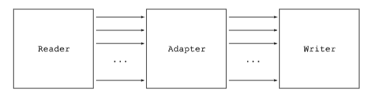
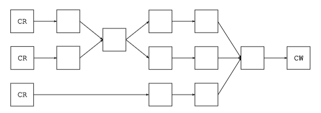

# 结构

编译后的类的整体结构非常简单。实际上，与本地编译的应用程序不同，编译后的类保留了来自源代码的结构信息和几乎所有符号。事实上，编译后的类包含：

* **一个描述类修饰符（例如 public 或 private）、名称、父类、接口和类注解的节**。
* **每个声明在该类中的字段都有一个节**。每个节描述字段的修饰符、名称、类型和注解。
* **每个声明在该类中的方法和构造函数都有一个节**。每个节描述方法的修饰符、名称、返回值和参数类型，以及方法的注解。它还包含方法的编译后的代码，以 Java 字节码指令序列的形式存在。

然而，源代码和编译后的类之间仍然存在一些差异：

* **编译后的类只描述一个类，而源代码文件可以包含多个类**。例如，描述具有一个内部类的类的源代码文件被编译成两个类文件：一个用于主类，一个用于内部类。但是，主类文件包含对其内部类的引用，而定义在方法中的内部类包含对其封装方法的引用。
* 编译后的类当然不包含注释，但它可以包含类、字段、方法和代码**属性**，这些属性可以用来关联这些元素的其他信息。自从 Java 5 中引入了注解，注解可以用来实现相同的目的，属性在很大程度上已经变得没有用处了。 
* 编译后的类不包含包和导入节，因此所有类型名称都必须是完全限定的。

另一个非常重要的结构差异是，编译后的类包含一个常量池节。这个池是一个包含类中出现的所有数字、字符串和类型常量的数组。这些常量只在常量池节中定义一次，并在类文件的其他所有节中通过其索引进行引用。希望 ASM 会隐藏与常量池相关的所有细节，这样你就不用为此而烦恼。
下图总结了编译后的类的整体结构：


<table border="1">
  <thead>
    <tr>
      <th colspan="4">类结构</th>
    </tr>
  </thead>
  <tbody>
    <tr>
      <td colspan="4">修饰符、名称、父类、接口</td>
    </tr>
    <tr>
      <td colspan="4">常量池：数字、字符串和类型常量</td>
    </tr>
    <tr>
      <td colspan="4">源文件名称（可选）</td>
    </tr>
    <tr>
      <td colspan="4">包含类引用</td>
    </tr>
    <tr>
      <td colspan="4">注解*</td>
    </tr>
    <tr>
      <td colspan="4">属性*</td>
    </tr>
    <tr>
      <td>内部类*</td>
      <td>名称</td>
      <td colspan="2"></td>
    </tr>
    <tr>
      <td>字段*</td>
      <td>修饰符、名称、类型</td>
      <td>注解*</td>
      <td>属性*</td>
    </tr>
    <tr>
      <td>方法*</td>
      <td>修饰符、名称、返回值和参数类型</td>
      <td>注解*</td>
      <td>属性*</td>
      <td>编译后的代码</td>
    </tr>
  </tbody>
</table>
注：*代表零个或多个

另一个重要区别是，Java 类型在编译类和源文件类中的表示方式不同。接下来的几节将解释它们在编译类中的表示方式。

## 内部名称

在许多情况下，类型被限制为类或接口类型。例如，类的超类、类实现的接口或方法抛出的异常不能是原始类型或数组类型，而必须是类或接口类型。这些类型在编译后的类中以内部名称表示。类的内部名称就是该类的完全限定名，其中点被斜杠替换。例如，String的内部名称是java/lang/String。

## 类型描述符

内部名称仅用于约束为类或接口类型的类型。在其他所有情况下，Java 类型在编译后的类中以类型描述符的形式表示。

| Java 类型 | 类型描述符 |
|---|---|
| boolean | Z |
| char | C |
| byte | B |
| short | S |
| int | I |
| float | F |
| long | J |
| double | D |
| Object | Ljava/lang/Object; |
| int[] | [I |
| Object[][] | [[Ljava/lang/Object; |


原始类型的描述符是单个字符：Z 表示 boolean，C 表示 char，B 表示 byte，S 表示 short，I 表示 int，F 表示 float，J 表示 long 和 D 表示 double。类类型的描述符是这个类的内部名称，前面加上 L，后面加上分号。例如，String 的类型描述符是 Ljava/lang/String;。最后，数组类型的描述符是一个方括号，后面跟着数组元素类型的描述符。

## 方法描述符

方法描述符是一个类型描述符的列表，它用单个字符串描述了方法参数类型和返回类型。
方法描述符以左括号开头，后面跟着每个形式参数的类型描述符，然后是右括号，最后是返回类型的类型描述符，或者如果方法返回 void 则用 V 表示（方法描述符不包含方法名称或参数名称）。

| 源文件中的方法声明 | 方法描述符 |
|---|---|
| void m(int i, float f) | (IF)V |
| int m(Object o) | (Ljava/lang/Object;)I |
| int[] m(int i, String s) | (ILjava/lang/String;)[I |
| Object m(int[] i) | ([I)Ljava/lang/Object; |

# 接口和组件

ASM 用于生成和转换编译后的类的 API 基于抽象类 ClassVisitor。该类中的每个方法都对应于具有相同名称的类文件结构节。简单节可以通过一个方法调用进行访问，该方法的参数描述了其内容，并返回空。内容长度和复杂度可以任意变化的节，则需要通过一个初始方法调用进行访问，该调用返回一个辅助访问器类。visitAnnotation、visitField 和 visitMethod 方法就是这种情况，它们分别返回 AnnotationVisitor、FieldVisitor 和 MethodVisitor。
相同的原理也递归地应用于这些辅助类。

```java
public abstract class ClassVisitor {
    /**
     * 构造函数 
     * @param api
     */
    public ClassVisitor(int api);

    /**
     * 构造函数
     * @param api
     * @param cv
     */
    public ClassVisitor(int api, ClassVisitor cv);

    /**
     * 用于访问类的版本、访问修饰符、名称、签名、父类名称和接口数组。
     * @param version 版本
     * @param access 访问修饰符
     * @param name 名称
     * @param signature 签名
     * @param superName 父类名称
     * @param interfaces 接口数组
     */
    public void visit(int version, int access, String name,
                      String signature, String superName, String[] interfaces);

    /**
     * 用于访问类的源文件名和调试信息。
     * @param source 源文件名称
     * @param debug 调试信息
     */
    public void visitSource(String source, String debug);

    /**
     * 用于访问外部类信息。
     * @param owner
     * @param name
     * @param desc
     */
    public void visitOuterClass(String owner, String name, String desc);

    /**
     * 用于访问类的注解信息
     * @param desc
     * @param visible
     * @return
     */
    AnnotationVisitor visitAnnotation(String desc, boolean visible);

    /**
     * 用于访问类的属性信息
     * @param attr
     */
    public void visitAttribute(Attribute attr);

    /**
     * 用于访问内部类信息
     * @param name
     * @param outerName
     * @param innerName
     * @param access
     */
    public void visitInnerClass(String name, String outerName,
                                String innerName, int access);

    /**
     * 用于访问类的字段信息
     * @param access
     * @param name
     * @param desc
     * @param signature
     * @param value
     * @return
     */
    public FieldVisitor visitField(int access, String name, String desc,
                                   String signature, Object value);

    /**
     * 用于访问类的方法信息
     * @param access
     * @param name
     * @param desc
     * @param signature
     * @param exceptions
     * @return
     */
    public MethodVisitor visitMethod(int access, String name, String desc,
                                      String signature, String[] exceptions);

    /**
     * 用于在访问结束时调用
     */
    void visitEnd();
}
```
`ClassVisitor` 类的方法必须按照 Javadoc 中指定的以下顺序调用：

```bash
visit 
visitSource? 
visitOuterClass? 
( visitAnnotation | visitAttribute )*
( visitInnerClass | visitField | visitMethod )*
visitEnd
```

ASM 提供了三个基于 `ClassVisitor` API 的核心组件来生成和转换类：
* `ClassReader` 类解析给定的编译后的类（以字节数组形式），并在传递给其 `accept` 方法的 `ClassVisitor` 实例上调用相应的 `visitXxx` 方法。它被视为一个事件生产者。
* `ClassWriter` 类是 `ClassVisitor` 抽象类的子类，它直接以二进制形式构建编译后的类。它产生的输出是一个包含编译后的类的字节数组，可以通过 `toByteArray` 方法检索。它被视为一个事件消费者。
* `ClassVisitor` 类将接收到的所有方法调用委托给另一个 `ClassVisitor` 实例。它被视为一个事件过滤器。

接下来的部分将展示如何使用这些组件来生成和转换类的具体示例。

## 解析类

解析现有类所需的唯一组件是 `ClassReader` 组件。让我们举一个例子来说明这一点。假设我们想以类似于 `javap` 工具的方式打印类的内容。第一步是编写一个 `ClassVisitor` 类的子类，它打印有关它访问的类的信息。下面是一个可能过于简化的实现：

```java
public class ClassPrinter extends ClassVisitor {
    public ClassPrinter() {
        super(ASM4);
    }
    public void visit(int version, int access, String name, String signature, String superName, String[] interfaces) {
        System.out.println(name + " extends " + superName + " {");
    }
    public void visitSource(String source, String debug) {
    }
    public void visitOuterClass(String owner, String name, String desc) {
    }
    public AnnotationVisitor visitAnnotation(String desc, boolean visible) {
        return null;
    }
    public void visitAttribute(Attribute attr) {
    }
    public void visitInnerClass(String name, String outerName, String innerName, int access) {
    }
    public FieldVisitor visitField(int access, String name, String desc, String signature, Object value) {
        System.out.println(" " + desc + " " + name);
        return null;
    }
    public MethodVisitor visitMethod(int access, String name, String desc, String signature, String[] exceptions) {
        System.out.println(" " + name + desc);
        return null;
    }
    public void visitEnd() {
        System.out.println("}");
    }
}
```

第二步是将这个 `ClassPrinter` 与 `ClassReader` 组件结合起来，以便 `ClassReader` 产生的事件被我们的 `ClassPrinter` 消费：

```java
ClassPrinter cp = new ClassPrinter();
ClassReader cr = new ClassReader("java.lang.Runnable");
cr.accept(cp, 0);
```

第二行创建了一个 `ClassReader` 来解析 `Runnable` 类。最后一行调用的 `accept` 方法解析了 `Runnable` 类的字节码，并在 `cp` 上调用了相应的 `ClassVisitor` 方法。结果是以下输出：

```java
java/lang/Runnable extends java/lang/Object {
    run()V
}
```

请注意，有几种方法可以构造一个 `ClassReader` 实例。必须读取的类可以通过名称指定，如上所示，也可以通过值指定，作为字节数组或 `InputStream`。可以通过 `ClassLoader` 的 `getResourceAsStream` 方法获得用于读取类内容的输入流：

```java
cl.getResourceAsStream(classname.replace('.', '/') + ".class");
```

其中 `classname` 是类的全限定名，例如 `"java.lang.Runnable"`。

## 生成类

生成类所需的唯一组件是 `ClassWriter` 组件。让我们举一个例子来说明这一点。考虑以下接口：

```java
package pkg;
public interface Comparable extends Mesurable {
    int LESS = -1;
    int EQUAL = 0;
    int GREATER = 1;
    int compareTo(Object o);
}
```

可以使用对 `ClassVisitor` 的六次方法调用来生成它：

```java
ClassWriter cw = new ClassWriter(0);
cw.visit(V1_5, ACC_PUBLIC + ACC_ABSTRACT + ACC_INTERFACE,
"pkg/Comparable", null, "java/lang/Object",new String[] { "pkg/Mesurable" });
cw.visitField(ACC_PUBLIC + ACC_FINAL + ACC_STATIC, "LESS", "I",null, new Integer(-1)).visitEnd();
cw.visitField(ACC_PUBLIC + ACC_FINAL + ACC_STATIC, "EQUAL", "I",null, new Integer(0)).visitEnd();
cw.visitField(ACC_PUBLIC + ACC_FINAL + ACC_STATIC, "GREATER", "I",null, new Integer(1)).visitEnd();
cw.visitMethod(ACC_PUBLIC + ACC_ABSTRACT, "compareTo","(Ljava/lang/Object;)I", null, null).visitEnd();
cw.visitEnd();
byte[] b = cw.toByteArray();
```

这个字节数组可以存储在 `Comparable.class` 文件中供以后使用。或者，它可以动态地使用 `ClassLoader` 加载。一种方法是定义一个 `ClassLoader` 子类，其 `defineClass` 方法是公共的：

```java
class MyClassLoader extends ClassLoader {
    public Class defineClass(String name, byte[] b) {
        return defineClass(name, b, 0, b.length);
    }
}
```

然后，生成的类可以直接加载为：

```java
Class c = myClassLoader.defineClass("pkg.Comparable", b);
```

另一种加载生成类的方法，可能更清晰，是定义一个 `ClassLoader` 子类，覆盖其 `findClass` 方法以动态生成请求的类：

```java
class StubClassLoader extends ClassLoader {
    @Override
    protected Class findClass(String name) throws ClassNotFoundException {
        if (name.endsWith("_Stub")) {
            ClassWriter cw = new ClassWriter(0);
            ...
            byte[] b = cw.toByteArray();
            return defineClass(name, b, 0, b.length);
        }
        return super.findClass(name);
    }
}
```

实际上，使用你生成的类的方式取决于上下文，超出了 ASM API 的范围。如果你正在编写一个编译器，类生成过程将由表示要编译的程序的抽象语法树驱动，生成的类将被存储在磁盘上。如果你正在编写一个动态代理类生成器或方面编织器，你将以某种方式使用 `ClassLoader`。

## 转换类

到目前为止，`ClassReader` 和 `ClassWriter` 组件是单独使用的。事件是“手动”产生的，并直接由 `ClassWriter` 消费，或者相反，它们由 `ClassReader` 产生，并“手动”消费，即由自定义的 `ClassVisitor` 实现消费。当这些组件一起使用时，事情开始变得非常有趣。第一步是将 `ClassReader` 产生的事件直接导向 `ClassWriter`。结果是，类读取器解析的类由类写入器重新构建：

```java
byte[] b1 = ...;
ClassReader cr = new ClassReader(b1);
ClassWriter cw = new ClassWriter(0);
cr.accept(cw, 0);
byte[] b2 = cw.toByteArray(); // b2 代表与 b1 相同的类
```

通过这种方式，你可以从一个类文件中读取字节码，然后使用 `ClassWriter` 将其重新构建为一个新的类文件。这可以用于类转换、重打包或任何需要处理字节码的场景。



现在，通过覆盖一些方法来过滤一些事件，就可以转换一个类。例如，考虑以下 `ClassVisitor` 子类：

```java
public class ChangeVersionAdapter extends ClassVisitor {
    public ChangeVersionAdapter(ClassVisitor cv) {
        super(ASM4, cv);
    }
    @Override
    public void visit(int version, int access, String name,
                      String signature, String superName, String[] interfaces) {
        cv.visit(V1_5, access, name, signature, superName, interfaces);
    }
}
```

这个类只覆盖了 `ClassVisitor` 类的一个方法。因此，除了对 `visit` 方法的调用（它们以修改后的类版本号转发）之外，所有调用都未更改地转发到传递给构造函数的类访问器 `cv`。


前面的转换只改变了原始类中的四个字节。然而，使用上述代码，`b1` 被完全解析，相应的事件被用来从头开始构建 `b2`，这并不是非常高效。更高效的方法是直接将 `b1` 中未转换的部分复制到 `b2` 中，而不解析这些部分，也不生成相应的事件。ASM 自动为方法执行这种优化：

* 如果一个 `ClassReader` 组件检测到通过其 `accept` 方法传入的 `ClassVisitor` 返回的 `MethodVisitor` 来自 `ClassWriter`，这意味着这个方法的内容将不会被转换，实际上甚至不会被应用程序看到。
* 在这种情况下，`ClassReader` 组件不会解析这个方法的内容，不会生成相应的事件，只是简单地复制这个方法的字节数组表示到 `ClassWriter` 中。

这种优化是由 `ClassReader` 和 `ClassWriter` 组件执行的，如果它们彼此有引用，可以这样设置（由于这种优化，上述代码的速度是之前代码的两倍，但这种优化需要将原始类中定义的所有常量复制到转换后的类中。对于添加字段、方法或指令的转换，这不是问题，但对于删除或重命名许多类元素的转换，与未优化的情况相比，这会导致类文件变大。因此，建议仅对“添加性”转换使用这种优化）：

```java
byte[] b1 = ...
ClassReader cr = new ClassReader(b1);
ClassWriter cw = new ClassWriter(cr, 0);
ChangeVersionAdapter ca = new ChangeVersionAdapter(cw);
cr.accept(ca, 0);
byte[] b2 = cw.toByteArray();
```

转换后的类 `b2` 可以存储在磁盘上，或者像前一节中描述的那样，使用 `ClassLoader` 加载。但是，在 `ClassLoader` 内部进行的类转换只能转换由该类加载器加载的类。如果您想转换所有类，您需要将转换放在 `java.lang.instrument` 包中定义的 `ClassFileTransformer` 内部（有关此包的更多详细信息，请参阅该包的文档）：

```java
public static void premain(String agentArgs, Instrumentation inst) {
    inst.addTransformer(new ClassFileTransformer() {
        public byte[] transform(ClassLoader l, String name, Class c, ProtectionDomain d, byte[] b) throws IllegalClassFormatException {
            ClassReader cr = new ClassReader(b);
            ClassWriter cw = new ClassWriter(cr, 0);
            ClassVisitor cv = new ChangeVersionAdapter(cw);
            cr.accept(cv, 0);
            return cw.toByteArray();
        }
    });
}
```

这段代码定义了一个 `premain` 方法，它使用 `Instrumentation` 对象的 `addTransformer` 方法添加了一个 `ClassFileTransformer`。这个转换器会在类加载时被调用，并可以转换所有加载的类。在 `transform` 方法中，它使用 `ClassReader` 和 `ClassWriter` 来转换类，并返回转换后的字节码。

## 删除类成员

上一节中用于转换类版本的方法当然可以应用于 `ClassVisitor` 类的其他方法。例如，通过更改 `visitField` 和 `visitMethod` 方法中的访问或名称参数，您可以更改字段或方法的修饰符或名称。此外，您可以选择不转发带有修改参数的方法调用。效果是相应的类元素被移除。
例如，以下类适配器从类中移除了有关外部类和内部类的信息，以及编译类所用的源文件名称（生成的类仍然完全功能，因为这些元素仅用于调试目的）。这是通过在适当的访问方法中不转发任何内容来完成的：

```java
public class RemoveDebugAdapter extends ClassVisitor {
    public RemoveDebugAdapter(ClassVisitor cv) {
        super(ASM4, cv);
    }
    @Override
    public void visitSource(String source, String debug) {
    }
    @Override
    public void visitOuterClass(String owner, String name, String desc) {
    }
    @Override
    public void visitInnerClass(String name, String outerName, String innerName, int access) {
    }
}
```

在这个适配器中，`visitSource`、`visitOuterClass` 和 `visitInnerClass` 方法都被覆盖，并且没有实现任何操作。这意味着在转换过程中，这些类元素的信息不会被包含在生成的类文件中。

这种策略对字段和方法不适用，因为 `visitField` 和 `visitMethod` 方法必须返回一个结果。为了删除一个字段或方法，您不得转发方法调用，并返回 `null` 给调用者。例如，以下类适配器通过名称和描述符（名称不足以识别一个方法，因为一个类可以包含多个具有相同名称但参数不同的方法）删除一个方法：

```java
public class RemoveMethodAdapter extends ClassVisitor {
    private String mName;
    private String mDesc;
    
    public RemoveMethodAdapter(ClassVisitor cv, String mName, String mDesc) {
        super(ASM4, cv);
        this.mName = mName;
        this.mDesc = mDesc;
    }
    
    @Override
    public MethodVisitor visitMethod(int access, String name, String desc, String signature, String[] exceptions) {
        if (name.equals(mName) && desc.equals(mDesc)) {
            // do not delegate to next visitor -> this removes the method
            return null;
        }
        return cv.visitMethod(access, name, desc, signature, exceptions);
    }
}
```

在这个适配器中，`visitMethod` 方法被覆盖，并在检测到要删除的方法时返回 `null`。这样，指定的方法就不会被包含在生成的类文件中。

## 添加类成员

您可以通过“转发”更多的调用而不是转发较少的调用来添加类元素。只要遵守各种 `visitXxx` 方法必须调用的顺序，新的调用可以在原始方法调用之间的几个地方插入。
例如，如果您想向类中添加一个字段，您必须在原始方法调用之间插入一个新的 `visitField` 调用，并且您必须将这个新调用放在您的类适配器的 `visit` 方法之一中。您不能在 `visit` 方法中这样做，例如，因为这可能导致调用 `visitField` 后跟 `visitSource`、`visitOuterClass`、`visitAnnotation` 或 `visitAttribute`，这是无效的。出于同样的原因，您不能将这个新调用放在 `visitSource`、`visitOuterClass`、`visitAnnotation` 或 `visitAttribute` 方法中。唯一的选择是 `visitInnerClass`、`visitField`、`visitMethod` 或 `visitEnd` 方法。
如果您将新调用放在 `visitEnd` 方法中，字段将始终被添加（除非您添加显式条件），因为这个方法始终被调用。如果您将其放在 `visitField` 或 `visitMethod` 中，将添加多个字段：每个原始类中的字段或方法一个。这两种解决方案都有意义；这取决于您的需求。例如，您可以添加一个计数器字段来计算对象上的调用次数，或者每个方法一个计数器，以分别计算每个方法的调用次数。

>注意：实际上，唯一真正正确的解决方案是通过在 `visitEnd` 方法中添加额外的调用来添加新成员。确实，一个类不应包含重复的成员，而确保新成员不是重复的唯一方法是将它们与所有现有成员进行比较，这只能在所有成员都已被访问之后进行，即 `visitEnd` 方法中。
这种方法相当受限。在实践中，使用不太可能被程序员使用的生成名称，如 `_counter$` 或 `_4B7F_`，足以避免重复成员，而无需在 `visitEnd` 中添加它们。请注意，正如第一章中讨论的，树 API 没有这个限制：可以使用这个 API 在转换过程中的任何时间添加新成员。

为了说明上述讨论，这里是一个类适配器，它向类中添加一个字段，除非该字段已经存在：

```java
public class AddFieldAdapter extends ClassVisitor {
    private int fAcc;
    private String fName;
    private String fDesc;
    private boolean isFieldPresent;
    
    public AddFieldAdapter(ClassVisitor cv, int fAcc, String fName, String fDesc) {
        super(ASM4, cv);
        this.fAcc = fAcc;
        this.fName = fName;
        this.fDesc = fDesc;
    }
    
    @Override
    public FieldVisitor visitField(int access, String name, String desc, String signature, Object value) {
        if (name.equals(fName)) {
            isFieldPresent = true;
        }
        return cv.visitField(access, name, desc, signature, value);
    }
    
    @Override
    public void visitEnd() {
        if (!isFieldPresent) {
            FieldVisitor fv = cv.visitField(fAcc, fName, fDesc, null, null);
            if (fv != null) {
                fv.visitEnd();
            }
        }
        cv.visitEnd();
    }
}
```

在这个适配器中，`visitField` 方法被覆盖，以检查是否存在具有指定名称的字段。如果存在，`isFieldPresent` 被设置为 `true`。在 `visitEnd` 方法中，如果 `isFieldPresent` 为 `false`，则表示字段不存在，适配器会添加一个新的字段。然后，`visitEnd` 方法调用 `cv.visitEnd()` 来结束类的访问。

## 转换链

到目前为止，我们已经看到了由 `ClassReader`、类适配器和 `ClassWriter` 组成的简单转换链。当然，可以使用更复杂的链，将多个类适配器链接在一起。链接多个适配器允许您组合多个独立的类转换，以执行复杂的转换。请注意，转换链不一定是线性的。您可以编写一个 `ClassVisitor`，将所有接收到的调用同时转发给多个 `ClassVisitor`：

```java
public class MultiClassAdapter extends ClassVisitor {
    protected ClassVisitor[] cvs;
    
    public MultiClassAdapter(ClassVisitor[] cvs) {
        super(ASM4);
        this.cvs = cvs;
    }
    
    @Override
    public void visit(int version, int access, String name, String signature, String superName, String[] interfaces) {
        for (ClassVisitor cv : cvs) {
            cv.visit(version, access, name, signature, superName, interfaces);
        }
    }
    ...
}
```

同样，多个类适配器可以委托给同一个 `ClassVisitor`（这需要一些预防措施，例如确保在这个 `ClassVisitor` 上调用 `visit` 和 `visitEnd` 方法正好一次）。因此，下图所示的转换链是完全可能的：



# 工具

除了 `ClassVisitor` 类及其相关的 `ClassReader` 和 `ClassWriter` 组件外，ASM 还在 `org.objectweb.asm.util` 包中提供了一些工具，这些工具在开发类生成器或适配器时可能很有用，但在运行时并不需要。ASM 还提供了一个实用类，用于在运行时操作内部名称、类型描述符和方法描述符。所有这些工具将在下面介绍。

## Type

如您在前面的章节中所见，ASM API 以编译类中存储的 Java 类型形式暴露它们，即作为内部名称或类型描述符。可以将它们以源代码中出现的样式暴露，以提高代码的可读性。但这需要在 `ClassReader` 和 `ClassWriter` 中系统地在这两种表示之间进行转换，这会降低性能。这就是为什么 ASM 不会透明地将内部名称和类型描述符转换为它们等效的源代码形式。但是，当需要时，它提供了 `Type` 类来手动进行这种转换。
`Type` 对象表示一个 Java 类型，可以由类型描述符或 `Class` 对象构造。`Type` 类还包含表示原始类型的静态变量。例如，`Type.INT_TYPE` 是表示 `int` 类型的 `Type` 对象。

`getInternalName` 方法返回 `Type` 的内部名称。例如，`Type.getType(String.class).getInternalName()` 给出 `String` 类的内部名称，即 `"java/lang/String"`。此方法必须仅用于类或接口类型。

`getDescriptor` 方法返回 `Type` 的描述符。因此，例如，在您的代码中，您可以使用 `Type.getType(String.class).getDescriptor()` 而不是 `"Ljava/lang/String;"`。或者，您可以使用 `Type.INT_TYPE.getDescriptor()` 而不是 `I`。

`Type` 对象还可以表示方法类型。这样的对象可以从方法描述符或 `Method` 对象构建。`getDescriptor` 方法然后返回与该类型相对应的方法描述符。此外，`getArgumentTypes` 和 `getReturnType` 方法可以用来获取与参数类型和返回类型相对应的 `Type` 对象。
例如，`Type.getArgumentTypes("(I)V")` 返回一个包含单个元素 `Type.INT_TYPE` 的数组。同样，调用 `Type.getReturnType("(I)V")` 返回 `Type.VOID_TYPE` 对象。

## TraceClassVisitor

为了检查生成的或转换的类是否符合您的预期，`ClassWriter` 返回的字节数组实际上并不太有帮助，因为人类无法阅读。文本表示将更容易使用。这就是 `TraceClassVisitor` 类提供的功能。这个类，如其名称所暗示的，扩展了 `ClassVisitor` 类，并构建了访问的类的文本表示。因此，您可以使用 `TraceClassVisitor` 而不是 `ClassWriter` 来生成类，以便获得实际生成的类的可读跟踪。或者，更好的是，您可以同时使用两者。实际上，`TraceClassVisitor` 除了其默认行为之外，还可以将其接收到的所有调用委托给另一个访问器，例如 `ClassWriter`：

```java
ClassWriter cw = new ClassWriter(0);
TraceClassVisitor cv = new TraceClassVisitor(cw, printWriter);
cv.visit(...);
...
cv.visitEnd();
byte b[] = cw.toByteArray();
```

这段代码创建了一个 `TraceClassVisitor`，它将所有接收到的调用委托给 `cw`，并将这些调用的文本表示打印到 `printWriter`。 通过这种方式，您可以同时获得类的字节码表示和文本表示，从而更容易地检查和调试类转换过程。

请注意，您可以在生成或转换链的任何位置使用 `TraceClassVisitor`，而不仅仅是 `ClassWriter` 之前，以便查看链中此点的操作情况。另外，请注意，此适配器生成的类的文本表示可以用于使用 `String.equals()` 容易地比较类。

## CheckClassAdapter

`ClassWriter` 类不会检查其方法是否以适当的顺序和有效的参数被调用。因此，可能生成会被 Java 虚拟机验证器拒绝的无效类。为了尽快检测这些错误，可以使用 `CheckClassAdapter` 类。与 `TraceClassVisitor` 类似，这个类扩展了 `ClassVisitor` 类，并将其所有方法调用委托给另一个 `ClassVisitor`，例如 `TraceClassVisitor` 或 `ClassWriter`。然而，这个类不是打印访问的类的文本表示，而是在委托给下一个访问器之前，检查其方法是否以适当的顺序和有效的参数被调用。如果出现错误，将抛出 `IllegalStateException` 或 `IllegalArgumentException`。
为了检查一个类，打印这个类的文本表示，并最终创建字节数组表示，您应该使用类似以下代码：

```java
ClassWriter cw = new ClassWriter(0);
TraceClassVisitor tcv = new TraceClassVisitor(cw, printWriter);
CheckClassAdapter cv = new CheckClassAdapter(tcv);
cv.visit(...);
...
cv.visitEnd();
byte b[] = cw.toByteArray();
```

请注意，如果您以不同的顺序链接这些类访问器，它们执行的操作也将以不同的顺序进行。例如，使用以下代码，检查将在跟踪之后进行：

```java
ClassWriter cw = new ClassWriter(0);
CheckClassAdapter cca = new CheckClassAdapter(cw);
TraceClassVisitor cv = new TraceClassVisitor(cca, printWriter);
```

与 `TraceClassVisitor` 类似，您可以在生成或转换链的任何位置使用 `CheckClassAdapter`，而不仅仅是 `ClassWriter` 之前，以便在此链中的此点检查类。

## ASMifier

这个类为 `TraceClassVisitor` 工具提供了一个替代的后端（该工具默认使用 `Textifier` 后端，生成类似上述输出的类型）。这个后端使 `TraceClassVisitor` 类的每个方法打印出调用它的 Java 代码。例如，调用 `visitEnd()` 方法将打印 `cv.visitEnd();`。结果是，当带有 `ASMifier` 后端的 `TraceClassVisitor` 访问器访问一个类时，它将打印用 ASM 生成此类的源代码。如果您使用此访问器访问已存在的类，这将很有用。例如，如果您不知道如何使用 ASM 生成某些编译后的类，可以编写相应的源代码，使用 `javac` 编译它，并使用 `ASMifier` 访问编译后的类。您将获得生成此编译后类的 ASM 代码！
`ASMifier` 类可以从命令行使用。例如，使用：

```java
java -classpath asm.jar:asm-util.jar org.objectweb.asm.util.ASMifier java.lang.Runnable
```

生成的代码，在缩进后，如下所示：

```java
package asm.java.lang;
import org.objectweb.asm.*;
public class RunnableDump implements Opcodes {
    public static byte[] dump() throws Exception {
        ClassWriter cw = new ClassWriter(0);
        FieldVisitor fv;
        MethodVisitor mv;
        AnnotationVisitor av0;
        cw.visit(V1_5, ACC_PUBLIC + ACC_ABSTRACT + ACC_INTERFACE, "java/lang/Runnable", null, "java/lang/Object", null);
        {
            mv = cw.visitMethod(ACC_PUBLIC + ACC_ABSTRACT, "run", "()V", null, null);
            mv.visitEnd();
        }
        cw.visitEnd();
        return cw.toByteArray();
    }
}
```

这段代码展示了如何使用 `ASMifier` 来生成一个编译后的类的 ASM 代码。这对于学习和理解如何使用 ASM 来生成类代码非常有用。


