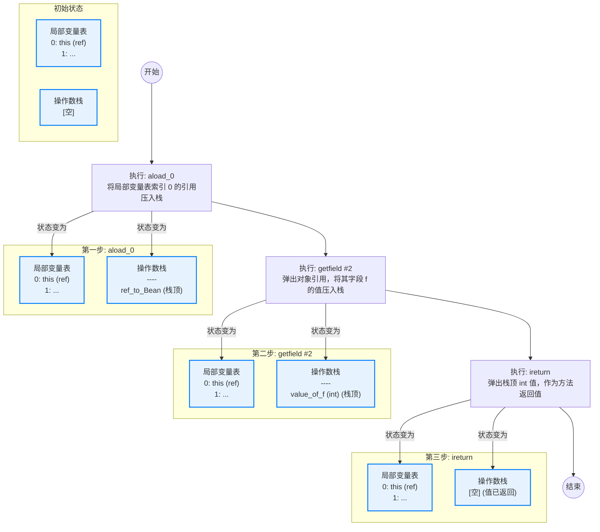
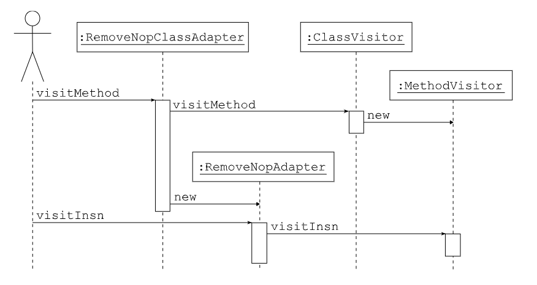
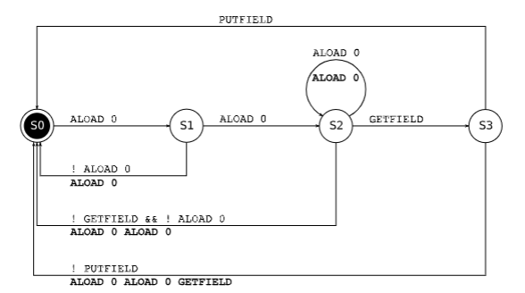

# 结构

在编译后的类中，方法的代码以字节码指令序列的形式存储。为了生成和转换类，了解这些指令以及它们的工作原理是至关重要的。本节提供了这些指令的概述，这应该足以开始编写简单的类生成器和转换器。若要获得完整的定义，您应该阅读Java虚拟机规范。

## 执行模型

在介绍字节码指令之前，有必要先介绍 Java 虚拟机执行模型。正如您所知，Java 代码是在线程中执行的。每个线程都有自己的执行栈，它由帧组成。每个帧代表一个方法调用：每次调用方法时，都会在当前线程的执行栈上推入一个新的帧。当方法返回，无论是正常返回还是由于异常返回时，这个帧就会从执行栈中弹出，执行继续在调用方法（其帧现在位于栈顶）中。
每个帧包含两部分：局部变量部分和操作数栈部分。局部变量部分包含可以通过索引访问的变量，这些变量可以无序访问。操作数栈部分，正如其名称所暗示的，是一个值栈，这些值被字节码指令用作操作数。这意味着这个栈中的值只能以后进先出的顺序访问。不要将操作数栈与线程的执行栈混淆：执行栈中的每个帧都包含自己的操作数栈。

局部变量部分和操作数栈部分的大小取决于方法的代码。它在编译时计算，并与字节码指令一起存储在编译后的类中。因此，对应于给定方法调用的所有帧具有相同的大小，但对应于不同方法的帧的局部变量部分和操作数栈部分的大小可能不同。

## 字节码指令

字节码指令由一个操作码（opcode）和一个固定数量的参数组成：
* 操作码是一个无符号字节值，因此称为字节码，并通过一个助记符符号来标识。例如，操作码值 0 由助记符符号 NOP 标识，对应于不执行任何操作的指令。
* 参数是定义精确指令行为的静态值。它们紧跟在操作码之后。例如，GOTO label 指令的操作码值是 167，它接受一个参数 label，这个标签指定了要执行的下一条指令。指令参数不应与指令操作数混淆：参数值是静态已知的，并存储在编译代码中，而操作数值来自操作数栈，并且仅在运行时已知。

字节码指令可以分为两类：一小部分指令用于在局部变量和操作数栈之间传输值；其他指令仅作用于操作数栈：它们从栈中弹出一些值，基于这些值计算结果，并将结果推回栈中。

ILOAD、LLOAD、FLOAD、DLOAD 和 ALOAD 指令读取一个局部变量并将其值推送到操作数栈。它们接受一个参数 i，表示要读取的局部变量的索引。ILOAD 用于加载布尔值、字节、字符、短整数或整数类型的局部变量。LLOAD、FLOAD 和 DLOAD 分别用于加载长整数、浮点数或双精度浮点数值（LLOAD 和 DLOAD 实际上加载两个槽位 i 和 i + 1）。最后，ALOAD 用于加载任何非原始值，即对象和数组引用。对称地，ISTORE、LSTORE、FSTORE、DSTORE 和 ASTORE 指令从操作数栈中弹出一个值并将其存储在由索引 i 指定的局部变量中。

正如您所看到的，`xLOAD` 和 `xSTORE` 指令是有类型的（实际上，正如您将在下面看到的，几乎所有的指令都是有类型的）。这是为了确保不会发生非法转换。确实，将一个值存储在局部变量中，然后以不同的类型加载它是非法的。例如，`ISTORE 1 ALOAD 1` 序列是非法的——它将允许将任意的内存地址存储在局部变量 1 中，并将此地址转换为对象引用！然而，在局部变量中存储一个类型与当前存储在此局部变量中的值的类型不同的值是完全合法的。这意味着局部变量的类型，即存储在此局部变量中的值的类型，可以在方法执行期间发生变化。

正如上面所说，所有其他字节码指令仅在工作在操作数栈上。它们可以被分组为以下类别：
* **栈操作**：这些指令用于操作栈上的值：`POP` 弹出栈顶的值，`DUP` 推送栈顶值的副本，`SWAP` 弹出两个值并以相反的顺序推送它们，等等。
* **常量**：这些指令将常量值推送到操作数栈上：`ACONST_NULL` 推送 `null`，`ICONST_0` 推送整数值 0，`FCONST_0` 推送 0f，`DCONST_0` 推送 0d，`BIPUSH b` 推送字节值 b，`SIPUSH s` 推送短整数值 s，`LDC cst` 推送任意的整数值、浮点数、长整数、双精度浮点数、字符串或类常量 cst，等等。
* **算术和逻辑**：这些指令从操作数栈中弹出数值，将它们组合，并将结果推回栈上。它们没有参数。`xADD`、`xSUB`、`xMUL`、`xDIV` 和 `xREM` 对应于 `+`、`-`、`*`、`/` 和 `%` 操作，其中 x 是 I、L、F 或 D。类似地，还有其他指令对应于 `<`、`>`、`>>`、`|`、`&` 和 `^`，用于整数值和长整数值。
* **类型转换**：这些指令从栈中弹出值，将其转换为另一种类型，并将结果推回。它们对应于 Java 中的类型转换表达式。`I2F`、`F2D`、`L2D` 等将数值从一种数值类型转换为另一种数值类型。`CHECKCAST t` 将引用值转换为类型 t。
* **对象操作**：这些指令用于创建对象、锁定它们、测试它们的类型，等等。例如，`NEW type` 指令将一个类型为 type 的新对象推送到栈上（其中 type 是一个内部名称）。
* **字段操作**：这些指令读取或写入字段的值。`GETFIELD owner name desc` 弹出一个对象引用，并推送其 name 字段的值。`PUTFIELD owner name desc` 弹出一个值和一个对象引用，并将此值存储在其 name 字段中。在这两种情况下，对象必须是类型 owner，其字段必须是类型 desc。`GETSTATIC` 和 `PUTSTATIC` 是类似的指令，但用于静态字段。
* **方法操作**：这些指令用于调用方法或构造函数。它们弹出与方法的参数数量相同的值，加上一个目标对象的值，并将方法调用的结果推回栈上。`INVOKEVIRTUAL` 指令对应于 Java 语法中的 `identifier.class`。例如，`owner name desc` 调用类 `owner` 中定义的 `name` 方法，其方法描述符为 `desc`。`INVOKESTATIC` 用于静态方法，`INVOKESPECIAL` 用于私有方法和构造函数，`INVOKEINTERFACE` 用于接口中定义的方法。最后，对于 Java 7 类，`INVOKEDYNAMIC` 用于新的动态方法调用机制。
* **数组操作**：这些指令用于读取和写入数组中的值。`xALOAD` 指令弹出索引和数组，并推送数组中该索引处的值。`xASTORE` 指令弹出值、索引和数组，并将该值存储在数组中的该索引处。这里的 x 可以是 I、L、F、D 或 A，也可以是 B、C 或 S。
* **跳转操作**：这些指令根据某些条件是否为真，或者无条件地跳转到任意指令。它们用于编译 `if`、`for`、`do`、`while`、`break` 和 `continue` 指令。例如，`IFEQ label` 从栈中弹出整数值，如果该值为 0，则跳转到由标签指定的指令（否则执行继续正常进行到下一条指令）。还有许多其他跳转指令，例如 `IFNE` 或 `IFGE`。最后，`TABLESWITCH` 和 `LOOKUPSWITCH` 对应于 Java 中的 `switch` 指令。
* **返回**：这些指令用于终止方法的执行，并将结果返回给调用者。`RETURN` 用于返回 `void` 的方法，`xRETURN` 用于其他方法。

让我们通过一些基本示例来更具体地了解字节码指令是如何工作的。考虑以下 Bean 类：

```java
package pkg;
public class Bean {
    private int f;
    
    public int getF() {
        return this.f;
    }
    
    public void setF(int f) {
        this.f = f;
    }
}
```

获取器方法的字节码如下：

```bash
ALOAD 0
GETFIELD pkg/Bean f I
IRETURN
```

第一条指令读取局部变量 0，该变量在创建此方法调用的帧时被初始化为 `this`，并将该值推送到操作数栈上。第二条指令从栈中弹出这个值，即 `this`，并推送此对象的 `f` 字段，即 `this.f`。最后一条指令从栈中弹出这个值，并将其返回给调用者。此方法的执行帧的连续状态如下图所示：



设置器方法的字节码如下：

```java
ALOAD 0
ILOAD 1
PUTFIELD pkg/Bean f I
RETURN
```
第一条指令与之前一样，将 `this` 推送到操作数栈上。第二条指令推送局部变量 1，该变量在创建此方法调用的帧时被初始化为 `f` 参数值。第三条指令弹出这两个值，并将整数值存储在引用对象的 `f` 字段中，即 `this.f`。最后一条指令在源代码中是隐式的，但在编译代码中是强制性的，它销毁当前的执行帧并返回给调用者。此方法的执行帧的连续状态如下图所示：


Bean 类还有一个默认的公共构造函数，由编译器生成，因为程序员没有定义显式的构造函数。这个默认的公共构造函数生成如下：`Bean() { super(); }`。此构造函数的字节码如下：
```java
ALOAD 0
INVOKESPECIAL java/lang/Object <init> ()V
RETURN
```
第一条指令将 `this` 推送到操作数栈上。第二条指令调用 `java/lang/Object` 类的 `<init>` 方法，即默认构造函数，并将 `this` 作为参数传递。最后一条指令销毁当前的执行帧并返回给调用者。

现在让我们考虑一个稍微复杂一点的setter方法：

```java
public void checkAndSetF(int f) {
    if (f >= 0) {
        this.f = f;
    } else {
        throw new IllegalArgumentException();
    }
}
```

这个新设置方法的字节码如下：

```java
ILOAD 1
IFLT label
ALOAD 0
ILOAD 1
PUTFIELD pkg/Bean f I
GOTO end
label:
NEW java/lang/IllegalArgumentException
DUP
INVOKESPECIAL java/lang/IllegalArgumentException <init> ()V
ATHROW
end:
RETURN
```
第一条指令将局部变量 1，初始化为 `f`，推送到操作数栈上。`IFLT` 指令从栈中弹出这个值，并将其与 0 进行比较。如果它小于（LT）0，则跳转到由标签 `label` 指定的指令，否则不执行任何操作，执行继续到下一条指令。接下来的三条指令与 `setF` 方法中的指令相同。`GOTO` 指令无条件地跳转到由 `end` 标签指定的指令，即 `RETURN` 指令。标签 `label` 和 `end` 标签之间的指令创建并抛出异常：`NEW` 指令创建一个异常对象并将其推送到操作数栈上。`DUP` 指令在栈上复制这个值。`INVOKESPECIAL` 指令弹出这两个副本中的一个，并在其上调用异常构造函数。最后，`ATHROW` 指令弹出剩余的副本并将其作为异常抛出（因此执行不会继续到下一条指令）。

## 异常处理

没有用于捕获异常的字节码指令：相反，方法的字节码与一组异常处理器相关联，这些处理器指定了在方法特定部分抛出异常时必须执行的代码。异常处理器类似于 `try catch` 块：它有一个范围，这是一个与 `try` 块内容相对应的指令序列，以及一个处理器，对应于 `catch` 块的内容。范围由起始和结束标签指定，处理器由一个起始标签指定。例如，下面的源代码：

```java
public static void sleep(long d) {
    try {
        Thread.sleep(d);
    } catch (InterruptedException e) {
        e.printStackTrace();
    }
}
```

被编译为：

```bash
TRYCATCHBLOCK try catch catch java/lang/InterruptedException
try:
    LLOAD 0
    INVOKESTATIC java/lang/Thread sleep (J)V
    RETURN
catch:
    INVOKEVIRTUAL java/lang/InterruptedException printStackTrace ()V
    RETURN
```

在 `try` 和 `catch` 标签之间的代码对应于 `try` 块，而 `catch` 标签之后的代码对应于 `catch` 块。`TRYCATCHBLOCK` 行指定了一个异常处理器，它覆盖了 `try` 和 `catch` 标签之间的范围，处理器的起始位置在 `catch` 标签处，并且适用于 `InterruptedException` 类或其子类的异常。这意味着如果在 `try` 和 `catch` 之间抛出了这样的异常，栈将被清空，异常将被推送到这个空栈上，并且执行将在 `catch` 处继续。

## 栈映射帧

使用 Java 6 或更高版本编译的类除了字节码指令外，还包含一组堆栈映射帧，这些帧用于加速 Java 虚拟机内部的类验证过程。堆栈映射帧给出了方法在执行过程中的某个点的执行帧状态。更精确地说，它给出了在执行特定字节码指令之前，每个局部变量槽位和每个操作数栈槽位中包含的值的类型。
例如，如果我们考虑上一节的 `getF` 方法，我们可以定义三个堆栈映射帧，分别给出在执行 `ALOAD`、`GETFIELD` 和 `IRETURN` 之前的执行帧状态。可以描述如下，其中第一个方括号中的类型对应于局部变量，其他类型对应于操作数栈：

```bash
执行帧状态（执行前）              指令
[pkg/Bean] []                 ALOAD 0
[pkg/Bean] [pkg/Bean]         GETFIELD
[pkg/Bean] [I]                IRETURN
```

为了节省空间，编译后的方法并不包含每个指令的帧：实际上，它只包含对应于跳转目标或异常处理器的指令的帧，或者跟在无条件跳转指令之后的指令的帧。确实，其他帧可以从这些帧中轻松快速地推断出来。

# 接口和组件

ASM 用于生成和转换编译后的方法的 API 基于抽象类 `MethodVisitor`，该类由 `ClassVisitor` 的 `visitMethod` 方法返回。除了下一章中解释的与注解和调试信息相关的一些方法外，这个类还定义了每个字节码指令类别的一个方法，基于这些指令的参数数量和类型。

```java
import org.objectweb.asm.AnnotationVisitor;
import org.objectweb.asm.Attribute;
import org.objectweb.asm.Handle;
import org.objectweb.asm.Label;
/**
 * 一个访问（或生成）已编译方法的抽象类。
 * <p>
 * 此类的实例由 {@link org.objectweb.asm.ClassVisitor#visitMethod} 方法生成。
 * 每个方法对应一个 {@code MethodVisitor} 实例。当 {@link ClassVisitor} 完成对方法的访问后，
 * 必须调用 {@link #visitEnd} 方法。方法中各个部分的访问必须遵循严格的顺序，
 * 该顺序在 {@link #visitCode} 方法的文档中有详细说明。
 * <p>
 * {@code MethodVisitor} 可以被链接。当构造函数中传入一个非 {@code null} 的 {@code MethodVisitor} 参数时，
 * 当前 {@code MethodVisitor} 实例会将所有调用委托给该参数。这通常用于在修改字节码的同时，
 * 将修改后的字节码传递给下一个处理器（例如 {@link org.objectweb.asm.ClassWriter}）。
 */
public abstract class MethodVisitor {
    /**
     * 构造一个新的 {@link MethodVisitor}。
     *
     * @param api ASM API 版本。必须是 {@link org.objectweb.asm.Opcodes} 中定义的常量之一，例如 {@link org.objectweb.asm.Opcodes#ASM9}。
     */
    public MethodVisitor(int api) {
    }
    /**
     * 构造一个新的 {@link MethodVisitor}。
     *
     * @param api ASM API 版本。必须是 {@link org.objectweb.asm.Opcodes} 中定义的常量之一。
     * @param mv  要将此访问器的调用委托给的 {@link MethodVisitor}。可以为 {@code null}。
     */
    public MethodVisitor(int api, MethodVisitor mv) {
    }
    // -------------------------------------------------------------------------
    // 访问方法属性（非代码部分）
    // -------------------------------------------------------------------------
    /**
     * 访问方法的默认注解值。
     * <p>
     * 此方法必须首先被调用（在 {@link #visitAnnotation} 之前）。
     *
     * @return 一个用于访问注解默认值的 {@link AnnotationVisitor}，如果此方法没有默认注解值，则返回 {@code null}。
     */
    public AnnotationVisitor visitAnnotationDefault() {
        return null;
    }
    /**
     * 访问方法上的一个注解。
     *
     * @param desc    注解的类描述符（例如 {@code "Ljava/lang/Override;"}）。
     * @param visible {@code true} 如果注解在运行时可见（通过反射可见），否则为 {@code false}。
     * @return 一个用于访问注解值的 {@link AnnotationVisitor}，如果此访问器只对注解的存在感兴趣，则返回 {@code null}。
     */
    public AnnotationVisitor visitAnnotation(String desc, boolean visible) {
        return null;
    }
    /**
     * 访问方法参数上的一个注解。
     *
     * @param parameter 参数的索引（0 代表第一个参数）。
     * @param desc      注解的类描述符。
     * @param visible   {@code true} 如果注解在运行时可见，否则为 {@code false}。
     * @return 一个用于访问注解值的 {@link AnnotationVisitor}，如果此访问器只对注解的存在感兴趣，则返回 {@code null}。
     */
    public AnnotationVisitor visitParameterAnnotation(int parameter, String desc, boolean visible) {
        return null;
    }
    /**
     * 访问方法的一个非标准属性。
     *
     * @param attr 一个非标准属性。
     */
    public void visitAttribute(Attribute attr) {
    }
    // -------------------------------------------------------------------------
    // 访问方法体（代码部分）
    // -------------------------------------------------------------------------
    /**
     * 开始访问方法的代码。
     * <p>
     * 此方法用于将方法属性与方法的代码分开。它必须在 {@link #visitAttribute} 之后，
     * 以及任何其他访问方法代码的 {@code visit*} 方法之前被调用。
     * <p>
     * <b>调用顺序:</b>
     * <ol>
     *   <li>可选地调用一次或多次 {@link #visitAnnotationDefault}。</li>
     *   <li>零次或多次调用 {@link #visitAnnotation}。</li>
     *   <li>零次或多次调用 {@link #visitParameterAnnotation}。</li>
     *   <li>零次或多次调用 {@link #visitAttribute}。</li>
     *   <li><b>调用一次 {@link #visitCode}。</b></li>
     *   <li>零次或多次调用 {@link #visitFrame}、{@link #visit*Insn} 和 {@link #visitLabel}，
     *       以访问方法体的字节码指令。</li>
     *   <li>零次或多次调用 {@link #visitTryCatchBlock}。</li>
     *   <li>零次或多次调用 {@link #visitLocalVariable} 和 {@link #visitLineNumber}。</li>
     *   <li>调用一次 {@link #visitMaxs}。</li>
     *   <li><b>调用一次 {@link #visitEnd}。</b></li>
     * </ol>
     */
    public void visitCode() {
    }
    /**
     * 访问一个栈映射帧。
     * <p>
     * 栈映射帧用于在方法执行的不同点验证局部变量表和操作数栈的类型。
     * 当 {@link org.objectweb.asm.ClassWriter#COMPUTE_FRAMES} 选项被使用时，此方法可以被忽略。
     *
     * @param type   帧的类型。可以是 {@link org.objectweb.asm.Opcodes#F_NEW},
     *               {@link org.objectweb.asm.Opcodes#F_FULL}, {@link org.objectweb.asm.Opcodes#F_APPEND},
     *               {@link org.objectweb.asm.Opcodes#F_CHOP}, {@link org.objectweb.asm.Opcodes#F_SAME} 或 {@link org.objectweb.asm.Opcodes#F_APPEND}。
     * @param nLocal 局部变量数组的长度。
     * @param local  局部变量的类型。类型可以是 {@link org.objectweb.asm.Opcodes#TOP},
     *               {@link org.objectweb.asm.Opcodes#INTEGER}, {@link org.objectweb.asm.Opcodes#FLOAT},
     *               {@link org.objectweb.asm.Opcodes#LONG}, {@link org.objectweb.asm.Opcodes#DOUBLE},
     *               {@link org.objectweb.asm.Opcodes#NULL}, {@link org.objectweb.asm.Opcodes#UNINITIALIZED_THIS}
     *               或内部名称（对于对象）。
     * @param nStack 操作数栈数组的长度。
     * @param stack  操作数栈的类型。类型约定与 {@code local} 相同。
     */
    public void visitFrame(int type, int nLocal, Object[] local, int nStack, Object[] stack) {
    }
    /**
     * 访问一个零操作数指令。
     *
     * @param opcode 要访问的指令的操作码。必须是 {@link org.objectweb.asm.Opcodes} 中定义的零操作数指令之一。
     *               例如 {@link org.objectweb.asm.Opcodes#ICONST_0}, {@link org.objectweb.asm.Opcodes#IRETURN},
     *               {@link org.objectweb.asm.Opcodes#FADD}, {@link org.objectweb.asm.Opcodes#ARRAYLENGTH}。
     */
    public void visitInsn(int opcode) {
    }
    /**
     * 访问一个带有一个 {@code int} 操作数的指令。
     *
     * @param opcode  要访问的指令的操作码。必须是 {@link org.objectweb.asm.Opcodes} 中定义的 {@code int} 操作数指令之一。
     *                例如 {@link org.objectweb.asm.Opcodes#BIPUSH}, {@link org.objectweb.asm.Opcodes#SIPUSH},
     *                {@link org.objectweb.asm.Opcodes#NEWARRAY}。
     * @param operand 指令的操作数。
     */
    public void visitIntInsn(int opcode, int operand) {
    }
    /**
     * 访问一个局部变量指令。
     * <p>
     * 局部变量指令用于加载或存储局部变量。
     *
     * @param opcode 要访问的指令的操作码。必须是 {@link org.objectweb.asm.Opcodes} 中定义的局部变量指令之一。
     *               例如 {@link org.objectweb.asm.Opcodes#ILOAD}, {@link org.objectweb.asm.Opcodes#ISTORE},
     *               {@link org.objectweb.asm.Opcodes#RET}。
     * @param var    局部变量的索引。
     */
    public void visitVarInsn(int opcode, int var) {
    }
    /**
     * 访问一个类型指令。
     * <p>
     * 类型指令接受一个内部类名作为参数。
     *
     * @param opcode 要访问的指令的操作码。必须是 {@link org.objectweb.asm.Opcodes} 中定义的类型指令之一。
     *               例如 {@link org.objectweb.asm.Opcodes#NEW}, {@link org.objectweb.asm.Opcodes#ANEWARRAY},
     *               {@link org.objectweb.asm.Opcodes#CHECKCAST}, {@link org.objectweb.asm.Opcodes#INSTANCEOF}。
     * @param desc   指令的操作数，必须是内部类名（例如 {@code "java/lang/String"}）。
     */
    public void visitTypeInsn(int opcode, String desc) {
    }
    /**
     * 访问一个字段指令。
     * <p>
     * 字段指令用于获取或设置对象的字段，或获取静态字段的值。
     *
     * @param opc   指令的操作码。必须是 {@link org.objectweb.asm.Opcodes#GETSTATIC},
     *              {@link org.objectweb.asm.Opcodes#PUTSTATIC}, {@link org.objectweb.asm.Opcodes#GETFIELD} 或 {@link org.objectweb.asm.Opcodes#PUTFIELD} 之一。
     * @param owner 定义字段的类的内部名（例如 {@code "java/lang/String"}）。
     * @param name  字段的名称。
     * @param desc  字段的描述符（例如 {@code "I"}, {@code "Ljava/lang/String;"}）。
     */
    public void visitFieldInsn(int opc, String owner, String name, String desc) {
    }
    /**
     * 访问一个方法指令。
     * <p>
     * 方法指令用于调用一个方法。
     *
     * @param opc   指令的操作码。必须是 {@link org.objectweb.asm.Opcodes#INVOKEVIRTUAL},
     *              {@link org.objectweb.asm.Opcodes#INVOKESPECIAL}, {@link org.objectweb.asm.Opcodes#INVOKESTATIC} 或 {@link org.objectweb.asm.Opcodes#INVOKEINTERFACE} 之一。
     * @param owner 定义方法的类的内部名。
     * @param name  方法的名称。
     * @param desc  方法的描述符（例如 {@code "(II)V"}）。
     */
    public void visitMethodInsn(int opc, String owner, String name, String desc) {
    }
    /**
     * 访问一个动态调用指令。
     * <p>
     * 动态调用指令用于调用由引导方法在运行时解析的动态方法。
     *
     * @param name    方法的名称。
     * @param desc    方法的描述符。
     * @param bsm     引导方法。
     * @param bsmArgs 引导方法的静态参数。参数可以是 {@link Integer}, {@link Float}, {@link Long},
     *                {@link Double}, {@link String}, {@link org.objectweb.asm.Type},
     *                {@link Handle} 或 {@link java.util.constant.ConstantDynamic}。
     */
    public void visitInvokeDynamicInsn(String name, String desc, Handle bsm, Object... bsmArgs) {
    }
    /**
     * 访问一个跳转指令。
     * <p>
     * 跳转指令是一个有条件的或无条件的分支。
     *
     * @param opcode 指令的操作码。必须是 {@link org.objectweb.asm.Opcodes} 中定义的跳转指令之一。
     *               例如 {@link org.objectweb.asm.Opcodes#IFEQ}, {@link org.objectweb.asm.Opcodes#IFNE},
     *               {@link org.objectweb.asm.Opcodes#GOTO}, {@link org.objectweb.asm.Opcodes#JSR}。
     * @param label  跳转的目标标签。此标签必须已经通过 {@link #visitLabel} 创建。
     */
    public void visitJumpInsn(int opcode, Label label) {
    }
    /**
     * 访问一个标签。
     * <p>
     * 标签表示方法代码中的一个位置，它可以被跳转指令、try-catch 块或局部变量引用。
     *
     * @param label 一个刚刚创建的 {@link Label} 对象。
     */
    public void visitLabel(Label label) {
    }
    /**
     * 访问一个 {@code LDC} 指令。
     * <p>
     * {@code LDC} 指令用于将一个常量从常量池加载到操作数栈。
     *
     * @param cst 要加载的常量。必须是 {@link Integer}, {@link Float}, {@link Long},
     *            {@link Double}, {@link String}, {@link org.objectweb.asm.Type} 或 {@link Handle}。
     */
    public void visitLdcInsn(Object cst) {
    }
    /**
     * 访问一个 {@code IINC} 指令。
     *
     * @param var      要递增的局部变量的索引。
     * @param increment 递增的量（可以是负数）。
     */
    public void visitIincInsn(int var, int increment) {
    }
    /**
     * 访问一个 {@code TABLESWITCH} 指令。
     *
     * @param min    键的最小值。
     * @param max    键的最大值。
     * @param dflt   默认情况下的跳转目标。
     * @param labels 每个键对应的跳转目标数组。数组的长度必须等于 {@code max - min + 1}。
     */
    public void visitTableSwitchInsn(int min, int max, Label dflt, Label[] labels) {
    }
    /**
     * 访问一个 {@code LOOKUPSWITCH} 指令。
     *
     * @param dflt  默认情况下的跳转目标。
     * @param keys  键的数组。
     * @param labels 每个键对应的跳转目标数组。数组的长度必须与 {@code keys} 的长度相同。
     */
    public void visitLookupSwitchInsn(Label dflt, int[] keys, Label[] labels) {
    }
    /**
     * 访问一个 {@code MULTIANEWARRAY} 指令。
     *
     * @param desc  数组元素的类型描述符（例如 {@code "[[I"}）。
     * @param dims  要创建的数组的维度。
     */
    public void visitMultiANewArrayInsn(String desc, int dims) {
    }
    /**
     * 访问一个 try-catch 块。
     *
     * @param start   try 块的开始标签。
     * @param end     try 块的结束标签。
     * @param handler catch 块处理程序的开始标签。
     * @param type    要捕获的异常类型的内部名（例如 {@code "java/io/IOException"}）。
     *                如果此 catch 块处理所有异常（即 {@code finally} 块），则为 {@code null}。
     */
    public void visitTryCatchBlock(Label start, Label end, Label handler, String type) {
    }
    /**
     * 访问一个局部变量声明。
     *
     * @param name      局部变量的名称。
     * @param desc      局部变量的类型描述符。
     * @param signature 局部变量的泛型签名。如果局部变量不是泛型的，或者其类型使用非泛型类型，则为 {@code null}。
     * @param start     局部变量作用域的开始标签。
     * @param end       局部变量作用域的结束标签。
     * @param index     局部变量的索引。
     */
    public void visitLocalVariable(String name, String desc, String signature, Label start, Label end, int index) {
    }
    /**
     * 访问一个行号声明。
     *
     * @param line   行号。
     * @param start  对应于此行号的代码的开始标签。
     */
    public void visitLineNumber(int line, Label start) {
    }
    /**
     * 访问此方法的最大栈大小和最大局部变量数。
     * <p>
     * 此方法必须在所有访问方法代码的指令（包括 {@link #visitLabel} 和 {@link #visitTryCatchBlock}）之后调用。
     * 如果 {@link org.objectweb.asm.ClassWriter#COMPUTE_MAXS} 选项被使用，则可以忽略此方法。
     *
     * @param maxStack 方法的最大栈大小。
     * @param maxLocals 方法的最大局部变量数（包括参数）。
     */
    public void visitMaxs(int maxStack, int maxLocals) {
    }
    /**
     * 结束对方法的访问。
     * <p>
     * 此方法必须被调用，并且必须在所有其他 {@code visit*} 方法之后调用。
     */
    public void visitEnd() {
    }
}
```

这些方法必须按照以下顺序调用（Javadoc 中 `MethodVisitor` 接口中指定了一些额外的约束）：

```bash
visitAnnotationDefault?
( visitAnnotation | visitParameterAnnotation | visitAttribute )*
( visitCode
    ( visitTryCatchBlock | visitLabel | visitFrame | visitXxxInsn |
    visitLocalVariable | visitLineNumber )*
    visitMaxs )?
visitEnd
```

`visitCode` 和 `visitMaxs` 方法因此可以用来检测方法字节码在事件序列中的开始和结束。类似于类，必须最后调用 `visitEnd` 方法，并用于检测方法在事件序列中的结束。
`ClassVisitor` 和 `MethodVisitor` 类可以组合使用以生成完整的类：

```java
ClassVisitor cv = ...;
cv.visit(...);
MethodVisitor mv1 = cv.visitMethod(..., "m1", ...);
mv1.visitCode();
mv1.visitInsn(...);
...
mv1.visitMaxs(...);
mv1.visitEnd();
MethodVisitor mv2 = cv.visitMethod(..., "m2", ...);
mv2.visitCode();
mv2.visitInsn(...);
...
mv2.visitMaxs(...);
mv2.visitEnd();
cv.visitEnd();
```

这段代码展示了如何使用 `ClassVisitor` 和 `MethodVisitor` 类来生成一个包含两个方法的类。首先，创建一个 `ClassVisitor` 实例并调用其 `visit` 方法来开始生成类。然后，调用 `visitMethod` 方法来生成方法，并使用 `visitCode`、`visitInsn`、`visitMaxs` 和 `visitEnd` 方法来定义方法的字节码。最后，调用 `visitEnd` 方法来结束类的生成。


ASM 提供了基于 `MethodVisitor` API 的三个核心组件来生成和转换方法:
- ClassReader 类解析编译后的方法的内 容，并在传递给其 accept 方法的 ClassVisitor 参数返回的 MethodVisitor 对象上调用相应的方法。
- ClassWriter 的 visitMethod 方法返回 MethodVisitor 接口的实现，该实现可以直接在二进制形式中构建编译后的方法。 
- MethodVisitor 类将其接收到的所有方法调用委托给另一个 MethodVisitor 实例。它可以被看作是一个事件过滤器。

计算方法的栈映射帧并不容易：您需要计算所有帧，找到对应于跳转目标或跟随无条件跳转的帧，最后压缩这些剩余的帧。同样，计算方法局部变量和操作数栈部分的大小比计算栈映射帧容易，但仍然不容易。希望 ASM 可以为您计算这些。当您创建 ClassWriter 时，您可以指定什么必须自动计算：
* 使用 new ClassWriter(0)，不会自动计算任何内容。您必须自己计算帧和局部变量以及操作数栈的大小。
* 使用 new ClassWriter(ClassWriter.COMPUTE_MAXS)，会为您计算局部变量和操作数栈部分的大小。您仍然需要调用 visitMaxs，但您可以使用任何参数：它们将被忽略并重新计算。使用此选项，您仍然需要自己计算帧。
* 使用 new ClassWriter(ClassWriter.COMPUTE_FRAMES)，所有内容都会自动计算。您不需要调用 visitFrame，但您仍然需要调用 visitMaxs（参数将被忽略并重新计算）。

使用这些选项很方便，但这也需要付出代价：COMPUTE_MAXS 选项使 ClassWriter 慢 10%，而使用 COMPUTE_FRAMES 选项则使其慢两倍。这与您自己计算所需的时间相比，在特定情况下，通常有更简单、更快的算法来计算这些内容，因为 ASM 必须处理所有情况。

请注意，如果您选择自己计算帧，可以让 ClassWriter 类为您执行压缩步骤。为此，您只需使用 `visitFrame` 方法访问您的未压缩帧，并提供以下参数：
* `F_NEW`：表示这是新的帧，需要计算其大小。
* `nLocals`：局部变量的数量。
* `locals`：包含局部变量类型的数组。
* `nStack`：操作数栈的大小。
* `stack`：包含操作数栈类型的数组。

此外，为了自动计算帧，有时需要计算两个给定类的共同父类。默认情况下，ClassWriter 类通过将两个类加载到 JVM 并使用反射 API 来计算共同父类。如果正在生成相互引用的多个类，这可能会成为一个问题，因为引用的类可能尚未存在。在这种情况下，可以覆盖 `getCommonSuperClass` 方法来解决此问题。

## 生成方法

`getF` 方法的字节码可以通过以下方法调用生成，其中 `mv` 是一个 `MethodVisitor` 对象：

```java
mv.visitCode();
mv.visitVarInsn(ALOAD, 0);
mv.visitFieldInsn(GETFIELD, "pkg/Bean", "f", "I");
mv.visitInsn(IRETURN);
mv.visitMaxs(1, 1);
mv.visitEnd();
```

第一条调用启动了字节码生成。后面跟着三个调用，用于生成该方法的三个指令（如您所见，字节码与 ASM API 之间的映射非常简单）。`visitMaxs` 调用必须在所有指令都被访问之后进行。它用于定义该方法执行帧中局部变量和操作数栈部分的大小。最后，最后一个调用用于结束方法的生成。

## 转换方法

您现在应该已经猜到，方法可以像类一样进行转换，即通过使用方法适配器来接收方法调用并进行一些修改：更改参数可以用来更改单个指令，不转发接收到的调用可以删除指令，在接收到的调用之间插入调用可以添加新指令。`MethodVisitor` 类提供了这种方法适配器的基本实现，它除了转发所有接收到的方法调用之外什么都不做。

为了了解如何使用方法适配器，让我们考虑一个非常简单的适配器，它用于删除方法内部的 `NOP` 指令（由于它们什么也不做，所以可以安全地删除）：

```java
public class RemoveNopAdapter extends MethodVisitor {
    public RemoveNopAdapter(MethodVisitor mv) {
        super(ASM4, mv);
    }
    @Override
    public void visitInsn(int opcode) {
        if (opcode != NOP) {
            mv.visitInsn(opcode);
        }
    }
}
```

这个适配器可以像下面这样用在类适配器内部：

```java
public class RemoveNopClassAdapter extends ClassVisitor {
    public RemoveNopClassAdapter(ClassVisitor cv) {
        super(ASM4, cv);
    }
    @Override
    public MethodVisitor visitMethod(int access, String name, String desc, String signature, String[] exceptions) {
        MethodVisitor mv;
        mv = cv.visitMethod(access, name, desc, signature, exceptions);
        if (mv != null) {
            mv = new RemoveNopAdapter(mv);
        }
        return mv;
    }
}
```

换句话说，类适配器只是构建了一个封装下一个类访问器返回的方法访问器的适配器，并返回这个适配器。这相当于构建了一个与类适配器链相似的方法适配器链。



**然而，这并非强制性的**： 完全可以构建一个与类适配器链不相似的方法适配器链。每个方法甚至可以有不同的方法适配器链。例如，类适配器可以选择只在方法中删除 `NOP`，而不是在构造函数中删除。可以这样实现：

```java
...
mv = cv.visitMethod(access, name, desc, signature, exceptions);
if (mv != null && !name.equals("<init>")) {
    mv = new RemoveNopAdapter(mv);
}
...
```

在 `visitMethod` 内部创建的串联在一起的方法适配器。方法适配器链甚至可以具有与类适配器链不同的拓扑结构。例如，类适配器链可能是线性的，而方法适配器链有分支：

```java
public MethodVisitor visitMethod(int access, String name, String desc, String signature, String[] exceptions) {
    MethodVisitor mv1, mv2;
    mv1 = cv.visitMethod(access, name, desc, signature, exceptions);
    mv2 = cv.visitMethod(access, "_" + name, desc, signature, exceptions);
    return new MultiMethodAdapter(mv1, mv2);
}
```

现在我们已经了解了方法适配器如何在类适配器内部使用和组合，接下来让我们看看如何实现比 `RemoveNopAdapter` 更有趣的方法适配器。

## 无状态转换

假设我们想要测量程序中每个类花费的时间。我们需要在每个类中添加一个静态计时器字段，并且我们需要将这个类的每个方法的执行时间添加到这个计时器字段中。换句话说，我们想要将一个类（例如类 C）转换成：

```java
public class C {
    public void m() throws Exception {
        Thread.sleep(100);
    }
}
```

变成这样：

```java
public class C {
    public static long timer;
    public void m() throws Exception {
        timer -= System.currentTimeMillis();
        Thread.sleep(100);
        timer += System.currentTimeMillis();
    }
}
```

为了了解如何在 ASM 中实现这一点，我们可以编译这两个类，并比较这两个版本上 `TraceClassVisitor` 的输出（使用默认的 `Textifier` 后端，或者使用 `ASMifier` 后端）。使用默认的后端，我们得到以下差异：

```bash
----new----
GETSTATIC C.timer : J
INVOKESTATIC java/lang/System.currentTimeMillis()J
LSUB
PUTSTATIC C.timer : J
----new----

LDC 100
INVOKESTATIC java/lang/Thread.sleep(J)V

----new----
GETSTATIC C.timer : J
INVOKESTATIC java/lang/System.currentTimeMillis()J
LADD
PUTSTATIC C.timer : J
---new---

RETURN
MAXSTACK = 4
MAXLOCALS = 1
```

我们看到，我们必须在方法开始时添加四条指令，在返回指令之前再添加四条指令。我们还需要更新最大操作数栈大小。方法的代码开始部分是通过 `visitCode` 方法访问的。因此，我们可以在方法适配器中覆盖这个方法，添加前四条指令：

```java
public void visitCode() {
    mv.visitCode();
    mv.visitFieldInsn(GETSTATIC, owner, "timer", "J");
    mv.visitMethodInsn(INVOKESTATIC, "java/lang/System", "currentTimeMillis", "()J");
    mv.visitInsn(LSUB);
    mv.visitFieldInsn(PUTSTATIC, owner, "timer", "J");
}
```

其中 `owner` 必须设置为正在转换的类的名称。现在我们必须在任意 `RETURN` 指令之前添加四条其他指令，但也要在任何 `xRETURN` 或 `ATHROW` 指令之前添加，因为这些指令都会终止方法的执行。这些指令没有参数，因此会在 `visitInsn` 方法中访问。然后我们可以覆盖这个方法，以便添加我们的指令：

```java
public void visitInsn(int opcode) {
    if ((opcode >= IRETURN && opcode <= RETURN) || opcode == ATHROW) {
        mv.visitFieldInsn(GETSTATIC, owner, "timer", "J");
        mv.visitMethodInsn(INVOKESTATIC, "java/lang/System", "currentTimeMillis", "()J");
        mv.visitInsn(LADD);
        mv.visitFieldInsn(PUTSTATIC, owner, "timer", "J");
    }
    mv.visitInsn(opcode);
}
```

最后，我们必须更新最大操作数栈大小。我们添加的指令会推送两个长整型值，因此需要在操作数栈上占用四个槽位。在方法开始时，操作数栈最初是空的，因此我们知道在开始时添加的四条指令需要一个大小为 4 的栈。我们还知道，我们插入的代码使栈状态保持不变（因为它弹出的值与推送的值一样多）。因此，如果原始代码需要一个大小为 s 的栈，那么转换后的方法所需的最大栈大小是 max(4, s)。不幸的是，我们还在返回指令之前添加了四条指令，并且在这里我们不知道这些指令之前操作数栈的大小。我们只知道它小于或等于 s。因此，我们可以说，在返回指令之前添加的代码可能需要一个大小最多为 s + 4 的操作数栈。这种最坏情况在实践中很少发生：使用常见的编译器，在 RETURN 之前的操作数栈只包含返回值，即它的 size 最多为 0、1 或 2。但如果我们想处理所有可能的情况，我们需要使用最坏情况。因此，我们必须像下面这样覆盖 `visitMaxs` 方法：

```java
public void visitMaxs(int maxStack, int maxLocals) {
    mv.visitMaxs(maxStack + 4, maxLocals);
}
```

现在一个有趣的问题是：栈映射帧怎么样呢？我们用作例子的原始代码和转换后的代码都没有包含任何帧，但是这是否是因为我们使用的特定代码呢？是否有一些情况需要更新帧？答案是不需要，因为 1) 插入的代码使操作数栈保持不变，2) 插入的代码不包含跳转指令，3) 原始代码的跳转指令——或者更正式地说，控制流图——没有修改。这意味着原始帧没有变化，而且由于不需要为插入的代码存储新的帧，因此压缩后的原始帧也没有变化。

## 有状态转换

上一节中看到的转换是局部的，并且不依赖于当前指令之前访问过的指令：在开始处添加的代码始终相同，并且始终添加，同样，在每个 RETURN 指令之前插入的代码也是如此。这种转换被称为无状态转换。它们易于实现，但只有最简单的转换才具有这种属性。

更复杂的转换需要记住一些关于当前指令之前访问过的指令的状态。例如，考虑一个转换，它删除所有 ICONST_0 IADD 序列的出现，这个序列的空效果是加 0。很明显，当访问 IADD 指令时，只有当最后访问的指令是 ICONST_0 时，才需要删除它。

这需要在方法适配器内部存储状态。因此，这种转换被称为有状态转换。

让我们更详细地看看这个例子。当访问 ICONST_0 时，只有当下一个指令是 IADD 时，才需要删除它。问题是下一个指令还不知道。解决方案是将这个决定推迟到下一个指令：如果它是 IADD，则删除这两个指令，否则发出 ICONST_0 和当前指令。

为了实现删除或替换某些指令序列的转换，引入一个 MethodVisitor 子类，其 visitXxxInsn 方法调用一个通用的 visitInsn() 方法是方便的：

```java
public abstract class PatternMethodAdapter extends MethodVisitor {
    protected final static int SEEN_NOTHING = 0;
    protected int state;
    
    public PatternMethodAdapter(int api, MethodVisitor mv) {
        super(api, mv);
    }
    @Overrid public void visitInsn(int opcode) {
        visitInsn();
        mv.visitInsn(opcode);
    }
    @Override public void visitIntInsn(int opcode, int operand) {
        visitInsn();
        mv.visitIntInsn(opcode, operand);
    }
    ...
    protected abstract void visitInsn();
}
```

然后，上述转换可以这样实现：

```java
public class RemoveAddZeroAdapter extends PatternMethodAdapter {
    private static int SEEN_ICONST_0 = 1;
    public RemoveAddZeroAdapter(MethodVisitor mv) {
        super(ASM4, mv);
    }
    @Override public void visitInsn(int opcode) {
        if (state == SEEN_ICONST_0) {
            if (opcode == IADD) {
                state = SEEN_NOTHING;
                return;
            }
        }
        visitInsn();
        if (opcode == ICONST_0) {
            state = SEEN_ICONST_0;
            return;
        }
        mv.visitInsn(opcode);
    }
    @Override protected void visitInsn() {
        if (state == SEEN_ICONST_0) {
            mv.visitInsn(ICONST_0);
        }
        state = SEEN_NOTHING;
    }
}
```

`visitInsn(int)` 方法首先测试是否检测到序列。在这种情况下，它重新初始化状态并立即返回，这会导致删除该序列。在其他情况下，它调用通用的 `visitInsn` 方法，如果这是最后访问的指令，则发出 ICONST_0。然后，如果当前指令是 ICONST_0，它记住这个事实并返回，以便推迟对这个指令的决定。在所有其他情况下，当前指令将转发到下一个访问者。

## 标签和帧

正如我们在前面的章节中看到的，标签和帧是在它们关联的指令之前访问的。换句话说，它们与指令同时访问，尽管它们本身不是指令。这对检测指令序列的转换有影响，但实际上这是一个优势。确实，如果我们删除的指令之一是跳转指令的目标会发生什么？如果有些指令可以跳转到 ICONST_0，这意味着有一个标签指定了这个指令。在删除这两个指令之后，这个标签将指定被删除的 IADD 后面的指令，这是我们所希望的。但是，如果有些指令可以跳转到 IADD，我们就不能删除指令序列（我们不能确定在这个跳转之前栈上是否推入了一个 0）。幸运的是，在这种情况下，ICONS_0 和 IADD 之间必须有一个标签，这很容易检测到。

对栈映射帧的推理也是一样的：如果在两个指令之间访问了一个栈映射帧，我们就不能删除它们。这两种情况可以通过将标签和帧视为模式匹配算法中的指令来处理。这可以在 `PatternMethodAdapter` 中完成（注意，`visitMaxs` 也调用通用的 `visitInsn` 方法；这是用来处理方法结束是必须检测的序列前缀的情况）：

```java
public abstract class PatternMethodAdapter extends MethodVisitor {
    ...
    @Override 
    public void visitFrame(int type, int nLocal, Object[] local, int nStack, Object[] stack) {
        visitInsn();
        mv.visitFrame(type, nLocal, local, nStack, stack);
    }
    
    @Override 
    public void visitLabel(Label label) {
        visitInsn();
        mv.visitLabel(label);
    }
    
    @Override 
    public void visitMaxs(int maxStack, int maxLocals) {
        visitInsn();
        mv.visitMaxs(maxStack, maxLocals);
    }
}
```

正如我们将在下一章中看到的，编译后的方法可能包含有关源文件行号的信息，这些信息用于异常堆栈跟踪等。这些信息是通过 `visitLineNumber` 方法访问的，该方法也与指令同时调用。然而，在这种情况下，指令序列中间的行号信息对转换或删除该序列的可能性没有任何影响。因此，在模式匹配算法中完全忽略它们是解决方案。

## 一个复杂的例子

前面的例子可以很容易地推广到更复杂的指令序列。例如，考虑一个转换，它删除自我字段赋值，通常是由于拼写错误，例如 `f = f;` 或者在字节码中 `ALOAD 0 ALOAD 0 GETFIELD f PUTFIELD f`。在实现这个转换之前，最好设计一个状态机来识别这个序列。



每个转换都标记有一个条件（当前指令的值）和一个动作（必须生成的指令序列，以粗体标注）。例如，当当前指令不是 ALOAD 0 时，会触发从状态 S1 到 S0 的转换。在这种情况下，到达该状态前遇到的那个 ALOAD 0 指令会被生成输出。注意从 S2 到自身的转换：当检测到三个或更多连续的 ALOAD 0 指令时会触发此转换。此时，我们会保持在 “已识别两个 ALOAD 0 指令” 的状态，并生成第三个 ALOAD 0 指令。一旦确定了状态机的逻辑，编写对应的方法适配器就变得简单直接了（8 个 switch 分支分别对应状态图中的 8 个转换流程）：
```java
class RemoveGetFieldPutFieldAdapter extends PatternMethodAdapter {
private final static int SEEN_ALOAD_0 = 1;
private final static int SEEN_ALOAD_0ALOAD_0 = 2;
private final static int SEEN_ALOAD_0ALOAD_0GETFIELD = 3;
private String fieldOwner;
private String fieldName;
private String fieldDesc;
public RemoveGetFieldPutFieldAdapter(MethodVisitor mv) {
super(mv);
}
@Override
public void visitVarInsn(int opcode, int var) {
switch (state) {
case SEEN_NOTHING: // S0 -> S1
if (opcode == ALOAD && var == 0) {
state = SEEN_ALOAD_0;
return;
}
break;
case SEEN_ALOAD_0: // S1 -> S2
if (opcode == ALOAD && var == 0) {
state = SEEN_ALOAD_0ALOAD_0;
return;
}
    break;
    case SEEN_ALOAD_0ALOAD_0: // S2 -> S2
        if (opcode == ALOAD && var == 0) {
            mv.visitVarInsn(ALOAD, 0);
            return;
        }
        break;
}
    visitInsn();
    mv.visitVarInsn(opcode, var);
}
    @Override
    public void visitFieldInsn(int opcode, String owner, String name,
                               String desc) {
        switch (state) {
            case SEEN_ALOAD_0ALOAD_0: // S2 -> S3
                if (opcode == GETFIELD) {
                    state = SEEN_ALOAD_0ALOAD_0GETFIELD;
                    fieldOwner = owner;
                    fieldName = name;
                    fieldDesc = desc;
                    return;
                }
                break;
            case SEEN_ALOAD_0ALOAD_0GETFIELD: // S3 -> S0
                if (opcode == PUTFIELD && name.equals(fieldName)) {
                    state = SEEN_NOTHING;
                    return;
                }
                break;
        }
        visitInsn();
        mv.visitFieldInsn(opcode, owner, name, desc);
    }
    @Override protected void visitInsn() {
        switch (state) {
            case SEEN_ALOAD_0: // S1 -> S0
                mv.visitVarInsn(ALOAD, 0);
                break;
            case SEEN_ALOAD_0ALOAD_0: // S2 -> S0
                mv.visitVarInsn(ALOAD, 0);
                mv.visitVarInsn(ALOAD, 0);
                break;
            case SEEN_ALOAD_0ALOAD_0GETFIELD: // S3 -> S0
                mv.visitVarInsn(ALOAD, 0);
                mv.visitVarInsn(ALOAD, 0);
                mv.visitFieldInsn(GETFIELD, fieldOwner, fieldName, fieldDesc);
                break;
        }
        state = SEEN_NOTHING;
    }
}
```

请注意，与 3.2.4 节中 AddTimerAdapter 情况相同的原因，本节介绍的有状态转换不需要转换栈映射帧：原始帧在转换后仍然有效。它们甚至不需要转换局部变量和操作数栈大小。最后必须注意的是，有状态转换不仅限于检测和转换指令序列的转换。还有许多其他类型的转换也是有状态的。例如，下一节中介绍的方法适配器就是这种情况。


# 工具

//todo