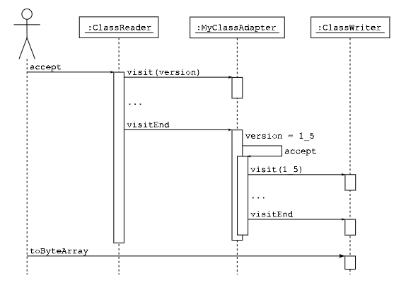

# 类

本章解释了如何使用 ASM 树 API 生成和转换类。它首先单独介绍树 API，然后解释如何将其与核心 API 结合使用。下一章将解释方法内容、注解和泛型的树 API。

## 接口和组件

### 演示

生成和转换编译后的 Java 类的 ASM 树 API 基于 `ClassNode` 类：

```java
public class ClassNode ... {
    public int version;
    public int access;
    public String name;
    public String signature;
    public String superName;
    public List<String> interfaces;
    public String sourceFile;
    public String sourceDebug;
    public String outerClass;
    public String outerMethod;
    public String outerMethodDesc;
    public List<AnnotationNode> visibleAnnotations;
    public List<AnnotationNode> invisibleAnnotations;
    public List<Attribute> attrs;
    public List<InnerClassNode> innerClasses;
    public List<FieldNode> fields;
    public List<MethodNode> methods;
}
```

这些字段的内容与核心 API 中的相同。例如，`name` 是内部名称，`signature` 是类签名）。一些字段包含其他 Xxx Node 类：这些类在下一章中详细介绍，它们具有相似的结构，即具有对应于类文件结构的子部分的字段。例如，`FieldNode` 类看起来像这样：


```java
public class FieldNode ... {
    public int access;
    public String name;
    public String desc;
    public String signature;
    public Object value;
    public FieldNode(int access, String name, String desc, String signature, Object value) {
    ...
    }
    ...
}
```

`MethodNode` 类类似：

```java
public class MethodNode ... {
    public int access;
    public String name;
    public String desc;
    public String signature;
    public List<String> exceptions;
    ...
    public MethodNode(int access, String name, String desc, String signature, String[] exceptions) {
    ...
    }
}
```

### 生成类

对象并初始化其字段。例如，2.2.3 节中的 `Comparable` 接口可以像下面这样构建，与 2.2.3 节中的代码量大致相同：

```java
ClassNode cn = new ClassNode();
cn.version = V1_5;
cn.access = ACC_PUBLIC + ACC_ABSTRACT + ACC_INTERFACE;
cn.name = "pkg/Comparable";
cn.superName = "java/lang/Object";
cn.interfaces.add("pkg/Mesurable");
cn.fields.add(new FieldNode(ACC_PUBLIC + ACC_FINAL + ACC_STATIC,"LESS", "I", null, new Integer(-1)));
cn.fields.add(new FieldNode(ACC_PUBLIC + ACC_FINAL + ACC_STATIC,"EQUAL", "I", null, new Integer(0)));
cn.fields.add(new FieldNode(ACC_PUBLIC + ACC_FINAL + ACC_STATIC,"GREATER", "I", null, new Integer(1)));
cn.methods.add(new MethodNode(ACC_PUBLIC + ACC_ABSTRACT,"compareTo", "(Ljava/lang/Object;)I", null, null));
```

使用树 API 生成类大约需要 30% 的时间（见附录 A.1），并且比使用核心 API 消耗更多的内存。但它使得可以以任何顺序生成类元素，这在某些情况下可能很方便。

### 添加和移除类成员

添加和删除类成员仅包括在 `ClassNode` 对象的字段或方法列表中添加或删除元素。例如，如果我们定义 `ClassTransformer` 类如下，以便能够轻松组合类转换器：

```java
public class ClassTransformer {
    protected ClassTransformer ct;
    public ClassTransformer(ClassTransformer ct) {
        this.ct = ct;
    }
    public void transform(ClassNode cn) {
        if (ct != null) {
            ct.transform(cn);
        }
    }
}
```
那么，2.2.5 节中的 `RemoveMethodAdapter` 可以像下面这样实现：

```java
public class RemoveMethodTransformer extends ClassTransformer {
    private String methodName;
    private String methodDesc;
    public RemoveMethodTransformer(ClassTransformer ct, String methodName, String methodDesc) {
        super(ct);
        this.methodName = methodName;
        this.methodDesc = methodDesc;
    }
    @Override public void transform(ClassNode cn) {
        Iterator<MethodNode> i = cn.methods.iterator();
        while (i.hasNext()) {
            MethodNode mn = i.next();
            if (methodName.equals(mn.name) && methodDesc.equals(mn.desc)) {
                i.remove();
            }
        }
        super.transform(cn);
    }
}
```

正如所见，与核心 API 的主要区别是您需要遍历所有方法，而使用核心 API 时则不需要这样做（这是在 `ClassReader` 中为您完成的）。实际上，这个区别几乎适用于所有基于树的转换。例如，2.2.6 节中的 `AddFieldAdapter` 在使用树 API 实现时也需要一个迭代器：

```java
public class AddFieldTransformer extends ClassTransformer {
    private int fieldAccess;
    private String fieldName;
    private String fieldDesc;
    public AddFieldTransformer(ClassTransformer ct, int fieldAccess, String fieldName, String fieldDesc) {
        super(ct);
        this.fieldAccess = fieldAccess;
        this.fieldName = fieldName;
        this.fieldDesc = fieldDesc;
    }
    @Override 
    public void transform(ClassNode cn) {
        boolean isPresent = false;
        for (FieldNode fn : cn.fields) {
            if (fieldName.equals(fn.name)) {
                isPresent = true;
                break;
            }
        }
        if (!isPresent) {
            cn.fields.add(new FieldNode(fieldAccess, fieldName, fieldDesc, null, null));
        }
        super.transform(cn);
    }
}
```

与类生成一样，使用树 API 转换类所需的时间更多，消耗的内存也更多。但这样做可以使一些转换更容易实现。例如，一个转换将向类添加一个包含其内容数字签名的注解。使用核心 API，数字签名只能在访问完所有类之后计算，但那时已经太晚了，因为必须在访问类成员之前访问注解。使用树 API，这个问题消失了，因为在这种情况下没有这样的约束。

实际上，可以使用核心 API 实现 `AddDigitialSignature` 示例，但类必须分两步转换。在第一步中，使用 `ClassReader`（而不是 `ClassWriter`）访问类，以便基于类内容计算数字签名。在第二步中，重用相同的 `ClassReader` 对类进行第二次访问，这次使用 `AddAnnotationAdapter` 链接到 `ClassWriter`。

通过推广这个论点，我们发现，实际上，任何转换都可以通过核心 API 实现，如果需要，可以使用多个步骤。但这会增加转换代码的复杂性，需要在步骤之间存储状态（这可能像完整的树表示一样复杂！），并且多次解析类会有成本，这必须与构建相应 `ClassNode` 的成本进行比较。

结论是，树 API 通常用于无法使用核心 API 单独一步实现的转换。但当然也有例外。例如，混淆器不能一步实现，因为您不能在从原始名称到混淆名称的映射完全构建之前转换类，这需要解析所有类。但树 API 也不是一个好的解决方案，因为它需要将所有要混淆的类的对象表示保留在内存中。在这种情况下，最好使用核心 API 分两步：一步计算原始名称和混淆名称之间的映射（一个简单的哈希表，比所有类的完整对象表示需要更少的内存），一步根据这个映射转换类。

## 组合

到目前为止，我们只看到了如何创建和转换 `ClassNode` 对象，但我们还没有看到如何从一个类的字节数组表示形式构造 `ClassNode`，或者反过来，如何从 `ClassNode` 构造这个字节数组。

实际上，这是通过组合核心 API 和树 API 组件来完成的，如本节所述。

### 说明

除了图 6.1 中显示的字段之外，`ClassNode` 类还扩展了 `ClassVisitor` 类，并提供了一个接受 `ClassVisitor` 作为参数的 `accept` 方法。`accept` 方法根据 `ClassNode` 字段值生成事件，而 `ClassVisitor` 方法执行逆操作，即根据接收的事件设置 `ClassNode` 字段：

```java
public class ClassNode extends ClassVisitor {
    ...
    public void visit(int version, int access, String name, String signature, String superName, String[] interfaces[]) {
        this.version = version;
        this.access = access;
        this.name = name;
        this.signature = signature;
        ...
    }
    ...
    public void accept(ClassVisitor cv) {
        cv.visit(version, access, name, signature, ...);
        ...
    }
}
```

因此，可以通过将 `ClassNode` 与 `ClassReader` 组合来从字节数组构造 `ClassNode`，这样 `ClassReader` 生成的将由 `ClassNode` 组件消耗，从而初始化其字段（如上代码所示）：

```java
ClassNode cn = new ClassNode();
ClassReader cr = new ClassReader(...);
cr.accept(cn, 0);
```

对称地，`ClassNode` 可以通过将其与 `ClassWriter` 组合来转换为它的字节数组表示，这样 `ClassNode` 的 `accept` 方法生成的事件将被 `ClassWriter` 消耗：

```java
ClassWriter cw = new ClassWriter(0);
cn.accept(cw);
byte[] b = cw.toByteArray();
```

### 模式

使用树 API 转换类可以通过将以下元素组合在一起来完成：

```java
ClassNode cn = new ClassNode(ASM4);
ClassReader cr = new ClassReader(...);
cr.accept(cn, 0);
... // 在这里按您想要的方式转换 cn
ClassWriter cw = new ClassWriter(0);
cn.accept(cw);
byte[] b = cw.toByteArray();
```

也可以使用基于树的类转换器，就像核心 API 中的类适配器一样。为此使用了两种常见模式。第一种使用继承：

```java
public class MyClassAdapter extends ClassNode {
    public MyClassAdapter(ClassVisitor cv) {
        super(ASM4);
        this.cv = cv;
    }
    @Override public void visitEnd() {
        // 在这里放置您的转换代码
        accept(cv);
    }
}
```

当这个类适配器在经典转换链中使用时：

```java
ClassWriter cw = new ClassWriter(0);
ClassVisitor ca = new MyClassAdapter(cw);
ClassReader cr = new ClassReader(...);
cr.accept(ca, 0);
byte[] b = cw.toByteArray();
```

`cr` 生成的将由 `ClassNode` `ca` 消耗，这导致初始化此对象字段。在最后，当 `visitEnd` 事件被消耗时，`ca` 执行转换，并通过调用其 `accept` 方法生成与转换后的类相对应的新事件，这些事件将被 `cw` 消耗。如果我们假设 `ca` 改变了类版本，相应的序列图显示在图 6.2 中。

与图 2.7 中 `ChangeVersionAdapter` 的序列图相比，我们可以看到 `ca` 和 `cw` 之间的事件发生在 `cr` 和 `ca` 之间的事件之后，而不是与正常类适配器同时发生。实际上，所有基于树的转换都会发生这种情况，这也解释了为什么它们比基于事件的转换更少受约束。



第二种模式可以实现相同的结果，使用类似的序列图，使用委托而不是继承：

```java
public class MyClassAdapter extends ClassVisitor {
    ClassVisitor next;
    public MyClassAdapter(ClassVisitor cv) {
        super(ASM4, new ClassNode());
        next = cv;
    }
    @Override
    public void visitEnd() {
        ClassNode cn = (ClassNode) cv;
        // 在此处放置你的转换代码
        cn.accept(next);
    }
}
```

这个模式使用两个对象而不是一个，但与第一个模式的工作方式完全相同：接收到的事件被用来构建一个 `ClassNode`，然后将其转换并重新转换为基于事件的表示形式，当接收到最后一个事件时。
这两种模式都允许您将基于树的类适配器与基于事件的适配器组合。它们也可以用来组合基于树的适配器，但如果您只需要组合基于树的适配器，这不是最佳解决方案：在这种情况下，使用诸如 `ClassTransformer` 之类的类将避免在两种表示之间进行不必要的转换。
