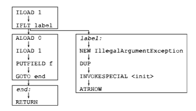

# 方法分析

本章介绍了基于树 API 的 ASM API，用于分析方法的代码。它首先介绍了代码分析算法，然后介绍了相应的 ASM API，并提供了一些示例。

## 说明

代码分析是一个非常大的主题，许多算法可用于分析代码。在这里全面介绍它们是不可能的，也不在本文档的范围之内。实际上，本节的目标只是概述 ASM 中使用的算法。关于这个主题的更好介绍可以在关于编译器的书籍中找到。接下来的几节介绍了两种重要的代码分析技术，即数据流分析和控制流分析：
* 数据流分析包括计算方法中每条指令的执行帧状态。这个状态可以以更抽象或更具体的方式表示。例如，引用值可以表示为单个值，每个类一个值，或者用 `{ null, not null, may be null }` 集合中的三个可能值等。
* 控制流分析包括计算方法的控制流图，并在该图上进行分析。控制流图是一个图，其节点是指令，其有向边连接两个指令 i → j 如果 j 可以在 i 之后立即执行。

### 数据流分析

可以执行两种类型的数据流分析：
* 前向分析计算每条指令执行后的执行帧状态，从其执行前的状态开始。
* 后向分析计算每条指令执行前的执行帧状态，从其执行后的状态开始。

前向数据流分析是通过模拟方法中每条字节码指令对其执行帧的影响来进行的，这通常包括：
* 从栈中弹出值，
* 将它们组合，
* 然后将结果推回栈。

这看起来像解释器或 Java 虚拟机所做的工作，但实际上完全不同，因为目标是模拟方法中所有可能的执行路径，而不是由某些特定方法参数值确定的单个执行路径。

一个结果是，对于分支指令，两个分支都被模拟（而真实的解释器只遵循一个分支，取决于实际的条件值）。

另一个结果是，操作的值实际上是可能值的集合。这些集合可以非常大，例如“所有可能的值”、“所有整数”、“所有可能的对象”或“所有可能的 String 对象”，在这种情况下，它们也可以被称为类型。它们也可以更精确，例如“所有正整数”、“0 到 10 之间的所有整数”或“所有可能非空对象”。模拟指令 i 的执行包括找到 i 的所有可能结果，对于其操作数值集合中的所有组合。例如，如果整数由三个集合 P = “正数或 null”、N = “负数或 null” 和 A = “所有整数”表示，模拟 IADD 指令意味着如果两个操作数都是 P，则返回 P，如果两个操作数都是 N，则返回 N，在其他所有情况下返回 A。

最后一个结果是，需要计算值集合的并集：例如，对应于 `(b ? e1 : e2)` 的可能值集合是 e1 和 e2 的可能值集合的并集。更一般地说，每次控制流图包含两个或更多具有共同目标的边时，都需要这种操作。在之前的例子中，其中整数由三个集合 P、N 和 A 表示，计算这两个集合的并集很容易：它总是 A，除非这两个集合相等。116

### 控制流分析

控制流分析是基于方法的控制流图的分析。例如，3.1.3 节中 `checkAndSetF` 方法的控制流图如下所示（图中包含了标签，就像真实指令一样）：



这个图可以分解为四个基本块（上面用矩形表示），基本块是一系列指令，其中除最后一条指令外，每条指令恰好有一个后继指令，并且除第一条指令外，没有指令可以是跳转的目标。

## 接口和组件

ASM API 用于代码分析的包位于 `org.objectweb.asm.tree.analysis`。正如包名所暗示的，它基于树 API。实际上，这个包提供了一个进行正向数据流分析的框架。为了能够执行各种数据流分析，并使用更精确或不那么精确的值集，数据流分析算法被分为两部分：一部分是固定的，由框架提供，另一部分是可变的，由用户提供。更确切地说：
* 整体数据流分析算法，以及从栈中弹出和将适当数量的值推回栈中的任务，在 `Analyzer` 和 `Frame` 类中一次性实现。
* 合并值和计算值集的并集的任务由用户定义的解释器和值子类执行。

尽管框架的主要目标是执行数据流分析，但 `Analyzer` 类也可以构建被分析方法的控制流图。这可以通过覆盖这个类的 `newControlFlowEdge` 和 `newControlFlowExceptionEdge` 方法来完成，默认情况下这些方法不执行任何操作。结果可以用于进行控制流分析。

--------------------------------
以上内容由AI生成，仅供参考和借鉴
### 基本数据流分析

`BasicInterpreter` 类是 `Interpreter` 抽象类的一个预定义子类。它通过使用 `BasicValue` 类中定义的七个值集来模拟字节码指令的效果：
* `UNINITIALIZED_VALUE` 表示“所有可能的值”。
* `INT_VALUE` 表示“所有 int、short、byte、boolean 或 char 值”。
* `FLOAT_VALUE` 表示“所有 float 值”。
* `LONG_VALUE` 表示“所有 long 值”。
* `DOUBLE_VALUE` 表示“所有 double 值”。
* `REFERENCE_VALUE` 表示“所有对象和数组值”。
* `RETURNADDRESS_VALUE` 用于子例程（见附录 A.2）。

这个解释器本身并不是很有用（方法帧已经提供了这样的信息，并且更详细——见 3.1.5 节），但它可以用作构建 `Analyzer` 的“空”解释器实现。然后，这个分析器可以用来检测方法中的不可达代码。实际上，即使遵循跳转指令的两个分支，也无法到达无法从第一条指令到达的代码。结果是，在分析之后，无论解释器实现如何，`Analyzer.getFrames` 方法返回的计算帧对于无法到达的指令都是空的。这个属性可以用来非常容易地实现一个 `RemoveDeadCodeAdapter` 类（有更有效的方法，但它们需要编写更多的代码）。

```java
public class RemoveDeadCodeAdapter extends MethodVisitor {
String owner;
MethodVisitor next;
public RemoveDeadCodeAdapter(String owner, int access, String name,
String desc, MethodVisitor mv) {
super(ASM4, new MethodNode(access, name, desc, null, null));
    this.owner = owner;
    next = mv;
}
    @Override public void visitEnd() {
        MethodNode mn = (MethodNode) mv;
        Analyzer<BasicValue> a =
                new Analyzer<BasicValue>(new BasicInterpreter());
        try {
            a.analyze(owner, mn);
            Frame<BasicValue>[] frames = a.getFrames();
            AbstractInsnNode[] insns = mn.instructions.toArray();
            for (int i = 0; i < frames.length; ++i) {
                if (frames[i] == null && !(insns[i] instanceof LabelNode)) {
                    mn.instructions.remove(insns[i]);
                }
            }
        } catch (AnalyzerException ignored) {
        }
        mn.accept(next);
    }
}
```

当与 7.1.5 节中的 `OptimizeJumpAdapter` 结合使用时，由跳转优化器引入的死代码被移除。例如，将这个适配器链应用于 `checkAndSetF` 方法得到：

```java
// after OptimizeJump // after RemoveDeadCode
ILOAD 1 ILOAD 1
IFLT label IFLT label
ALOAD 0 ALOAD 0
ILOAD 1 ILOAD 1
PUTFIELD ... PUTFIELD ...
RETURN RETURN
label: label:
F_SAME F_SAME
NEW ... NEW ...
DUP DUP
INVOKESPECIAL ... INVOKESPECIAL ...
ATHROW ATHROW
end: end:
F_SAME
RETURN
```

请注意，死标签不会被移除。这是故意的：确实，这不会改变生成的代码，但避免了移除一个尽管不可达，但可能在 `LocalVariableNode` 中引用的标签。

### 基本数据流验证器

`BasicVerifier` 类扩展了 `BasicInterpreter` 类。它使用相同的七个值集，但与 `BasicInterpreter` 不同，它检查指令是否被正确使用。例如，它检查 IADD 指令的操作数是否是 `INTEGER_VALUE` 值（而 `BasicInterpreter` 只是返回结果，即 `INTEGER_VALUE`）。这个类可以在类生成器或适配器开发过程中的调试目的中使用，如 3.3 节所述。例如，这个类可以检测 `ISTORE 1 ALOAD 1` 序列是无效的。它可以包含在一个实用方法适配器中，如下所示（在实践中，使用 `CheckMethodAdapter` 类更简单，该类可以配置为使用 `BasicVerifier`）：

```java
public class BasicVerifierAdapter extends MethodVisitor {
String owner;
MethodVisitor next;
public BasicVerifierAdapter(String owner, int access, String name,
String desc, MethodVisitor mv) {
super(ASM4, new MethodNode(access, name, desc, null, null));
this.owner = owner;
next = mv;
}
@Override public void visitEnd() {
MethodNode mn = (MethodNode) mv;
Analyzer<BasicValue> a =
new Analyzer<BasicValue(new BasicVerifier());
try {
a.analyze(owner, mn);
} catch (AnalyzerException e) {
throw new RuntimeException(e.getMessage());
}
mn.accept(next);
}
}
```

### 简单数据流验证器

`SimpleVerifier` 类扩展了 `BasicVerifier` 类。它使用更多的集合来模拟字节码指令的执行：实际上，每个类都由自己的集合表示，代表该类的所有可能对象。因此，它可以检测更多的错误，例如在可能值为“所有类型为 Thread 的对象”的对象上调用 `String` 类中定义的方法。

这个类使用 Java 反射 API 来执行与类层次结构相关的验证和计算。因此，它将方法引用的类加载到 JVM 中。这个默认行为可以通过覆盖这个类的受保护方法来更改。

与 `BasicVerifier` 类似，这个类可以在开发类生成器或适配器时使用，以便更容易地找到错误。但它也可以用于其他目的。一个例子是删除方法中不必要的转换：如果这个分析器发现 `CHECKCAST` 指令的操作数是“所有类型为 from 的对象”的值集，并且 `to` 是 `from` 的超类，那么 `CHECKCAST` 指令是不必要的，可以被移除。这个转换的实现如下：


```java
public class RemoveUnusedCastTransformer extends MethodTransformer {
String owner;
public RemoveUnusedCastTransformer(String owner,
MethodTransformer mt) {
super(mt);
this.owner = owner;
}
@Override public MethodNode transform(MethodNode mn) {
Analyzer<BasicValue> a =
new Analyzer<BasicValue>(new SimpleVerifier());
try {
a.analyze(owner, mn);
Frame<BasicValue>[] frames = a.getFrames();
AbstractInsnNode[] insns = mn.instructions.toArray();
for (int i = 0; i < insns.length; ++i) {
AbstractInsnNode insn = insns[i];
if (insn.getOpcode() == CHECKCAST) {
Frame f = frames[i];
if (f != null && f.getStackSize() > 0) {
Object operand = f.getStack(f.getStackSize() - 1);
Class<?> to = getClass(((TypeInsnNode) insn).desc);
Class<?> from = getClass(((BasicValue) operand).getType());
if (to.isAssignableFrom(from)) {
mn.instructions.remove(insn);
}
}
}
}
} catch (AnalyzerException ignored) {
}
return mt == null ? mn : mt.transform(mn);
}
private static Class<?> getClass(String desc) {
try {
return Class.forName(desc.replace(’/’, ’.’));
} catch (ClassNotFoundException e) {
throw new RuntimeException(e.toString());
}
}
    private static Class<?> getClass(Type t) {
        if (t.getSort() == Type.OBJECT) {
            return getClass(t.getInternalName());
        }
        return getClass(t.getDescriptor());
    }
}
```

对于 Java 6 类（或使用 `COMPUTE_FRAMES` 升级到 Java 6 的类），使用核心 API 的 `AnalyzerAdapter` 来执行这个操作更简单、更高效：

```java
public class RemoveUnusedCastAdapter extends MethodVisitor {
public AnalyzerAdapter aa;
public RemoveUnusedCastAdapter(MethodVisitor mv) {
super(ASM4, mv);
}
@Override public void visitTypeInsn(int opcode, String desc) {
if (opcode == CHECKCAST) {
Class<?> to = getClass(desc);
if (aa.stack != null && aa.stack.size() > 0) {
Object operand = aa.stack.get(aa.stack.size() - 1);
if (operand instanceof String) {
Class<?> from = getClass((String) operand);
if (to.isAssignableFrom(from)) {
return;
}
}
}
}
mv.visitTypeInsn(opcode, desc);
}
private static Class getClass(String desc) {
try {
return Class.forName(desc.replace(’/’, ’.’));
} catch (ClassNotFoundException e) {
throw new RuntimeException(e.toString());
}
}
}
```

### 用户自定义数据流分析器

让我们假设我们想要检测可能为 null 的对象上的字段访问和方法调用，例如在以下源代码片段中（其中第一行防止某些编译器检测到错误，否则会被检测为“o 可能未初始化”错误）：

```java
Object o = null;
while (...) {
o = ...;
}
o.m(...); // potential NullPointerException!
```

然后，我们需要一个数据流分析，它可以在对应于最后一行的 `INVOKEVIRTUAL` 指令处告诉我们，栈底值（对应于 `o`）可能是 null。为了做到这一点，我们需要区分三个引用值集合：包含 null 值的 NULL 集合，包含所有非 null 引用值的 NONNULL 集合，以及包含所有引用值的 MAYBENULL 集合。然后，我们需要考虑 `ACONST_NULL` 将 NULL 集合推送到操作数栈上，而所有其他将引用值推送到栈上的指令将推送 NONNULL 集合（换句话说，我们假设任何字段访问或方法调用的结果都不是 null——如果我们不对程序的所有类进行全局分析，我们无法做得更好）。MAYBENULL 集合是必要的，以表示 NULL 和 NONNULL 集合的并集。

上述规则必须在一个自定义的 `Interpreter` 子类中实现。我们可以从头开始实现它，但也可以通过扩展 `BasicInterpreter` 类来实现，这要容易得多。实际上，如果我们认为 `BasicValue.REFERENCE_VALUE` 对应于 NONNULL 集合，那么我们只需要覆盖模拟 `ACONST_NULL` 执行的方法，使其返回 NULL，以及计算集合并集的方法：

```java
class IsNullInterpreter extends BasicInterpreter {
public final static BasicValue NULL = new BasicValue(null);
public final static BasicValue MAYBENULL = new BasicValue(null);
public IsNullInterpreter() {
super(ASM4);
}
@Override public BasicValue newOperation(AbstractInsnNode insn) {
if (insn.getOpcode() == ACONST_NULL) {
return NULL;
}
return super.newOperation(insn);
}
@Override public BasicValue merge(BasicValue v, BasicValue w) {
if (isRef(v) && isRef(w) && v != w) {
return MAYBENULL;
}
    return super.merge(v, w);
}
    private boolean isRef(Value v) {
        return v == REFERENCE_VALUE || v == NULL || v == MAYBENULL;
    }
}
```

使用 `IsNullnterpreter` 来检测可能导致潜在空指针异常的指令变得很容易。

```java
public class NullDereferenceAnalyzer {
public List<AbstractInsnNode> findNullDereferences(String owner,
MethodNode mn) throws AnalyzerException {
List<AbstractInsnNode> result = new ArrayList<AbstractInsnNode>();
Analyzer<BasicValue> a =
new Analyzer<BasicValue>(new IsNullInterpreter());
a.analyze(owner, mn);
Frame<BasicValue>[] frames = a.getFrames();
AbstractInsnNode[] insns = mn.instructions.toArray();
for (int i = 0; i < insns.length; ++i) {
AbstractInsnNode insn = insns[i];
if (frames[i] != null) {
Value v = getTarget(insn, frames[i]);
if (v == NULL || v == MAYBENULL) {
result.add(insn);
}
}
}
return result;
}
private static BasicValue getTarget(AbstractInsnNode insn,
Frame<BasicValue> f) {
switch (insn.getOpcode()) {
case GETFIELD:
case ARRAYLENGTH:
case MONITORENTER:
case MONITOREXIT:
return getStackValue(f, 0);
case PUTFIELD:
return getStackValue(f, 1);
case INVOKEVIRTUAL:
case INVOKESPECIAL:
case INVOKEINTERFACE:
String desc = ((MethodInsnNode) insn).desc;
return getStackValue(f, Type.getArgumentTypes(desc).length);
}
return null;
}
```

`findNullDereferences` 方法使用 `IsNullInterpreter` 分析给定的方法节点。然后，它测试每条指令，检查其引用操作数（如果有的话）的可能值集合是否是 NULL 或 NONNULL 集合。如果是这种情况，这条指令可能导致空指针异常，因此它被添加到由该方法返回的此类指令列表中。

`getTarget` 方法返回 `insn` 的对象操作数在帧 `f` 中对应的 `Value`，如果 `insn` 没有对象操作数，则返回 null。它的主要作用是计算此值相对于操作数栈顶的偏移量，这取决于指令的类型。

### 控制流分析

控制流分析可以有许多应用。一个简单的例子是计算方法的圈复杂度。这个指标定义为控制流图中的边数，减去节点数，再加上二。例如，`checkAndSetF` 方法的圈复杂度，其控制流图在 8.1.2 节中显示，是 11 - 12 + 2 = 1。这个指标给出了方法“复杂性”的良好指示（这个数字与方法的平均错误数之间存在相关性）。它还给出了为了“正确”测试方法所需的测试用例数。

计算这个指标的算法可以使用 ASM 分析框架实现（有更有效的方法，仅基于核心 API，但它们需要编写更多的代码）。第一步是构建控制流图。正如本章开头所述，这可以通过覆盖 `Analyzer` 类的 `newControlFlowEdge` 方法来完成。这个类将节点表示为 `Frame` 对象。如果我们想在这些对象中存储图，我们需要扩展 `Frame` 类。

```java
class Node<V extends Value> extends Frame<V> {
Set< Node<V> > successors = new HashSet< Node<V> >();
public Node(int nLocals, int nStack) {
super(nLocals, nStack);
}
    public Node(Frame<? extends V> src) {
        super(src);
    }
}
```

然后，我们可以提供一个 `Analyzer` 子类来构建我们的控制流图，并使用其结果来计算边的数量、节点的数量，最后计算圈复杂度：

```java
public class CyclomaticComplexity {
public int getCyclomaticComplexity(String owner, MethodNode mn)
throws AnalyzerException {
Analyzer<BasicValue> a =
new Analyzer<BasicValue>(new BasicInterpreter()) {
protected Frame<BasicValue> newFrame(int nLocals, int nStack) {
return new Node<BasicValue>(nLocals, nStack);
}
protected Frame<BasicValue> newFrame(
Frame<? extends BasicValue> src) {
return new Node<BasicValue>(src);
}
protected void newControlFlowEdge(int src, int dst) {
Node<BasicValue> s = (Node<BasicValue>) getFrames()[src];
s.successors.add((Node<BasicValue>) getFrames()[dst]);
}
};
a.analyze(owner, mn);
Frame<BasicValue>[] frames = a.getFrames();
int edges = 0;
int nodes = 0;
for (int i = 0; i < frames.length; ++i) {
if (frames[i] != null) {
edges += ((Node<BasicValue>) frames[i]).successors.size();
nodes += 1;
}
}
return edges - nodes + 2;
}
}
```