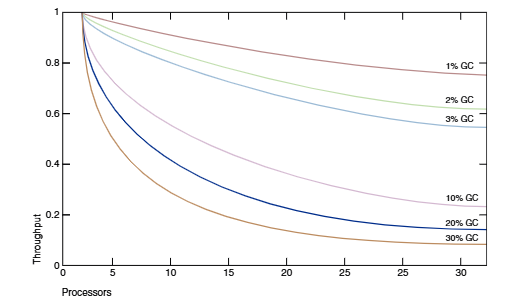
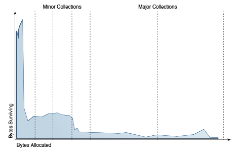
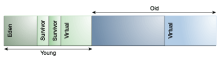
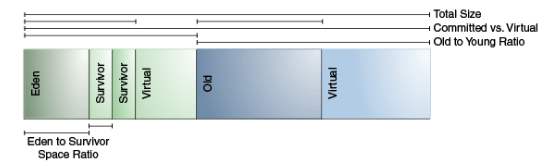
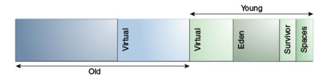
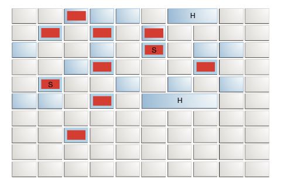
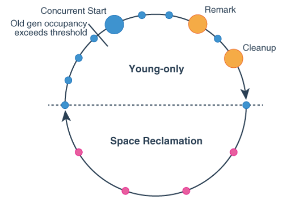

# 简介

从桌面上的小程序到大型服务器上的 Web 服务，各种应用程序都使用 Java 平台标准版 (Java SE)。为了支持这些多样化的部署，Java HotSpot 虚拟机 (Java HotSpot VM) 提供了多种垃圾回收器，每个回收器都针对不同的需求进行了设计。Java SE 会根据应用程序运行的计算机类型选择最合适的垃圾回收器。然而，这种选择可能并非对每个应用程序都最优化。对于那些对性能有严格目标或其他要求的用户、开发人员和系统管理员，可能需要显式选择垃圾回收器并调整某些参数，以实现所需的性能水平。本文档提供了帮助完成这些任务的信息。

## 什么是垃圾回收器

垃圾回收器 (GC) 会自动管理应用程序的动态内存分配请求。 垃圾回收器通过以下操作执行自动动态内存管理：
* 从操作系统分配和归还内存。
* 当应用程序请求时，将内存分配给应用程序。
* 确定哪些内存部分仍然被应用程序使用。
* 重新回收未使用的内存，以便应用程序再次使用。

Java HotSpot 垃圾回收器采用各种技术来提高这些操作的效率：

* 结合年龄，使用代际清除来集中精力在堆中回收大量可回收内存区域的区域。
* 使用多个线程积极并行操作，或在后台与应用程序并发执行某些长时间运行的操作。
* 通过压缩活动对象来尝试回收更大的连续空闲内存。

## 为什么垃圾回收器的选择很重要

垃圾回收器的目的是让应用程序开发者从手动动态内存管理中解放出来。开发者不再需要匹配分配与释放。

然而，这需要一些额外的运行时开销。Java HotSpot 虚拟机提供了多种垃圾回收算法供选择。

什么时候选择垃圾回收器很重要呢？对于某些应用程序，答案永远是否定的。也就是说，应用程序可以在存在垃圾回收的情况下，以适中的频率和持续时间暂停，表现良好。然而，对于大量应用程序，尤其是那些数据量庞大、线程众多和事务率高的应用程序，情况并非如此。

Amdahl 定律（给定问题中的并行加速受限于问题的串行部分）意味着大多数工作负载无法完全并行化；总有一部分是串行的，无法从并行性中受益。在 Java 平台上，目前有四种支持的垃圾回收选项，Serial GC 之外，其他所有选项都通过并行化工作来提高性能。将垃圾回收的额外开销降至最低非常重要。以下示例可以说明这一点。

下图模拟了一个理想的系统，该系统在除垃圾回收外都具有完美的可扩展性。红线表示在一个单处理器系统上，应用程序仅在垃圾回收中花费 1% 的时间。这导致在具有 32 个处理器的系统上吞吐量损失超过 20%。洋红色线条显示，对于一个在垃圾回收中花费 10% 时间的应用程序（在单处理器应用程序中，这不是一个令人难以置信的垃圾回收时间），当扩展到 32 个处理器时，吞吐量损失超过 75%。



这张图显示，在小型系统上开发时可能忽略的吞吐量问题，在扩展到大型系统时可能会成为主要瓶颈。然而，在减少这种瓶颈方面的小幅改进可以带来性能的大幅提升。对于足够大的系统，选择合适的垃圾回收器并在必要时对其进行调整变得很有价值。

Serial回收器通常适用于大多数小型应用，特别是那些在现代处理器上需要高达约100兆字节堆的应用。其他回收器具有额外的开销或复杂性，这是获得特殊行为的代价。如果应用程序不需要其他回收器的特殊行为，则使用Serial GC。

一种Serial回收器可能不是最佳选择的情况是运行在具有大量内存和两个或更多处理器的机器上的大型、多线程应用程序。在这种情况下，当应用程序运行在服务器类机器上时，默认选择的是垃圾优先G1收集器；

# 人体工程学

人体工程学是 Java 虚拟机 (JVM) 和垃圾回收启发式算法（例如基于行为的启发式算法）改进应用程序性能的过程。

JVM 为垃圾回收器、堆大小和运行时编译器提供与平台相关的默认选择。这些选择满足了不同类型应用程序的需求，同时减少了命令行调整的需求。此外，基于行为的调优会动态优化堆的大小，以满足应用程序指定的行为。

本节描述了这些默认选择和基于行为的调优。在使用后续章节中描述的更详细的控制之前，请使用这些默认值。

## 垃圾回收器、堆和运行时编译器的默认选择

这些是重要的垃圾回收器、堆大小和运行时编译器的默认选择：

* G1收集器
* GC 线程的最大数量由堆大小和可用 CPU 资源限制
* 初始堆大小为物理内存的 1/64
* 最大堆大小为物理内存的 1/4
* 分层编译器，使用 C1 和 C2

## 基于行为的优化

Java HotSpot 虚拟机垃圾回收器可以被配置为优先满足两个目标之一：最大暂停时间和应用程序吞吐量。如果达到首选目标，回收器将尝试最大化另一个目标。然而，这些目标并不总是能够达到：应用程序需要至少一个堆来保存所有活动数据，而其他配置可能会阻止达到某些或全部目标。

### 最大暂停时间目标

暂停时间是垃圾回收器停止应用程序并回收不再使用的空间所花费的时间。最大暂停时间目标的目的是限制这些暂停中最长的时间。
垃圾回收器会维护暂停时间的平均值和方差。平均值从执行开始时计算，但权重会偏向更近期的暂停，使其对平均值的影响更大。如果暂停时间的平均值加上方差大于最大暂停时间目标，则垃圾回收器认为目标未达成。
最大暂停时间目标可以通过命令行选项 -XX:MaxGCPauseMillis=<nnn> 来指定。这被解释为垃圾回收器的一个提示，表示期望的暂停时间为 nnn 毫秒或更短。垃圾回收器会调整 Java 堆大小和其他与垃圾回收相关的参数，试图将垃圾回收暂停时间控制在 nnn 毫秒以内。最大暂停时间目标的默认值因回收器而异。这些调整可能会导致垃圾回收发生得更频繁，从而降低应用程序的整体吞吐量。然而，在某些情况下，所需的暂停时间目标无法达到。

### 吞吐量目标

吞吐量目标是根据垃圾回收所花费的时间和垃圾回收之外所花费的时间来衡量的。
该目标由命令行选项 -XX:GCTimeRatio=nnn 指定。垃圾回收时间与应用程序时间的比例为 1/(1+nnn)。例如，-XX:GCTimeRatio=19 将垃圾回收时间目标设置为总时间的 1/20 或 5%。
垃圾回收所花费的时间是所有由垃圾回收引起的暂停的总时间。如果吞吐量目标未达成，垃圾回收器可以采取的一个可能行动是增加堆的大小，以便在收集暂停之间的应用程序运行时间可以更长。

### 足迹

如果吞吐量和最大暂停时间目标都已达成，则垃圾回收器会减小堆的大小，直到其中一个目标（通常是吞吐量目标）无法达成。垃圾回收器可以使用的最小和最大堆大小可以通过 -Xms=<nnn> 和 -Xmx=<mmm> 分别设置最小和最大堆大小。

## 调优策略

堆的大小会根据所选的吞吐量目标增长或缩小。了解堆调整策略，例如选择最大堆大小和选择最大暂停时间目标。

除非你知道你需要一个大于默认最大堆大小的堆，否则不要为堆选择最大值。选择一个足够满足你应用程序的吞吐量目标。

应用程序行为的改变可能导致堆的增长或缩小。例如，如果应用程序开始以更高的速率分配内存，那么堆会增长以维持相同的吞吐量。

如果堆增长到最大大小并且吞吐量目标没有达到，那么最大堆大小对于吞吐量目标来说太小了。将最大堆大小设置为接近平台总物理内存的值，但不会导致应用程序交换。再次执行应用程序。如果吞吐量目标仍然没有达到，那么应用程序时间的目标对于平台上的可用内存来说太高了。

如果吞吐量目标可以达到，但暂停时间过长，那么选择一个最大暂停时间目标。选择最大暂停时间目标可能意味着你的吞吐量目标无法达到，所以选择对于应用程序可以接受的折衷值。

通常情况下，随着垃圾回收器试图满足相互竞争的目标，堆的大小会波动。即使应用程序已经达到稳定状态，这也是正确的。实现吞吐量目标（可能需要更大的堆）的压力与最大暂停时间和最小足迹的目标（两者都可能需要较小的堆）竞争。

# 垃圾回收器的实现方式

Java SE 平台的一个优点是它将开发者与内存分配和垃圾回收的复杂性隔离开来。 然而，当垃圾回收成为主要瓶颈时，了解一些实现方面的知识是有用的。垃圾回收器对应用程序使用对象的方式做出假设，这些假设反映在可调整的参数中，可以通过调整这些参数来提高性能，而不会牺牲抽象的强大功能。

## 分代垃圾回收

当一个对象无法从程序中任何其他活动对象的引用中访问时，该对象被认为是垃圾，其内存可以被虚拟机重用。

一个理论上的、最直接的垃圾回收算法在每次运行时都会遍历每个可访问的对象。任何剩余的对象都被认为是垃圾。这种方法所花费的时间与活动对象的数量成正比，这对于维护大量活动数据的大型应用程序来说是不可接受的。

Java HotSpot 虚拟机包含多种不同的垃圾回收算法，除了 ZGC 之外，所有算法都使用一种称为分代收集的技术。虽然简单的垃圾回收每次都会检查堆中的每个活动对象，但分代收集利用了大多数应用程序的几个经验观察到的属性，以最小化回收未使用（垃圾）对象所需的工作量。这些观察到的属性中最重要的是弱分代假设，它指出大多数对象只存活很短的时间。

下中的蓝色区域是对象生命期的典型分布。x 轴显示以分配的字节数度量的对象生命周期。y 轴上的字节数是具有相应生命周期的对象的总字节数。左侧的尖锐峰值代表可以在分配后不久被回收的对象（换句话说，已经“死亡”）。例如，迭代器对象通常只在单个循环的持续时间内存活。



有些对象确实存活时间更长，因此分布向右延伸。例如，通常有一些在初始化时分配的对象会一直存活到虚拟机退出。在这两个极端之间，是那些在某个中间计算过程中存活的对象，这里显示为初始峰值右侧的块。有些应用程序的分布看起来非常不同，但令人惊讶的是，有相当多的应用程序具有这种一般形状。通过关注大多数对象“早死”的事实，可以有效地进行回收。

## 代

为了优化这种情况，内存被管理在代（内存池，持有不同年龄的对象）中。当一代填满时，垃圾回收就会在这一代发生。

绝大多数对象都是在专门为年轻对象（年轻代）分配的池中分配的，并且大多数对象都在那里死亡。当年轻代填满时，它会导致一次小回收，其中只收集年轻代；其他代中的垃圾不会被回收。这种回收的成本大致与被收集的活动对象数量成正比；一个充满死亡对象的年轻代回收非常快。

通常，在每次小回收中，年轻代中幸存下来的一些对象会被移动到老年代。最终，老年代填满并必须被回收，导致一次大回收，其中整个堆都会被回收。大回收通常比小回收持续时间长得多，因为涉及的对象数量显著更多。下图显示了Serial垃圾回收器中代的默认安排：



在启动时，Java HotSpot 虚拟机会在地址空间中保留整个 Java 堆，但除非需要，否则不会为其分配任何物理内存。覆盖 Java 堆的整个地址空间在逻辑上被分为年轻代和老年代。为对象内存保留的完整地址空间可以进一步分为年轻代和老年代。

年轻代由 eden 和两个幸存者空间组成。大多数对象最初都在 eden 中分配。在任何时候，一个幸存者空间是空的，它作为 eden 和另一个幸存者空间中活动对象在垃圾回收时的目的地；垃圾回收后，eden 和源幸存者空间都是空的。在下一次垃圾回收中，两个幸存者空间的作用会交换。最近填满的空间是活动对象的来源，这些对象被复制到另一个幸存者空间。对象以这种方式在幸存者空间之间复制，直到它们被复制了特定次数或没有足够的空间。然后，这些对象被复制到老年代。这个过程也被称为老化。

## 性能考虑

垃圾回收的主要衡量标准是吞吐量和延迟。

* 吞吐量是在长时间内，未花费在垃圾回收上的总时间的百分比。吞吐量包括分配时间（但通常不需要调整分配速度）。
* 延迟是应用程序的响应能力。垃圾回收暂停会影响应用程序的响应能力。

用户对垃圾回收有不同的要求。例如，一些人认为对 Web 服务器来说，正确的指标是吞吐量，因为垃圾回收期间的暂停可能是可以容忍的，或者简单地被网络延迟所掩盖。然而，在交互式图形程序中，即使是短暂的暂停也可能对用户体验产生负面影响。

一些用户对其他考虑因素敏感。足迹是进程的工作集，以页面和缓存行来衡量。在物理内存有限或进程众多的系统上，足迹可能决定可伸缩性。及时性是对象变为垃圾和内存变为可用之间的时间，对于分布式系统（包括远程方法调用 RMI）来说是一个重要的考虑因素。

通常，选择特定代的大小是在这些考虑因素之间进行权衡。例如，一个非常大的年轻代可能会最大化吞吐量，但这是以足迹、及时性和暂停时间为代价的。通过使用较小的年轻代，可以最小化年轻代暂停，但这是以吞吐量为代价的。一个代的大小不会影响另一个代的收集频率和暂停时间。

选择垃圾回收器的方式并不总是最优的，并且可以使用命令行选项进行覆盖；请参阅影响垃圾回收性能的因素。

## 吞吐量和内存占用测量

吞吐量和内存占用最好使用特定于应用程序的指标来测量。

例如，可以使用客户端负载生成器测试 Web 服务器的吞吐量。然而，由于垃圾回收导致的暂停可以通过检查虚拟机本身的诊断输出来轻松估计。命令行选项 -verbose:gc 在每次回收时打印有关堆和垃圾回收的信息。以下是一个示例：

```bash
[15,651s][info ][gc] GC(36) Pause Young (G1 Evacuation Pause) 239M->57M(307M)
(15,646s, 15,651s) 5,048ms
[16,162s][info ][gc] GC(37) Pause Young (G1 Evacuation Pause) 238M->57M(307M)
(16,146s, 16,162s) 16,565ms
[16,367s][info ][gc] GC(38) Pause Full (System.gc()) 69M->31M(104M) (16,202s,
16,367s) 164,581ms
```

输出显示了两次年轻代回收，然后是一次由应用程序通过调用 System.gc() 初始化的全回收。这些行以从应用程序启动时的时间戳开始。接下来是有关日志级别（info）和标签（gc）的信息。然后是 GC 标识号。在这种情况下，有三次 GC，编号分别为 36、37 和 38。然后记录 GC 的类型和启动 GC 的原因。之后，记录了一些关于内存使用情况的信息。该日志使用格式 "GC 前使用" -> "GC 后使用" ("堆大小")。
在示例的第一行中，这是 239M->57M(307M)，这意味着 GC 之前使用了 239 MB，GC 清除了大部分内存，但 57 MB 仍然存活。堆大小为 307 MB。请注意，在这个示例中，全 GC 将堆从 307 MB 缩小到 104 MB。
在内存使用信息之后，还记录了 GC 的开始和结束时间以及持续时间（结束 - 开始）。

-verbose:gc 命令是 -Xlog:gc 的别名。-Xlog 是 HotSpot JVM 中用于日志记录的通用日志配置选项。它是一个基于标签的系统，其中 gc 是一个标签。要获取有关 GC 正在做什么的更多信息，您可以配置日志记录以打印带有 gc 标签和任何其他标签的任何消息。为此的命令行选项是 -Xlog:gc*。
以下是使用 -Xlog:gc* 记录的一个 G1 年轻代回收的示例：

```bash
[10.178s][info][gc,start ] GC(36) Pause Young (G1 Evacuation Pause)
[10.178s][info][gc,task ] GC(36) 使用 28 个工作线程中的 28 个进行回收
[10.191s][info][gc,phases ] GC(36) 预回收集合：0.0ms
[10.191s][info][gc,phases ] GC(36) 回收集合：6.9ms
[10.191s][info][gc,phases ] GC(36) 回收后集合：5.9ms
[10.191s][info][gc,phases ] GC(36) 其他：0.2ms
[10.191s][info][gc,heap ] GC(36) Eden 区域：286->0(276)
[10.191s][info][gc,heap ] GC(36) 幸存者区域：15->26(38)
[10.191s][info][gc,heap ] GC(36) 老年代区域：88->88
[10.191s][info][gc,heap ] GC(36) 巨大区域：3->1
[10.191s][info][gc,metaspace ] GC(36) 元空间：8152K->8152K(1056768K)
[10.191s][info][gc ] GC(36) 暂停年轻代 (G1 回收暂停) 391M->114M(508M) 13.075ms
[10.191s][info][gc,cpu ] GC(36) 用户=0.20s 系统=0.00s 实际=0.01s
```

## 影响垃圾回收性能的因素

影响垃圾回收性能的两个最重要因素是可用内存总量和堆中分配给年轻代的比例。

### 总堆

影响垃圾回收性能的最重要因素是可用内存总量。 由于回收发生在代填满时，吞吐量与可用内存量成反比。

>注意：以下关于堆的增长和缩小、堆布局和默认值的讨论以Serial收集器为例。虽然其他收集器使用类似的机制，但此处提供的信息可能不适用于其他收集器。 请参阅其他收集器的相应主题以获取类似信息。

#### 影响代大小的堆选项

有许多选项影响代的大小。下图展示了堆中已提交空间和虚拟空间之间的差异。在虚拟机初始化时，会保留整个堆的空间。保留空间的大小可以通过 -Xmx 选项指定。如果 -Xms 参数的值小于 -Xmx 参数的值，则不是所有保留的空间都会立即提交给虚拟机。未提交的空间在此图中标记为“虚拟”。堆的不同部分，即老年代和年轻代，可以根据需要增长到虚拟空间的限制。

一些参数是堆的一部分相对于另一部分的比率。例如，参数 –XX:NewRatio 表示老年代相对于年轻代的大小。



#### 默认堆大小选项值

默认情况下，虚拟机在每次回收时都会尝试增长或缩小堆，以保持每次回收时空闲空间与活动对象的比例在特定范围内。

这个目标范围由选项 -XX:MinHeapFreeRatio=<minimum> 和 -XX:MaxHeapFreeRatio=<maximum> 设置为百分比，总大小下限由 -Xms <min> 和上限由 -Xmx <max> 限制。

使用这些选项，如果一代中的空闲空间百分比低于 40%，则该代会扩展以保持 40% 的空闲空间，直到达到允许的最大大小。同样，如果空闲空间超过 70%，则该代会收缩，以便只有 70% 的空间是空闲的，受到该代最小大小的限制。

Java SE 中用于并行收集器的计算现在用于所有垃圾回收器。计算的一部分是 64 位平台的最大堆大小的上限。请参阅并行收集器默认堆大小。对于客户端 JVM 也有类似的计算，其结果比服务器 JVM 的最大堆大小小。

以下是关于服务器应用程序堆大小的一般指南：
* 除非你有暂停问题，否则尽量给虚拟机分配尽可能多的内存。默认大小通常太小。
* 将 -Xms 和 -Xmx 设置为相同的值会增加可预测性，因为它将最重要的尺寸决策从虚拟机中移除。然而，如果你做出了错误的选择，虚拟机就无法补偿。
* 通常，随着处理器数量的增加，增加内存，因为分配可以是并行的。

#### 通过最小化 Java 堆大小来保存动态足迹

如果您需要最小化应用程序的动态内存占用（执行过程中的最大 RAM 消耗），那么可以通过最小化 Java 堆大小来实现。Java SE 嵌入式应用程序可能需要这样做。

最小化 Java 堆大小，通过降低选项 -XX:MaxHeapFreeRatio（默认值为 70%）和 -XX:MinHeapFreeRatio（默认值为 40%）的值，使用命令行选项 -XX:MaxHeapFreeRatio 和 -XX:MinHeapFreeRatio。将 -XX:MaxHeapFreeRatio 降低至 10%，并且将 -XX:MinHeapFreeRatio 的值降低，已经证明可以成功减小堆大小，同时不会造成太大的性能下降；然而，结果可能会有很大差异，这取决于您的应用程序。尝试不同的这些参数值，直到它们尽可能低，同时仍然保持可接受的性能。

在Serial GC 中，您可以指定 -XX:-ShrinkHeapInSteps，这会立即将 Java 堆减少到目标大小（由参数 -XX:MaxHeapFreeRatio 指定）。您可能会遇到性能下降。否则，Java 运行时会逐步减少 Java 堆到目标大小；这个过程需要多个垃圾回收周期。

### 年轻代

在可用内存总量之后，影响垃圾回收性能的第二大因素是分配给年轻代的堆比例。

年轻代越大，小回收发生的频率越低。然而，对于有限的堆大小，较大的年轻代意味着较小的老年代，这将增加大回收的频率。最佳选择取决于应用程序分配的对象的寿命分布。

#### 年轻代大小选项

默认情况下，年轻代大小由选项 -XX:NewRatio 控制。

例如，设置 -XX:NewRatio=3 表示年轻代和老年代之间的比例是 1:3。换句话说，eden 和幸存者空间的总大小将是总堆大小的四分之一。

选项 -XX:NewSize 和 -XX:MaxNewSize 从下限和上限限制年轻代的大小。将这些值设置为相同的值会固定年轻代的大小，就像将 -Xms 和 -Xmx 设置为相同的值会固定总堆大小一样。这对于以比 -XX:NewRatio 允许的整数倍更细的粒度调整年轻代的大小很有用。

#### 幸存者空间大小

您可以使用选项 -XX:SurvivorRatio 来调整幸存者空间的大小，但通常这对性能并不重要。

例如，-XX:SurvivorRatio=6 将 eden 和幸存者空间之间的比例设置为 1:6。换句话说，每个幸存者空间将是 eden 大小的一半，因此是年轻代大小的一半（不是七分之一，因为有两个幸存者空间）。

如果幸存者空间太小，那么复制收集会直接溢出到老年代。如果幸存者空间太大，那么它们就会无用地空着。在每次垃圾回收时，虚拟机会选择一个阈值，这是对象在被认为是老年代之前可以被复制的次数。这个阈值被选择以保持幸存者空间半满。您可以使用日志配置 -Xlog:gc,age 来显示这个阈值和新一代中对象的年龄。这对于观察应用程序的寿命分布也很有用。

| 选项                | 默认值         |
|-------------------|-------------|
| -XX:NewRatio      | 2           |
| -XX:NewSize       | 1310 MB     |
| -XX:MaxNewSize    | not limited |
| -XX:SurvivorRatio | 8           |

年轻代的最大大小是根据总堆的最大大小和 -XX:NewRatio 参数的值计算出来的。"-XX:MaxNewSize" 参数的默认值 "not limited" 意味着除非在命令行上指定了 -XX:MaxNewSize 的值，否则计算出的值不受 -XX:MaxNewSize 的限制。

对于服务器应用程序，以下是一般性指南：
* 首先决定您愿意为虚拟机提供的最大堆大小。然后，绘制您的性能指标与年轻代大小之间的关系图，以找到最佳设置。
    - 注意，最大堆大小应始终小于机器上安装的内存量，以避免过多的页面错误和交换。
* 如果总堆大小是固定的，那么增加年轻代大小需要减少老年代大小。保持老年代足够大，以容纳应用程序在任何给定时间使用的所有活动数据，再加上一些额外的空间（10% 到 20% 或更多）。
* 在老年代之前所述的约束条件下：
    - 为年轻代提供足够的内存。
    - 随着处理器数量的增加，增加年轻代的大小，因为分配可以并行化。

# 可用的垃圾收集器

到目前为止的讨论都是关于Serial GC的。Java HotSpot 虚拟机包括三种不同类型的收集器，每种都有不同的性能特征。

| 收集器         | 描述                                                                                                                                                                                                                                                                                                                 |
|-------------|--------------------------------------------------------------------------------------------------------------------------------------------------------------------------------------------------------------------------------------------------------------------------------------------------------------------|
| Serial GC   | Serial GC使用单个线程执行所有垃圾回收工作，这使得它相对高效，因为没有线程之间的通信开销。它最适合单处理器机器，因为它无法利用多处理器硬件，尽管对于具有小数据集（大约 100 MB）的应用程序，它在多处理器上也可能很有用。串行收集器在某些硬件和操作系统配置中默认选择，或者可以通过选项 -XX:+UseSerialGC 显式启用。                                                                                                                                          |
| Parallel GC | Parallel GC是一种类似于Serial GC的分代收集器。Serial GC和Parallel GC之间的主要区别在于，Parallel GC使用多个线程来加速垃圾回收。Parallel GC适用于在多处理器或多线程硬件上运行的中型到大型数据集的应用程序。您可以使用 -XX:+UseParallelGC 选项来启用它。并行压缩是一种功能，它使Parallel GC能够并行执行主要回收。没有并行压缩，主要回收是使用单个线程执行的，这可能会显著限制可伸缩性。如果已指定 -XX:+UseParallelGC 选项，则默认启用并行压缩。您可以使用 -XX:-UseParallelOldGC 选项将其禁用。 |
| G1 GC       | G1 是一个主要并发的收集器。主要并发的收集器会在应用程序并发执行一些昂贵的操作。这个收集器旨在从小型机器扩展到大型多处理器机器，并具有大量内存。它提供了以高概率满足暂停时间目标的能力，同时实现高吞吐量。G1 在大多数硬件和操作系统配置中默认选择，或者可以使用 -XX:+UseG1GC 显式启用。                                                                                                                                                              |
| Z GC        | Z 垃圾回收器 (ZGC) 是一个可扩展的低延迟垃圾回收器。ZGC 执行所有昂贵的操作都是并行的，不会停止应用程序线程的执行。ZGC 提供了最大暂停时间为几毫秒，但这是以牺牲一些吞吐量为代价的。它适用于需要低延迟的应用程序。暂停时间与正在使用的堆大小无关。ZGC 支持从 8MB 到 16TB 的堆大小。要启用此功能，请使用 -XX:+UseZGC 选项。                                                                                                                                 |


除非您的应用程序有相当严格的暂停时间要求，否则首先运行您的应用程序并允许虚拟机选择一个收集器。 如有必要，调整堆大小以提高性能。如果性能仍然无法满足您的目标，请使用以下准则作为选择收集器的起点：

* 如果应用程序的数据集较小（大约 100 MB），则使用 -XX:+UseSerialGC 选项选择串行收集器。
* 如果应用程序将在单处理器上运行，并且没有暂停时间要求，则使用 -XX:+UseSerialGC 选项选择串行收集器。
* 如果（a）峰值应用程序性能是首要任务，并且（b）没有暂停时间要求或可接受的暂停时间为一秒或更长，则让虚拟机选择收集器或使用 -XX:+UseParallelGC 选项选择并行收集器。
* 如果响应时间比整体吞吐量更重要，并且必须保持垃圾回收暂停时间较短，则使用 -XX:+UseG1GC 选项选择主要并发收集器。
* 如果响应时间是一个高优先级，则使用 -XX:UseZGC 选项选择完全并发收集器。
  这些准则仅提供了选择收集器的起点，因为性能取决于堆的大小、应用程序维护的活动数据量以及可用处理器的数量和速度。
  如果推荐的收集器无法达到所需的性能，则首先尝试调整堆和代的大小以满足所需的目标。如果性能仍然不足，则尝试使用不同的收集器：使用并发收集器来减少暂停时间，并在多处理器硬件上使用并行收集器来提高整体吞吐量。

## Parallel GC

Parallel GC（这里也称为吞吐量收集器）是一种类似于串行收集器的分代收集器。串行收集器和并行收集器之间的主要区别在于，并行收集器使用多个线程来加速垃圾回收。
并行收集器通过命令行选项 -XX:+UseParallelGC 启用。默认情况下，使用此选项时，小回收和大回收都并行运行，以进一步减少垃圾回收开销。

### Parallel GC垃圾回收的线程数量

在一台拥有 <N> 个硬件线程的机器上，其中 <N> 大于 8，并行收集器使用 <N> 的一个固定比例作为垃圾收集线程的数量。

这个比例大约为5/8，适用于较大的N值。当N值小于8时，使用的数字是N。在选定的平台上，比例降至5/16。垃圾收集器线程的具体数量可以通过命令行选项进行调整（稍后描述）。在一台处理器的主机上，并行收集器可能不如串行收集器表现好，因为并行执行需要额外的开销（例如同步）。然而，当运行中等到大型堆的应用程序时，在双处理器计算机上，它通常比串行收集器有适度的性能提升，当有超过两个处理器时，通常比串行收集器表现显著更好。

可以通过命令行选项-XX:ParallelGCThreads=<N>来控制垃圾收集器线程的数量。如果您正在使用命令行选项调整堆大小，那么并行收集器所需的堆大小与串行收集器相同。然而，启用并行收集器应该会使收集暂停时间更短。由于多个垃圾收集器线程参与小收集，在收集过程中从年轻代提升到老代可能会导致一些碎片化。每个参与小收集的垃圾收集器线程都会预留一部分老年代用于提升，并且将可用空间分配到这些“提升缓冲区”可能会导致碎片化效应。减少垃圾收集器线程的数量并增加老年代的大小将减少这种碎片化效应。

### Parallel GC中各代的排列

Parallel GC中各代排列方式不同，如下图所示：



### Parallel GC人体工程学

当使用 -XX:+UseParallelGC 选项选择并行收集器时，它启用了一种自动调整方法，允许您指定行为而不是代大小和其他低级调整细节。

#### 指定Parallel GC行为的选项

您可以指定最大垃圾回收暂停时间、吞吐量和足迹（堆大小）。

* 最大垃圾回收暂停时间：最大暂停时间目标通过命令行选项 -XX:MaxGCPauseMillis=<N> 指定。这被解释为希望暂停时间不超过 <N> 毫秒的提示；默认情况下没有最大暂停时间目标。如果指定了暂停时间目标，则尝试调整堆大小和其他与垃圾回收相关的参数，以使垃圾回收暂停时间短于指定值；然而，可能无法始终满足所需的暂停时间目标。这些调整可能会导致垃圾回收器降低应用程序的整体吞吐量。
* 吞吐量：吞吐量目标是根据垃圾回收所花费的时间与垃圾回收之外所花费的时间（称为应用程序时间）来衡量的。该目标通过命令行选项 -XX:GCTimeRatio=<N> 指定，该选项将垃圾回收时间与应用程序时间的比例设置为 1 / (1 + <N>)。
  例如，-XX:GCTimeRatio=19 将垃圾回收的总时间目标设置为总时间的 1/20 或 5%。默认值为 99，结果是在垃圾回收中花费 1% 的时间。
* 足迹：最大堆足迹使用选项 -Xmx<N> 指定。此外，收集器还有一个隐含的目标，即在满足其他目标的情况下尽量减小堆的大小。

#### Parallel GC目标的优先级

目标包括最大暂停时间目标、吞吐量目标和最小足迹目标，并且按照这个顺序处理：

首先满足最大暂停时间目标。只有满足了这个目标之后，才会处理吞吐量目标。同样，只有在前两个目标都满足之后，才会考虑足迹目标。

#### Parallel GC代大小调整
例如，平均暂停时间等统计信息在每次回收结束时更新。

然后进行测试以确定目标是否已经满足，并根据需要调整代的大小。例外情况是显式垃圾回收，例如调用 System.gc()，在保持统计信息和调整代大小时会被忽略。

代的大小通过增加或减少固定百分比的代大小来增长或缩小，以便代向其期望的大小逐步增长或缩小。增长和缩小的速度不同。默认情况下，代以 20% 的增量增长，并以 5% 的增量缩小。增长百分比由命令行选项 -XX:YoungGenerationSizeIncrement=<Y>（针对年轻代）和 -XX:TenuredGenerationSizeIncrement=<T>（针对老年代）控制。代缩小的百分比由命令行标志 -XX:AdaptiveSizeDecrementScaleFactor=<D> 调整。如果增长增量为 X%，则缩小的减量为 X/D%。

如果收集器在启动时决定增长代的大小，则会向增量中添加一个补充百分比。这个补充随着回收次数的增加而衰减，并且没有长期影响。补充的目的是提高启动性能。缩小的百分比没有补充。

如果最大暂停时间目标没有达到，则一次只缩小一个代的大小。如果两个代的暂停时间都超过了目标，则首先缩小暂停时间较大的代的大小。

如果吞吐量目标没有达到，则增加两个代的大小。每个代的大小根据其对总垃圾回收时间的贡献成比例增加。例如，如果年轻代的垃圾回收时间占总回收时间的 25%，并且年轻代的全增量增长为 20%，则年轻代将增加 5%。

#### Parallel GC默认堆大小

除非在命令行上指定了初始和最大堆大小，否则它们会根据机器上的内存量计算。默认最大堆大小是物理内存的四分之一，而初始堆大小是物理内存的 1/64。分配给年轻代的最大空间是总堆大小的三分之一。

#### Parallel GC初始和最大堆大小规范

如果您知道应用程序需要多少堆才能良好运行，那么您可以将 -Xms 和 -Xmx 设置为相同的值。如果您不知道，那么 JVM 将从使用初始堆大小开始，然后逐渐增加 Java 堆，直到找到堆使用和性能之间的平衡。
其他参数和选项可能会影响这些默认值。要验证您的默认值，请使用 -XX:+PrintFlagsFinal 选项，并在输出中查找 -XX:MaxHeapSize。例如，在 Linux 上，您可以运行以下命令：

```bash
java -XX:+PrintFlagsFinal <GC options> -version | grep MaxHeapSize
```

### Parallel GC时间过长和OutOfMemoryError

如果垃圾回收（GC）花费的时间过多，并行收集器会抛出 OutOfMemoryError。

如果总时间中超过 98% 用于垃圾回收，并且回收的堆空间不到 2%，则会抛出 OutOfMemoryError。这个功能旨在防止应用程序在堆太小的情况下长时间运行，几乎没有或没有进展。如果需要，可以通过在命令行中添加选项 -XX:-UseGCOverheadLimit 来禁用此功能。

### Parallel GC测量

Parallel GC的详细垃圾回收器输出与串行收集器的输出基本相同。

## G1 GC

### 简介

G1 GC针对的是多处理器机器，这些机器可以扩展到大量内存。它试图以高概率满足垃圾回收暂停时间目标，同时实现高吞吐量，且对配置的需求很小。G1旨在通过当前的目标应用程序和环境提供最佳的性能平衡，这些应用程序和环境的特征包括：
* 堆大小可达数十GB或更大，其中超过50%的Java堆被活动数据占用。
* 对象分配和提升的速率可能随时间显著变化。
* 堆中存在大量的碎片。
* 可预测的暂停时间目标，不超过几百毫秒，避免长时间的垃圾回收暂停。

G1在应用程序运行的同时执行其部分工作。它将本应可供应用程序使用的处理器资源用于更短的收集暂停。这一点在应用程序运行期间使用一个或多个垃圾收集线程时最为明显。因此，与吞吐量收集器相比，虽然垃圾收集暂停通常是G1收集器更短，但应用程序的吞吐量也往往会略有下降。

G1是默认的收集器。

G1收集器通过以下几种方式实现高性能，并尝试满足暂停时间目标，这些方式将在后续章节中描述。

### 启用G1

G1 GC是默认的收集器，因此通常您不需要执行任何额外的操作。您可以通过在命令行上提供 -XX:+UseG1GC 选项来显式启用它。

### 基本概念

G1 是一种分代、增量、并行、大部分并发、STW和迁移的垃圾回收器，它在每个STW中监控暂停时间目标。

与其他收集器类似，G1 将堆分为（虚拟的）年轻代和老年代。空间回收工作集中在年轻代，因为在那里进行空间回收效率最高，偶尔也会在老年代进行空间回收。

一些操作总是在STW中执行，以提高吞吐量。其他操作，如果应用程序停止将会花费更多时间，例如整个堆操作如全局标记，是在与应用程序并行和并发执行的。

为了保持空间回收的停止世界暂停时间短，G1 以增量步骤和并行方式执行空间回收。G1 通过跟踪有关先前应用程序行为和垃圾回收暂停的信息来建立相关成本模型，以此来实现可预测性。它使用这些信息来调整暂停中完成的工作量。例如，G1 首先回收最有效率的区域（即大部分填充了垃圾的区域，因此得名）。

G1 主要通过迁移来回收空间：在选定的内存区域中找到的活动对象被复制到新的内存区域，并在过程中进行压缩。完成迁移后，先前由活动对象占用的空间被应用程序重新用于分配。

G1 不是实时收集器。它试图在较长时间内以高概率满足设置的暂停时间目标，但并不总是对给定暂停有绝对的确定性。

#### 堆布局

G1 将堆划分为一组大小相等的堆区域，每个区域都是一个连续的虚拟内存范围，如下图所示。区域是内存分配和内存回收的基本单位。在任何给定时间，这些区域中的每一个都可以是空的（浅灰色），或者分配给特定的代，年轻代或老年代。当内存请求到来时，内存管理器会分配空闲区域。内存管理器将它们分配给一个代，然后将其作为空闲空间返回给应用程序，应用程序可以在其中分配自己。



年轻代包含 eden 区域（红色）和幸存者区域（带有"S"的红色）。这些区域的功能与其他收集器中的相应连续空间相同，不同之处在于 G1 中的这些区域在内存中通常以非连续的模式排列。老年代由老年代区域（浅蓝色）组成。老年代区域可能为巨大（带有"H"的浅蓝色），用于跨越多个区域的巨大对象。

应用程序总是分配到年轻代，即 eden 区域，除了直接分配为属于老年代的巨大对象。

#### 垃圾回收周期

在高层次上，G1 收集器在两个阶段之间交替。年轻代阶段包含垃圾回收，这些回收逐渐用老年代中的对象填满当前可用的内存。空间回收阶段是 G1 逐步回收老年代空间的地方，同时处理年轻代。然后循环重新开始，进入另一个年轻代阶段。

下图给出了这个循环的概述，以及可能发生的垃圾回收暂停序列的示例。



以下列表详细描述了 G1 垃圾回收周期的各个阶段、它们的暂停以及阶段之间的过渡：
1. 年轻代阶段：此阶段以几次正常的年轻代回收开始，这些回收将对象提升到老年代。年轻代阶段和空间回收阶段之间的过渡发生在老年代占用率达到某个阈值，即初始堆占用阈值时。此时，G1 安排一次并发启动年轻代回收，而不是正常的年轻代回收。
   * 并发启动：这种回收除了执行正常的年轻代回收外，还启动标记过程。并发标记确定老年代区域中当前可访问（活动）的对象，以便在随后的空间回收阶段保留。在标记过程尚未完全完成时，可能会发生正常的年轻代回收。标记过程以两个特殊的停止世界暂停结束：标记重述和清理。
   * 标记重述：此暂停完成标记本身，执行全局引用处理和类卸载，回收完全为空的区域，并清理内部数据结构。在标记重述和清理之间，G1 计算信息，以便以后能够并发回收选定的老年代区域中的空闲空间，这将在清理暂停中完成。
   * 清理：此暂停确定是否实际跟随空间回收阶段。如果跟随空间回收阶段，则年轻代阶段以单个准备混合年轻代回收结束。
2. 空间回收阶段：这个阶段包括多个混合收集，除了年轻代区域外，还会迁移老年代区域集合中的活动对象。 当 G1 确定迁移更多老年代区域不会产生足够的空闲空间值得付出努力时，空间回收阶段结束。空间回收后，收集周期会重新开始另一个仅年轻代阶段。作为备份，如果应用程序在收集活动信息时耗尽内存，G1 会像其他收集器一样执行就地停止世界的完整堆压缩（完整 GC）。

#### 垃圾回收暂停和回收集

G1 在STW中执行垃圾回收和空间回收。活动对象通常从源区域复制到堆中的一个或多个目标区域，并且对已移动对象的现有引用进行调整。

对于非巨大区域，对象的目标区域由该对象的源区域确定：

* 年轻代（eden 和幸存者区域）的对象根据其年龄被复制到幸存者区域或老年代区域。
* 来自老年代区域的对象被复制到其他老年代区域。

巨大区域中的对象被处理方式不同。G1 只确定它们的活动性，如果它们不活动，则回收它们占用的空间。巨大区域内的对象永远不会被 G1 移动。
回收集是从中回收空间的源区域集合。根据垃圾回收的类型，回收集由不同类型的区域组成：

* 在仅年轻代阶段，回收集仅由年轻代中的区域组成，以及可能被回收的巨大区域中的对象。
* 在空间回收阶段，回收集由年轻代中的区域、可能被回收的巨大区域中的对象，以及回收集候选区域集合中的一些老年代区域组成。

G1 在并发周期中准备回收集候选区域。在重标记暂停期间，G1 选择占用率低的区域，即包含大量空闲空间的区域。这些区域然后在重标记和清理暂停之间并发准备，以便后续回收。清理暂停根据这些准备的效率对结果进行排序。在后续混合回收中，效率更高的区域似乎需要更少的时间来回收，并且包含更多的空闲空间，因此被优先选择。

### G1内部机制

#### Java 堆大小调整

G1 在调整 Java 堆大小时遵循标准规则，使用 -XX:InitialHeapSize 作为最小 Java 堆大小，-XX:MaxHeapSize 作为最大 Java 堆大小，-XX:MinHeapFreeRatio 用于确定最小空闲内存百分比，-XX:MaxHeapFreeRatio 用于确定调整后最大空闲内存百分比。G1 收集器仅在重标记和完整 GC 暂停期间考虑调整 Java 堆大小。此过程可能会释放内存给操作系统或从操作系统分配内存。

#### 仅年轻代阶段代大小调整

G1 在正常年轻代收集的末尾始终调整年轻代的大小，以便在下一个收集器阶段。这样，G1 可以满足使用 -XX:MaxGCPauseTimeMillis 和 -XX:PauseTimeIntervalMillis 设置的暂停时间目标，基于对实际暂停时间的长期观察。它考虑了相似大小的年轻代回收所需的时间，包括在收集过程中需要复制的对象数量以及这些对象的相互连接程度。

如果没有其他限制，G1 会自适应地调整年轻代的大小，以满足暂停时间，其大小在 -XX:G1NewSizePercent 和 -XX:G1MaxNewSizePercent 确定的值之间。有关如何解决长时间暂停的更多信息，请参阅垃圾优先垃圾回收器调优。

或者，可以使用 -XX:NewSize 和 -XX:MaxNewSize 分别设置最小和最大年轻代大小。
>注意:仅指定这些选项中的一个，将使年轻代大小固定为 -XX:NewSize 和 -XX:MaxNewSize 分别传递的值。这将禁用暂停时间控制。

#### 空间回收阶段代大小调整

在空间回收阶段，G1 试图在单个垃圾回收暂停中最大化回收的老年代空间量。年轻代的大小设置为允许的最小值，通常由 -XX:G1NewSizePercent 确定。

在这个阶段的每次混合回收开始时，G1 从候选回收集中选择一组区域添加到回收集中。这组额外的老年代区域由三部分组成：
* 确保回收进度的最小老年代区域集。这组老年代区域由候选回收集中的区域数量除以 -XX:G1MixedGCCountTarget 确定的空间回收阶段的长度来确定。
* 如果 G1 预测在收集最小集之后还有剩余时间，则从候选回收集中添加额外的老年代区域。老年代区域被添加，直到预测剩余时间的 80% 被使用。
* 在回收了前两部分之后，如果在这个暂停中还有剩余时间，G1 会逐步回收一组可选回收集区域。

前两组区域在初始回收过程中被收集，可选回收集中的额外区域适合剩余的暂停时间。这种方法确保了空间回收的进展，同时提高了保持暂停时间和最小化由于管理可选回收集而产生的开销的概率。

当候选回收集区域中可以回收的剩余空间量小于 -XX:G1HeapWastePercent 设置的百分比时，空间回收阶段结束。

#### 周期性垃圾回收

如果由于应用程序不活跃而长时间没有垃圾回收，虚拟机可能会长时间保留大量未使用的内存，这些内存本可以用于其他地方。为了避免这种情况，可以使用 -XX:G1PeriodicGCInterval 选项强制 G1 进行定期垃圾回收。此选项确定 G1 考虑执行垃圾回收的最小时间间隔（以毫秒为单位）。如果自上次垃圾回收暂停以来已经过去了这么多时间，并且没有正在进行的并发周期，G1 会触发额外的垃圾回收，并可能产生以下效果：
* 在仅年轻代阶段：G1 使用并发启动暂停开始并发标记，或者如果指定了 -XX:-G1PeriodicGCInvokesConcurrent，则执行完整 GC。
* 在空间回收阶段：G1 继续空间回收阶段，触发适合当前进度的垃圾回收暂停类型。

可以使用 -XX:G1PeriodicGCSystemLoadThreshold 选项来细化是否触发垃圾回收：如果 JVM 主机系统（例如容器）的 getloadavg() 调用返回的平均一分钟系统负载值高于此值，则不会运行周期性垃圾回收。

#### 确定启动堆占用

启动堆占用百分比（IHOP）是触发初始标记收集的阈值，定义为老年代大小的百分比。

默认情况下，G1 通过观察标记所需的时间以及标记周期期间老年代通常分配的内存量，自动确定最佳 IHOP。这个功能称为自适应 IHOP。如果此功能处于活动状态，则选项 -XX:InitiatingHeapOccupancyPercent 确定当前老年代大小的百分比作为初始值，只要没有足够的观察结果来良好预测启动堆占用阈值。使用选项 -XX:-G1UseAdaptiveIHOP 关闭 G1 的此行为。在这种情况下，-XX:InitiatingHeapOccupancyPercent 的值始终确定此阈值。

在内部，自适应 IHOP 尝试设置启动堆占用，以便空间回收阶段的第一混合垃圾回收在老年代占用达到当前最大老年代大小减去 -XX:G1HeapReservePercent 作为额外缓冲时开始。

#### 标记

G1 标记使用称为开始时快照（SATB）的算法。它在初始标记暂停时对堆进行虚拟快照，此时所有在标记开始时被认为是活动的对象都被认为是活动的，直到标记结束。这意味着在标记期间变为死亡（不可达）的对象仍然被认为是活动的，以便进行空间回收（有一些例外）。这可能导致与其他收集器相比，一些额外的内存被错误地保留。然而，SATB 在重标记暂停期间可能提供更好的延迟。在标记期间过于保守地认为是活动的对象将在下一次标记期间被回收。有关标记问题的更多信息，请参阅垃圾优先垃圾回收器调优主题。

#### 在非常拥挤的堆放情况下的行为

当应用程序占用太多内存，以至于清理操作找不到足够的空间进行复制时，就会发生清理失败。清理失败意味着 G1 尝试通过保持已经移动的对象在新位置，而不复制尚未移动的对象，仅调整对象之间的引用来完成当前的垃圾回收。清理失败可能会产生一些额外的开销，但通常应该与其他年轻代回收一样快。在这个带有清理失败的垃圾回收之后，G1 将像正常一样恢复应用程序，而无需采取其他措施。G1 假设清理失败发生在垃圾回收的接近结束时；也就是说，大多数对象已经被移动，并且有足够的剩余空间继续运行应用程序，直到标记完成并开始空间回收。

如果这个假设不成立，那么 G1 最终会安排一次完整 GC。这种类型的回收执行整个堆的就地压缩。这可能会非常慢。

#### 巨大对象
巨大对象是指大小大于或等于半个区域的对象。当前的区域大小如 G1 GC 的人体工程学默认值部分所述，除非使用 -XX:G1HeapRegionSize 选项设置。

这些巨大对象有时会被特殊处理：
* 每个巨大对象都会被分配为老年代中连续区域的序列。对象本身的起始位置始终位于该序列中第一个区域的起始位置。序列中最后一个区域的任何剩余空间将直到整个对象被回收之前都无法用于分配。
* 通常，巨大对象只能在标记阶段的清理暂停结束时或它们变得不可达时进行回收。然而，对于基本类型数组的巨大对象（例如，布尔值、各种整数和浮点值），G1 会尝试在垃圾回收暂停时回收巨大对象，如果它们不被许多对象引用。此行为默认启用，但您可以使用选项 -XX:G1EagerReclaimHumongousObjects 禁用它。
* 巨大对象的分配可能会导致垃圾回收暂停过早发生。G1 在每次巨大对象分配时检查启动堆占用阈值，如果当前占用超过该阈值，可能会立即强制执行初始标记年轻代回收。
* 巨大对象即使在完整 GC 期间也不会移动。这可能会导致过早的慢速完整 GC 或意外的内存不足条件，因为区域空间的碎片化导致大量空闲空间。

### G1 GC 的人体工程学默认值

本主题提供了 G1 特有的最重要默认值的概述及其默认值。它们提供了一个大致的预期行为和资源使用概述，使用 G1 而无需任何额外选项。

| 选项和默认值                               | 描述                                                                                                                                                                              |
|--------------------------------------|---------------------------------------------------------------------------------------------------------------------------------------------------------------------------------|
| -XX:MaxGCPauseMillis=200             | 最大停顿时间的目标。                                                                                                                                                                      |
| -XX:GCPauseTimeInterval=<ergo>       | 设置最大暂停时间间隔的目标。默认情况下，G1 不设置任何目标，允许 G1 在极端情况下连续执行垃圾回收。                                                                                                                            |
| -XX:ParallelGCThreads=<ergo>         | 在垃圾回收暂停期间用于并行工作的最大线程数。这来自计算机上可用的线程数，计算方式如下：如果进程可用的 CPU 线程数少于或等于 8，则使用该数。否则，将超过 8 的线程数加上五分之五，得到最终的线程数。在每次暂停开始时，最大线程数进一步受最大总堆大小的限制：G1 不会使用超过每 -XX:HeapSizePerGCThread 的 Java 堆容量。 |
| -XX:ConcGCThreads=<ergo>             | 用于并发工作的最大线程数。默认情况下，此值为 -XX:ParallelGCThreads 除以 4。                                                                                                                              |
| -XX:+G1UseAdaptiveIHOP               | -XX:InitiatingHeapOccupancyPercent=45                                                                                                                                           | 控制启动堆占用的默认值表示该值自适应确定已开启，并且在前几次回收周期中，G1 将使用老年代占用的 45% 作为标记开始阈值。 |
| -XX:G1HeapRegionSize=<ergo>          | 堆区域的大小。默认值基于最大堆大小，计算得到大约 2048 个区域。大小必须是 2 的幂，有效值为 1 到 32 MB。                                                                                                                    |
| -XX:G1NewSizePercent=5               | -XX:G1MaxNewSizePercent=60                                                                                                                                                      | 年轻代在总堆大小中的比例，在当前使用的 Java 堆大小百分比之间变化。 |
| -XX:G1HeapWastePercent=5             | 允许在回收集候选区域中未回收的空间百分比。如果回收集候选区域中的空闲空间低于此值，G1 将停止空间回收阶段。                                                                                                                          |
| -XX:G1MixedGCCountTarget=8           | 空间回收阶段预期的回收次数。                                                                                                                                                                  |
| -XX:G1MixedGCLiveThresholdPercent=85 | 老年代区域中活动对象占用率高于此百分比的区域不会在这个空间回收阶段被回收。                                                                                                                                           |


### 与其他GC比较

G1 与其他收集器的主要区别总结如下：
* 并行 GC 只能整体压缩和回收旧代空间。G1 将这项工作增量地分配到多个更短的收集过程中。这显著缩短了暂停时间，但可能会以吞吐量为代价。
* G1 在任何收集过程中都可以回收一些完全为空、面积大的旧代区域。这可以避免许多不必要的垃圾回收，以较小的努力释放大量空间。
* G1 可以选择性地尝试并发地重复使用 Java 堆上的重复字符串。回收旧代中的空、大对象始终启用。您可以使用选项 -XX:-G1EagerReclaimHumongousObjects 禁用此功能。默认情况下，字符串重复使用是禁用的。您可以使用选项 -XX:+UseStringDeduplication 启用它。
* G1 的并发性质可能会导致比上述收集器更高的开销，从而影响吞吐量。
* ZGC 针对非常大的堆，旨在以进一步牺牲吞吐量为代价提供显著更短的暂停时间。

由于 G1 的工作方式，它有一些独特的机制来提高垃圾回收效率：
* G1 可以在任何收集过程中回收一些完全为空、面积大的旧代区域。这可以避免许多不必要的垃圾回收，以较小的努力释放大量空间。
* G1 可以选择性地尝试并发地重复使用 Java 堆上的重复字符串。回收旧代中的空、大对象始终启用。您可以使用选项 -XX:-G1EagerReclaimHumongousObjects 禁用此功能。默认情况下，字符串重复使用是禁用的。您可以使用选项 -XX:+UseStringDeduplication 启用它。

### G1 GC调优

#### 一般建议

G1 的一般建议是使用其默认设置，最终根据需要使用 -XX:MaxGCPauseMillis 设置不同的暂停时间目标，并使用 -Xmx 设置最大 Java 堆大小。

G1 的默认设置与其他收集器不同，它的目标既不是最大吞吐量也不是最低延迟，而是以高吞吐量提供相对较小且均匀的暂停。然而，G1 在堆中增量回收空间和暂停时间控制的机制在应用程序线程和空间回收效率方面都会产生一些开销。

如果您更倾向于高吞吐量，则可以通过使用 -XX:MaxGCPauseMillis 放宽暂停时间目标，或者提供更大的堆。如果延迟是主要要求，则修改暂停时间目标。

避免使用像 -Xmn、-XX:NewRatio 等选项将年轻代大小限制为特定值，因为年轻代大小是 G1 满足暂停时间的主要手段。将年轻代大小设置为单个值会覆盖并实际上禁用暂停时间控制。

#### 从其他收集器迁移到 G1

通常，从其他收集器迁移到 G1，特别是从并发标记清除收集器迁移时，首先删除所有影响垃圾回收的选项，并且仅使用 -Xmx 设置暂停时间目标和整体堆大小，可选地使用 -Xms。

许多对其他收集器有用的选项，在 G1 上要么完全没有效果，要么甚至降低吞吐量和满足暂停时间目标的可能性。例如，设置年轻代大小，这完全阻止 G1 调整年轻代大小以满足暂停时间目标。

#### 提高 G1 性能

G1 设计为无需指定额外选项即可提供良好的整体性能。然而，在某些情况下，默认启发式或默认配置可能提供次优结果。本节提供了一些关于在这些情况下进行诊断和改进的指南。本指南仅描述了 G1 提供的提高垃圾回收器性能的可能性，在给定应用程序集的情况下。在个案基础上，应用程序级别的优化可能比尝试调整 VM 以获得更好的性能更有效，例如，通过避免一些长期存活对象来避免一些问题情况。

为了诊断目的，G1 提供了全面的日志记录。一个好的起点是使用 -Xlog:gc*=debug 选项，然后根据需要进一步细化输出。日志在暂停期间和暂停之外提供了关于垃圾回收活动的详细概述。这包括收集的类型以及暂停中特定阶段所花费的时间的细分。

以下小节探讨了常见的一些性能问题。

##### 观察完整垃圾回收

一个完整的堆垃圾回收（Full GC）通常非常耗时。由旧生代堆占用过高引起的 Full GC 可以通过在日志中找到“Pause Full（分配失败）”这个词来检测。Full GC 通常在遇到表示 to-space 耗尽的标签的垃圾回收失败之前发生。

Full GC 发生的原因是因为应用程序分配了太多无法快速回收的对象。通常，并发标记未能及时完成以启动空间回收阶段。由于分配了大量的巨型对象，遇到 Full GC 的概率可能会增加。由于这些对象在 G1 中的分配方式，它们可能占用比预期的更多内存。

目标应该是确保并发标记按时完成。这可以通过减少旧生代的分配率或给并发标记更多时间来完成。

G1 提供了几个选项来更好地处理这种情况：
* 您可以使用 gc+heap=info 日志来确定 Java 堆上由巨型对象占用的区域数量。在“Humongous regions: X->Y”行中的 Y 表示由巨型对象占用的区域数量。如果这个数字与老年代区域数量相比很高，最好的选择是尝试减少这个对象数量。您可以通过使用 -XX:G1HeapRegionSize 选项来增加区域大小来实现这一点。当前选择的堆区域大小将在日志的开头打印出来。
* 增加Java堆的大小。这通常会增加标记完成所需的时间。
* 通过设置 -XX:ConcGCThreads 显式增加并发标记线程的数量。
* 强制 G1 更早开始标记。G1 自动根据早期应用程序行为确定启动空间回收的初始堆占用百分比（IHOP）阈值。如果应用程序行为发生变化，这些预测可能会出错。有两种选项：通过修改 -XX:G1ReservePercent 来增加自适应 IHOP 计算中使用的缓冲区，从而降低启动空间回收的目标占用率；或者，通过设置 -XX:-G1UseAdaptiveIHOP 和 -XX:InitiatingHeapOccupancyPercent 手动禁用 IHOP 的自适应计算。

除了分配失败之外，Full GC 的其他原因通常表明应用程序或某些外部工具导致完整的堆回收。如果原因是 System.gc()，并且无法修改应用程序源代码，则可以通过使用 -XX:+ExplicitGCInvokesConcurrent 或设置 -XX:+DisableExplicitGC 完全忽略它们来减轻 Full GC 的影响。外部工具仍然可能强制 Full GC；它们只能通过不请求它们来移除。

##### 巨型对象碎片化

一个完整的堆垃圾回收（Full GC）可能在所有 Java 堆内存耗尽之前发生，因为需要找到连续的区域集来分配它们。在这种情况下，可能的选项是通过使用 -XX:G1HeapRegionSize 选项增加堆区域大小以减少巨型对象的数量，或者增加堆的大小。在极端情况下，即使可用内存表明有足够的空间，G1 也可能没有足够的连续空间来分配对象。这将导致虚拟机退出，如果该 Full GC 无法回收足够的连续空间。因此，除了之前提到的减少巨型对象分配量，或者增加堆的大小之外，没有其他选择。

##### 调整延迟

本节讨论了在常见延迟问题（即暂停时间过长）的情况下，如何改进 G1 行为的提示。

###### 不寻常的系统或实时使用

对于每次垃圾回收暂停，gc+cpu=info 日志输出包含一行包含操作系统信息的记录，详细说明了在暂停时间内花费了多长时间。例如，输出为：User=0.19s Sys=0.00s Real=0.01s。

用户时间是在虚拟机代码中花费的时间，系统时间是在操作系统中花费的时间，而实时时间是暂停期间经过的绝对时间量。如果系统时间相对较高，那么通常原因是环境问题。常见的系统时间过高的问题包括：

* 虚拟机从操作系统内存分配或释放内存可能会导致不必要的延迟。通过使用选项 -Xms 和 -Xmx 将最小和最大堆大小设置为相同的值，并使用 -XX:+AlwaysPreTouch 预先触摸所有内存，将这项工作移至虚拟机启动阶段，可以避免这些延迟。
* 尤其是在 Linux 中，透明大页（THP）功能将小页合并成大页，往往会阻碍随机进程，不仅是在暂停期间。由于虚拟机分配和维持了大量的内存，因此存在比平常更高的风险。有关如何禁用透明大页功能的说明，请参阅您的操作系统文档。
* 写入日志输出可能会因为某些后台任务间歇性地占用所有 I/O 带宽而导致一段时间内的暂停，这些后台任务可能是针对日志写入的硬盘。考虑为您的日志使用单独的磁盘或其他存储，例如基于内存的文件系统，以避免这种情况。

另一个需要注意的情况是实时时间远远大于其他时间的总和，这可能表明虚拟机在可能过载的机器上没有获得足够的 CPU 时间。

###### 引用对象处理时间过长

关于处理引用对象所花费的时间的信息显示在引用处理阶段。在引用处理阶段，G1 根据特定类型引用对象的要求更新引用对象的引用。默认情况下，G1 尝试使用以下启发式方法并行化引用处理的子阶段：对于每个 -XX:ReferencesPerThread 引用对象，启动一个单独的线程，受限于 -XX:ParallelGCThreads 中的值。可以通过将 -XX:ReferencesPerThread 设置为 0 来禁用此启发式方法，默认使用所有可用线程，或者通过 -XX:-ParallelRefProcEnabled 完全禁用并行化。

###### 仅年轻代收集在仅年轻代阶段花费时间过长

正常的年轻代回收，通常任何年轻代回收大致需要的时间与年轻代的大小成比例，或者更具体地说，需要复制的收集集中的活动对象数量。如果回收集合阶段花费时间过长，特别是对象复制子阶段，减少 -XX:G1NewSizePercent。这会减少年轻代的最小大小，从而可能缩短暂停时间。

年轻代大小的问题还可能出现在应用程序性能突然变化时，特别是存活对象的数量突然变化。这可能导致垃圾回收暂停时间出现峰值。在这种情况下，使用 -XX:G1MaxNewSizePercent 减少最大年轻代大小可能会有所帮助。这限制了年轻代的最大大小，从而减少了在暂停期间需要处理的物体数量。

###### 混合回收耗时过长
混合回收用于回收旧代空间。混合回收的集合包含年轻代和旧代区域。您可以通过启用 gc+ergo+cset=trace 日志输出来获取关于年轻代或旧代区域疏散对暂停时间贡献的信息。分别查看年轻代和旧代区域的预测年轻区域时间和预测旧区域时间。

如果预测的年轻区域时间过长，请查看“仅年轻代回收在仅年轻代阶段耗时过长”选项。否则，为了减少旧代区域对暂停时间的贡献，G1 提供了三个选项：

* 通过增加 -XX:G1MixedGCCountTarget 来在更多垃圾回收中分散旧代区域回收。
* 避免收集那些收集所需时间比例较大的区域，通过不将它们放入候选收集集合中来实现，使用 -XX:G1MixedGCLiveThresholdPercent。在许多情况下，高度占用的区域需要花费很多时间来收集。
* 提前停止旧代空间回收，以便 G1 不会收集那么多的高度占用区域。在这种情况下，增加 -XX:G1HeapWastePercent。

请注意，最后两个选项减少了当前空间回收阶段可以回收空间的候选收集集合区域数量。这意味着 G1 可能无法在旧代中回收足够的空间以维持持续运行。然而，后续的空间回收阶段可能能够垃圾回收它们。

###### 高 Update RS 和 Scan RS 时间

为了使 G1 能够回收单个旧代区域，G1 跟踪跨区域引用的位置，即从一个区域指向另一个区域的引用。指向给定区域的跨区域引用集称为该区域的记忆集。在移动区域内容时，必须更新记忆集。区域记忆集的维护主要是并发的。为了性能考虑，G1 在应用程序在两个对象之间安装新的跨区域引用时，不会立即更新区域的记忆集。记忆集更新请求被延迟和批量处理以提高效率。

G1 需要完整的记忆集来进行垃圾回收，因此垃圾回收的 Update RS 阶段处理任何未完成的记忆集更新请求。Scan RS 阶段在记忆集中搜索对象引用，移动区域内容，然后更新这些对象引用到新位置。根据应用程序的不同，这两个阶段可能需要显著的时间。

通过使用选项 -XX:G1HeapRegionSize 调整堆区域的大小会影响跨区域引用的数量以及记忆集的大小。处理区域记忆集可能是垃圾回收工作的重要部分，因此这直接影响可达到的最大暂停时间。较大的区域倾向于有更少的跨区域引用，因此处理它们所需的工作量相对减少，尽管同时，较大的区域可能意味着每个区域有更多的活动对象需要回收，增加了其他阶段的时间。

G1 尝试安排记忆集更新的并发处理，以便 Update RS 阶段占用大约 -XX:G1RSetUpdatingPauseTimePercent 百分比的允许最大暂停时间。通过减少这个值，G1 通常执行更多的记忆集更新工作并发。

与应用程序分配大对象相结合的虚假高 Update RS 时间可能是由一个优化引起的，该优化试图通过批量处理来减少并发记忆集更新工作。如果创建此类批次的应用程序恰好在垃圾回收之前发生，那么垃圾回收必须在暂停的 Update RS 时间部分处理所有这些工作。使用 -XX:-ReduceInitialCardMarks 禁用此行为，可能避免这些情况。

Scan RS 时间也由 G1 执行的压缩量决定，以保持记忆集存储大小低。记忆集在内存中存储得越紧凑，垃圾回收期间检索存储值所需的时间就越长。G1 在更新记忆集时自动执行这种压缩，称为记忆集粗化，取决于该区域记忆集的当前大小。特别是在最高压缩级别，检索实际数据可能非常慢。选项 -XX:G1SummarizeRSetStatsPeriod 与 gc+remset=trace 级别日志记录结合使用，显示是否发生这种粗化。如果是这样，那么在 GC 前摘要部分中的行“Did <X> coarsenings”将显示一个高值。-XX:G1RSetRegionEntries 选项可以显著增加，以减少这些粗化的数量。避免在生产环境中使用此详细的记忆集日志记录，因为收集这些数据可能需要大量的时间。

##### 调整吞吐量

G1 的默认策略试图在吞吐量和延迟之间保持平衡；然而，在某些情况下，更高的吞吐量是可取的。除了如前所述减少整体暂停时间之外，还可以减少暂停的频率。

主要思想是使用 -XX:MaxGCPauseMillis 增加最大暂停时间。代大小启发式将自动调整年轻代的大小，这直接决定了暂停的频率。如果这不能导致预期的行为，特别是在空间回收阶段，则使用 -XX:G1NewSizePercent 增加最小年轻代大小将强制 G1 这样做。

在某些情况下，-XX:G1MaxNewSizePercent，即允许的最大年轻代大小，可能会通过限制年轻代大小来限制吞吐量。这可以通过查看 gc+heap=info 日志记录的区域摘要输出来诊断。在这种情况下，Eden 区域和幸存者区域的综合百分比接近总区域数的 -XX:G1MaxNewSizePercent 百分比。在这种情况下，考虑增加 -XX:G1MaxNewSizePercent。

另一个增加吞吐量的选项是尝试减少并发工作量，特别是并发记忆集更新通常需要大量的 CPU 资源。增加 -XX:G1RSetUpdatingPauseTimePercent 将工作从并发操作移至垃圾回收暂停。在最坏的情况下，可以通过设置 -XX:-G1UseAdaptiveConcRefinement -XX:G1ConcRefinementGreenZone=2G -XX:G1ConcRefinementThreads=0 来禁用并发记忆集更新。这主要禁用了这个机制，并将所有记忆集更新工作移至下一次垃圾回收暂停。

通过使用 -XX:+UseLargePages 启用大页面也可能提高吞吐量。有关如何设置大页面的说明，请参阅您的操作系统文档。

您可以通过禁用堆大小调整来最小化堆大小调整工作；将选项 -Xms 和 -Xmx 设置为相同的值。此外，您可以使用 -XX:+AlwaysPreTouch 将操作系统工作移至虚拟内存，以物理内存支持 VM 启动时间。这两项措施特别有助于使暂停时间更加一致。


##### 调整堆大小

与其他收集器一样，G1 旨在调整堆的大小，以便在垃圾回收中花费的时间低于 -XX:GCTimeRatio 选项确定的比率。调整此选项以使 G1 满足您的需求。

##### 可调整的默认值

本节描述了本主题中引入的命令行选项的默认值和一些附加信息。

| 选项和默认值                                  | 描述                                                                                                                                                                                                                                                                                       |
|-----------------------------------------|------------------------------------------------------------------------------------------------------------------------------------------------------------------------------------------------------------------------------------------------------------------------------------------|
| -XX:+G1UseAdaptiveConcRefinement        | -XX:G1ConcRefinementGreenZone=<ergo> -XX:G1ConcRefinementYellowZone=<ergo> -XX:G1ConcRefinementRedZone=<ergo> -XX:G1ConcRefinementThreads=<ergo> 并发记忆集更新（细化）使用这些选项来控制并发细化线程的工作分配。G1 为这些选项选择人体工程学值，以便 -XX:G1RSetUpdatingPauseTimePercent 时间用于垃圾回收暂停处理任何剩余工作，并根据需要自适应调整。谨慎更改，因为这可能导致极长的暂停。 |
| -XX:+ReduceInitialCardMarks             | 此选项将初始对象分配的并发记忆集更新（细化）工作批量处理。                                                                                                                                                                                                                                                            |
| -XX:+ParallelRefProcEnabled             | -XX:ReferencesPerThread=1000 -XX:ReferencesPerThread 确定并行化程度：每个 N 个引用对象，一个线程将参与引用处理的子阶段，受限于 -XX:ParallelGCThreads。值为 0 表示始终使用 -XX:ParallelGCThreads 指示的最大线程数。这决定了是否应该由多个线程并行处理 java.lang.Ref.* 实例。                                                                                       |
| -XX:G1RSetUpdatingPauseTimePercent=10   | 这决定了 G1 在 Update RS 阶段更新任何剩余记忆集的总垃圾回收时间百分比。G1 使用此设置控制并发记忆集更新的数量。                                                                                                                                                                                                                         |
| -XX:G1SummarizeRSetStatsPeriod=0        | 这是 G1 生成记忆集摘要报告的 GC 数量的周期。设置为 0 以禁用。生成记忆集摘要报告是一项成本高昂的操作，因此只有在必要时，并且使用合理的较高值时才应使用。使用 gc+remset=trace 打印任何内容。                                                                                                                                                                              |
| -XX:GCTimeRatio=12                      | 这是确定目标时间比率的除数，即垃圾回收时间与应用程序时间之比。确定在增加堆大小之前可以花费在垃圾回收中的目标时间比例的实际公式是 1 / (1 + GCTimeRatio)。此默认值导致目标时间约为 8% 用于垃圾回收。                                                                                                                                                                           |
| -XX:G1PeriodicGCInterval=0              | 以毫秒为单位检查 G1 是否应触发定期垃圾回收的间隔。设置为 0 以禁用。                                                                                                                                                                                                                                                    |
| -XX:+G1PeriodicGCInvokesConcurrent      | 如果设置，定期垃圾回收将触发并发标记或继续现有的收集周期，否则触发完整 GC。                                                                                                                                                                                                                                                  |
| -XX:G1PeriodicGCSystemLoadThreshold=0.0 | 这是由主机 getloadavg() 调用返回的当前系统负载阈值，用于确定是否应触发定期垃圾回收。当前系统负载高于此值会阻止定期垃圾回收。值为零表示禁用此阈值检查。                                                                                                                                                                                                       |


## Z GC

ZGC是一个可扩展的低延迟垃圾回收器。ZGC 执行所有昂贵的操作都是并行的，不会停止应用程序线程的执行超过几毫秒。它适用于需要低延迟的应用程序。暂停时间与正在使用的堆大小无关。ZGC 支持从 8MB 到 16TB 的堆大小。Z 垃圾回收器通过命令行选项 -XX:+UseZGC 启用。

### 设置堆大小

对于 ZGC 来说，最重要的调整选项是设置最大堆大小（-Xmx）。由于 ZGC 是一个并发收集器，必须选择一个最大堆大小，以便 1) 堆可以容纳应用程序的活动集，并且 2) 在 GC 运行时，有足够的剩余空间来服务分配。需要多少剩余空间很大程度上取决于应用程序的分配速率和活动集大小。通常，给予 ZGC 的内存越多，效果越好。但同时，浪费内存是不理想的，因此关键在于在内存使用和 GC 需要运行的频率之间找到平衡。

### 设置并发 GC 线程数

另一个可能需要考虑的调整选项是设置并发 GC 线程数（-XX:ConcGCThreads）。ZGC 有启发式方法来自动选择这个数字。这个启发式方法通常效果很好，但根据应用程序的特点，可能需要调整。这个选项本质上决定了 GC 应该获得多少 CPU 时间。给予太多，GC 会从应用程序那里窃取太多 CPU 时间。给予太少，应用程序可能会比 GC 收集垃圾的速度更快。

### 返回未使用的内存给操作系统

默认情况下，ZGC 会释放未使用的内存，将其返回给操作系统。这对于内存占用是一个问题的应用程序和环境很有用。这个功能可以使用 -XX:-ZUncommit 禁用。此外，内存不会被释放，以便堆大小缩小到最小堆大小（-Xms）以下。这意味着如果将最小堆大小（-Xms）配置为等于最大堆大小（-Xmx），这个功能将隐式禁用。

可以使用 -XX:ZUncommitDelay=<seconds>（默认为 300 秒）配置未提交延迟。这个延迟指定内存需要未使用多长时间才能有资格释放。

# 其它考虑因素

## 终结和弱引用、软引用和虚引用

一些应用程序通过使用终结和弱引用、软引用或虚引用与垃圾回收进行交互。

然而，不建议使用终结。它可能导致安全问题、性能问题和可靠性问题。例如，依赖终结来关闭文件描述符会使外部资源（描述符）依赖于垃圾回收的及时性。

### 终结

一个类可以声明一个终结器——即受保护的方法 protected void finalize()——其主体释放任何底层资源。垃圾回收器将安排对不可达对象的终结器进行调度，这将在垃圾回收器回收对象内存之前调用。

当一个对象变得不可达，因此有资格进行垃圾回收，当从垃圾回收器根到对象没有路径时。垃圾回收器根包括来自活动线程和内部 JVM 的引用；它们是保持对象在内存中的引用。

请参阅 Java 平台标准版故障排除指南中的“监控待终结的对象”，以确定您的系统中是否正在积累可终结对象。此外，您可以使用以下工具之一：

- JMC：
  1. 在 JVM 浏览器中，右键点击您的 JVM 并选择启动 JMX 控制台。
  2. 在 MBean 浏览器中，在 MBean 树中展开 java.lang 并选择 Memory。
  3. 在 MBean 功能中，属性 ObjectPendingFinalizationCount 是等待终结的对象的大致数量。
- jcmd：运行以下命令以打印有关 Java 终结队列的信息；值 <pid> 是您的 JVM 的进程 ID：
    ```bash
    jcmd <pid> GC.finalizer_info
    ```

### 避免使用终结的方法
#### try-with-resources 语句

try-with-resources 语句是一种 try 语句，它声明了一个或多个资源。资源是一个在程序完成后必须关闭的对象。try-with-resources 语句确保在代码块结束时关闭每个资源，即使发生了一个或多个异常。有关更多信息，请参阅 try-with-resources 语句。

#### Cleaner API

如果您预计应用程序中的资源生命周期将超出 try-with-resources 语句的范围，则可以使用 Cleaner API。Cleaner API 允许程序在对象变得不可达后一段时间内运行清理操作。

Cleaner 允许您避免终结器的许多缺点：
* 更安全：Cleaner 必须显式注册一个对象。此外，清理操作无法访问该对象，因此对象复活是不可能的。
* 性能更好：您有更多控制权来决定何时注册清理操作，这意味着清理操作永远不会处理未初始化或部分初始化的对象。您还可以取消对象的清理操作。
* 更可靠：您可以控制运行清理操作的线程。

然而，与终结器一样，垃圾回收器会安排清理操作，因此它们可能会遭受无界延迟。因此，在需要及时释放资源的情况下，不要使用 Cleaner API。
以下是一个 Cleaner 的简单示例。它执行以下操作：
1. 定义一个清理操作类 State，它初始化清理操作并定义清理操作本身（通过重写 State::run() 方法）。
2. 创建 Cleaner 的一个实例。
3. 使用 Cleaner 的这个实例，注册对象 myObject1 和一个清理操作（State 的一个实例）。
4. 为了确保垃圾回收器安排清理操作，并在示例结束前执行 State::run()，示例：
   - a. 将 myObject1 设置为 null，以确保它是幻影不可达的。有关更多信息，请参阅 。
   - b. 在循环中调用 System.gc() 以触发垃圾回收清理。
```java
import java.lang.ref.Cleaner;
public class CleanerExample {
    // This Cleaner is shared by all CleanerExample instances
    private static final Cleaner CLEANER = Cleaner.create();
    private final State state;
    
    public CleanerExample(String id) {
        state = new State(id);
        CLEANER.register(this, state);
    }
    // Cleaning action class for CleanerExample
    private static class State implements Runnable {
        final private String id;
        private State(String id) {
            this.id = id;
            System.out.println("Created cleaning action for " + this.id);
        }
        @Override
        public void run() {
            System.out.println("Cleaner garbage collected " + this.id);
        }
    }
    public static void main(String[] args) {
        CleanerExample myObject1 = new CleanerExample("myObject1");
        // Make myObject1 unreachable
        System.out.println("-- Give the GC a chance to schedule the Cleaner --");
        for (int i = 0; i < 100; i++) {
            // Calling System.gc() in a loop is usually sufficient to trigger
            // cleanup in a small program like this.
            System.gc();
            try {
                Thread.sleep(1);
            } catch (InterruptedException ignored) {
                
            }
        }
        System.out.println("-- Finished --");
    }
}
```

此示例打印以下内容：
```bash
创建了 myObject1 的清理操作
-- 给垃圾回收器一个机会来安排清理器 --
清理器垃圾回收了 myObject1
-- 完成 --
```

如果您正在为生产环境实现清理器，请考虑以下事项：
* 清理操作类（此示例中的 State）应该是私有的实现细节。特别是，它不应该在 main(String[]) 方法中使用。因此，您的清理操作类在实际可行的情况下应该是不可变的。新对象应该处理创建自己的清理操作类并在其构造函数中注册自己。
* 类通常需要访问清理操作类中的对象。最简单的方法是对象保存对清理操作类的引用。
* Cleaner 实例应该共享。在此示例中，所有 CleanerExample 实例应该共享一个静态的 Cleaner 实例。

有关实现清理器的更多信息，请参阅 Cleaner 类的 JavaDoc API 文档。

### 引用对象类型

有三种引用对象类型：SoftReference、WeakReference 和 PhantomReference。每种引用对象类型对应于不同的可达性级别。以下是从强到弱的可达性级别，反映了对象的生命周期：

* 如果一个对象可以通过不遍历任何引用对象的方式被某个线程访问，则该对象是强可达的。新创建的对象由创建它的线程强可达。
* 如果一个对象不是强可达的，但可以通过遍历软引用来访问，则该对象是软可达的。
* 如果一个对象既不是强可达的也不是软可达的，但可以通过遍历弱引用来访问，则该对象是弱可达的。当弱引用指向弱可达对象时，该对象变得有资格进行终结。
* 如果一个对象既不是强可达的、软可达的也不是弱可达的，它已经被终结，并且有一些虚引用指向它，则该对象是虚可达的。
* 当一个对象不能以任何上述方式访问时，它就是不可达的，因此有资格被回收。

每种引用对象类型封装了对特定对象的单个引用，该对象称为引用对象。引用对象提供了清除引用对象的方法。

引用对象实例的最常见用途包括：
* 在系统需要释放内存时（例如，如果需要可以重新生成的缓存值），保持对对象的访问，同时仍然允许它被垃圾回收。
* 确定对象是否已达到特定的可达性级别，并可能采取一些行动（与 ReferenceQueue 类结合使用）。

## 显式垃圾回收

应用程序与垃圾回收的另一种交互方式是使用 System.gc() 显式调用完整垃圾回收。

这可以强制执行大回收，即使可能不需要（例如，当小回收就足够时），因此通常应避免这样做。显式垃圾回收的性能影响可以通过使用标志 -XX:+DisableExplicitGC 禁用它们来测量，这会导致虚拟机忽略对 System.gc() 的调用。

显式垃圾回收最常见的用途之一是远程方法调用（RMI）的分布式垃圾回收（DGC）。使用 RMI 的应用程序引用其他虚拟机中的对象。在这些分布式应用程序中，如果不定期调用本地堆的垃圾回收，就无法回收垃圾，因此 RMI 定期强制执行完整回收。这些回收的频率可以通过属性进行控制，例如以下示例：

```bash
java -Dsun.rmi.dgc.client.gcInterval=3600000
-Dsun.rmi.dgc.server.gcInterval=3600000 ...
```

此示例指定每小时进行一次显式垃圾回收，而不是默认的每分钟一次。然而，这也可能导致某些对象被回收的时间大大延长。如果不需要对 DGC 活动的及时性设置上限，这些属性可以设置为 Long.MAX_VALUE，使显式回收之间的时间实际上是无限的。

##  软引用

在服务器虚拟机中，软引用的存活时间比在客户端虚拟机中更长。

清除速率可以通过命令行选项 -XX:SoftRefLRUPolicyMSPerMB=<N> 控制，该选项指定了堆中每兆字节空闲空间软引用将被保持活着的毫秒数（一旦它不再是强可达的）。默认值是每兆字节 1000 毫秒，这意味着每兆字节空闲空间，软引用将在最后一个强引用被回收后存活 1 秒。这是一个近似值，因为软引用只在垃圾回收期间被清除，这可能是不定期的。

## 类元数据

Java 类在 Java Hotspot 虚拟机内部有内部表示，被称为类元数据。

在 Java Hotspot 虚拟机的前几个版本中，类元数据被分配在所谓的永久代中。从 JDK 8 开始，永久代被移除，类元数据被分配在本地内存中。默认情况下，可用于类元数据的本地内存量是无限的。使用选项 -XX:MaxMetaspaceSize 可以对用于类元数据的本地内存量设置上限。

Java Hotspot 虚拟机明确管理用于元数据的空间。空间从操作系统请求，然后被划分为块。类加载器从其块（一个块绑定到特定的类加载器）中分配空间用于元数据。当类加载器卸载类时，它的块被回收以供重用或返回给操作系统。元数据使用 mmap 分配的空间，而不是 malloc。

如果启用了 -XX:UseCompressedOops 并且使用了 -XX:UseCompressedClassesPointers，那么类元数据将使用两个逻辑上不同的本地内存区域。-XX:UseCompressedClassPointers 使用 32 位偏移量来表示 64 位进程中的类指针，就像 -XX:UseCompressedOops 用于 Java 对象引用一样。为这些压缩类指针（32 位偏移量）分配了一个区域。该区域的大小可以通过 -XX:CompressedClassSpaceSize 设置，默认为 1GB。压缩类指针的空间在初始化时通过 -XX:mmap 预留，并根据需要提交。-XX:MaxMetaspaceSize 应用于已提交的压缩类空间和其他类元数据的总和。

当相应的 Java 类被卸载时，类元数据将被释放。Java 类在垃圾回收过程中被卸载，并且可能会触发垃圾回收以卸载类并释放类元数据。当为类元数据提交的空间达到一定水平（高水位标记）时，将触发垃圾回收。垃圾回收后，高水位标记可能会根据从类元数据中释放的空间量升高或降低。高水位标记会升高，以避免过快地再次触发垃圾回收。高水位标记最初设置为命令行选项 -XX:MetaspaceSize 的值。它根据选项 -XX:MaxMetaspaceFreeRatio 和 -XX:MinMetaspaceFreeRatio 升高或降低。如果为类元数据提交的空间占总提交空间的比例大于 -XX:MaxMetaspaceFreeRatio，则高水位标记将降低。如果小于 -XX:MinMetaspaceFreeRatio，则高水位标记将升高。

指定一个更高的 -XX:MetaspaceSize 选项值以避免因类元数据而触发的早期垃圾回收。应用程序分配的类元数据量取决于应用程序，没有通用的 -XX:MetaspaceSize 选择指南。默认的 -XX:MetaspaceSize 大小取决于平台，范围从 12MB 到约 20MB。

关于元数据使用空间的信息包含在堆的打印输出中。以下是典型输出：

```bash
[0,296s][info][gc,heap,exit] 堆
[0,296s][info][gc,heap,exit] 垃圾优先堆，总计 514048K，已使用 0K
[0x00000005ca600000, 0x00000005ca8007d8, 0x00000007c0000000)
[0,296s][info][gc,heap,exit] 区域大小 2048K，1 个年轻代（2048K），0 个幸存者（0K）
[0,296s][info][gc,heap,exit] 元空间已使用 2575K，容量 4480K，已提交 4480K，保留 1056768K
[0,296s][info][gc,heap,exit] 类空间已使用 238K，容量 384K，已提交 384K，保留 1048576K
```

在以 Metaspace 开头的行中，used 值是用于加载类的空间量。capacity 值是当前分配块中元数据的可用空间。committed 值是块可用空间量。reserved 值是保留（但不一定已提交）的元数据空间量。以 class space 开头的行包含压缩类指针元数据的相应值。


